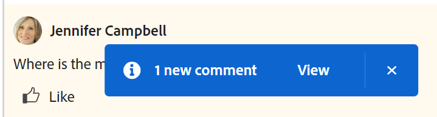

# Verwalten von Zielkommentaren in Adobe Workfront-Zielen

<!--Audited: 01/2024-->

<!--consider retiring this article when goals and all objects are in parity and we remove the legacy commenting from the system. From then on, there is just ONE way to comment and that will be documented in the Update Work article-->

<!--take "legacy" and "new commenting" references out when we remove the legacy - April 2024???-->

<!--The highlighted information on this page refers to functionality not yet generally available. It is available only in the Preview environment for all customers. 

For information about the current release schedule, see [First Quarter 2024 release overview](../../product-announcements/product-releases/24-q1-release-activity/24-q1-release-overview.md).-->

<!--
After the monthly releases to Production, the same features are also available in the Production environment for customers who enabled fast releases.   
For information about fast releases, see [Enable or disable fast releases for your organization](../../administration-and-setup/set-up-workfront/configure-system-defaults/enable-fast-release-process.md)  
-->

Sie können allen Zielen Kommentare hinzufügen, die Sie in den Adobe Workfront-Zielen anzeigen können.

## Zugriffsanforderungen

Sie müssen über folgenden Zugriff verfügen, um die in diesem Artikel beschriebenen Aktionen durchzuführen:

<table style="table-layout:auto">
<col>
</col>
<col>
</col>
<tbody>
 <tr> 
   <td role="rowheader">Adobe Workfront-Plan*</td> 
   <td> 
   
Für den neuen Plan und die Lizenzstruktur:
  <ul><li>Ein ultimativer Plan </li></ul>
   

Für den aktuellen Plan und die Lizenzstruktur: 
<ul><li> A Pro oder höher </li>
  <li>Eine Adobe Workfront Goals-Lizenz zusätzlich zu einer Workfront-Lizenz.</li></ul>

   </td> 
  </tr>
 <tr>
 <td role="rowheader">Adobe Workfront-Lizenz</td>
 <td>
 
Alle</td>
 </tr>
 <tr>
 <td role="rowheader">Produkt*</td>
 <td>
 
 Neue Produktanforderung: Wenn Sie über das Select- oder Prime Adobe Workfront-Abonnement verfügen, müssen Sie auch eine zusätzliche Adobe Workfront Goals-Lizenz erwerben. Workfront-Ziele sind im Ultimate Workfront-Plan enthalten.

 Oder
 
Aktuelle Produktanforderung: Sie müssen eine zusätzliche Lizenz für die in diesem Artikel beschriebene Funktion "Adobe Workfront Goals for Access"erwerben. 
 
Weitere Informationen finden Sie unter <a href="../../workfront-goals/goal-management/access-needed-for-wf-goals.md" class="MCXref xref">Voraussetzungen für die Verwendung von Workfront-Zielen</a>. 
 </td>
 </tr>
 <tr>
 <td role="rowheader">Konfiguration der Zugriffsebene</td>
 <td> 
Zugriff auf Ziele anzeigen oder höher
 </td>
 </tr>
 <tr data-mc-conditions="">
 <td role="rowheader">Objektberechtigungen</td>
 <td>
  

  
Anzeigen oder Höhere Berechtigungen für das Ziel

  
Standardmäßig erhalten Benutzer keinen Zugriff auf Ziele 

 
Informationen zum Freigeben von Zielen finden Sie unter <a href="../../workfront-goals/workfront-goals-settings/share-a-goal.md" class="MCXref xref">Freigeben eines Ziels in Workfront-Zielen</a>. 

  
 </td>
 </tr>
 <tr>
   <td role="rowheader">
Layout-Vorlage
</td>
   <td> 
Allen Benutzern, einschließlich Workfront-Administratoren, muss eine Layoutvorlage zugewiesen werden, die den Bereich Ziele im Hauptmenü enthält. 
  
</td>
  </tr>
</tbody>
</table>

*Weitere Informationen finden Sie unter [Zugriffsanforderungen in der Workfront-Dokumentation](/help/quicksilver/administration-and-setup/add-users/access-levels-and-object-permissions/access-level-requirements-in-documentation.md).

## Verwalten von Zielkommentaren

Sie können Ziele im Abschnitt &quot;Aktualisierungen&quot;auf der Seite eines Ziels mit Kommentaren versehen.

1. Klicken Sie auf das Symbol **Hauptmenü** oben rechts oder, falls verfügbar, auf das Symbol **Hauptmenü** oben links, das Symbol  und klicken Sie dann auf **Ziele**.

Dadurch wird die Zielliste geöffnet.
1. Suchen Sie das Ziel, dem Sie Kommentare hinzufügen möchten, und klicken Sie dann auf seinen Namen, um die Zielseite zu öffnen.
1. Klicken Sie im linken Bereich auf **Aktualisierungen** .

   Weitere Informationen zum Verwalten von Kommentaren zu Workfront-Objekten finden Sie unter [Arbeit aktualisieren](/help/quicksilver/workfront-basics/updating-work-items-and-viewing-updates/update-work.md).

<!--   
1. (Optional) To locate an existing comment, start typing a keyword (*****or a user's name********) in the **Search** box in the upper-right corner of the **Comments** tab. 
   
   

   The keyword (****or user****) you searched for is highlighted and the comments that contain it display at the top of the Updates section. 

      >[!NOTE]
      >
      >You must search for a word included in a comment or reply. You cannot search for a tagged user or team.
   
   For more information, see [Update work](../../workfront-basics/updating-work-items-and-viewing-updates/update-work.md).

1. Click the **x** icon in the search field to clear the search results and return to the complete update.
1. Click the **Comments** tab in the upper-left corner of the Updates area.
1. Start entering a comment in the **New comment** box.
         
   

   >[!TIP]
   >
   >Navigating away from the Updates section before you finish typing and submitting a comment keeps the comment on the page in draft mode even after you log off and log back on. Drafts are saved for 7 days after which they are discarded and cannot be recovered. Drafted comments are only visible to the user entering them.

1. (Optional) To undo or redo a change, use the following shortcut keys:
      * CTRL + Z (⌘+z for Mac) to undo a change 
      * CTRL + Y (⌘+y for Mac) to redo a change 
1. (Optional) To add rich-text formatting to your update, a hyperlink, or an emoji, use any options on the Rich Text toolbar or the icons adjacent to it. For more information, see [Update work](../../workfront-basics/updating-work-items-and-viewing-updates/update-work.md). 
1. (Optional) In the **Tag people or teams** area, start typing the name or the email of a user, or a team that you would like to include in this comment, then select it when it displays in the list. 
1. Select the **Private to my company** toggle to make the comment visible only to people in your company. 

      >[!TIP]
      >
      >You must have a Company specified in your profile to have this option available in the Updates area. 

1. Click **Submit**. 

      >[!TIP]
      >
      >If another user submits a comment to the same item you are updating, there will be a red line with a "New" indicator to inform you of the newer comments, as well as a blue notification at the bottom of the screen indicating the number of new comments. 
      >
      >The indicator only displays only after the comment was submitted on the item, and not when the comment is still composed. 
      >
      
1. (Optional) To edit a comment, click the **More** menu  to the right of the Like icon, then click **Edit**. 
1. Edit the information in the comment or remove any of the tagged users. 
   You can edit your comment within 15 minutes from submitting it. An "edited" indicator is added to the left of the date stamp that displays when the comment was updated.

   

   >[!TIP]
   >
   > * An email is generated to notify users of your update only when you submit the original update. No email is generated after you edited your update.
   >
   > * The date stamp is the date of the original comment and not the date of the latest update. 

1. (Optional) Click the **More** menu , then click any of the following options to copy information from a comment to the clipboard or into a new reply:

      * **Copy link** to copy the link of an update, without the replies.
      * **Copy body text** to copy the text of an update. 
      * **Quote reply** to open a new comment box where the original comment is quoted in a new reply and is marked as a block quote.

         For more information, see [Update work](../../workfront-basics/updating-work-items-and-viewing-updates/update-work.md). 

1. (Optional) Click the **More** menu  to the right of a comment, then click **Delete** to delete a comment you added. For more information, see [Update work](../../workfront-basics/updating-work-items-and-viewing-updates/update-work.md).
1. (Optional) Click **Reply** to reply to an existing comment, then follow the steps 5-9 above. For more information about replying to updates, see [Reply to updates](../../workfront-basics/updating-work-items-and-viewing-updates/reply-to-updates.md). (**********insure this stays accurate*********)
1. (Conditional and optional) If other users have added comments that display outside of the visible area in the Updates section, click **View** inside the blue **new comments banner** at the bottom of the screen  to display these comments.
   
   
   
   Additional comments display at the bottom of the screen.
1. (Optional) Click the **Like** icon to like a comment that someone else added. The icon updates with the number of likes.

1. (Optional) Click the **System Activity** tab to view updates logged by the system. When a goal is updated, Workfront generates a note about that update that and displays it in the System Activity tab. Workfront also records a system update when a result, activity, or project is added to the goal or when it is updated. (*********ensure the casing on the tab has not changed**********)-->

