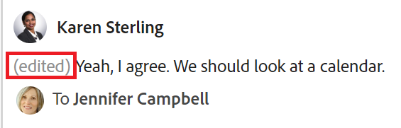

# Verwalten von Zielkommentaren in Adobe Workfront-Zielen

<!--The highlighted information on this page refers to functionality not yet generally available. It is available only in the Preview environment. -->

Sie können allen Zielen, die Sie in Adobe Workfront-Zielen anzeigen können, Kommentare hinzufügen.

<!--drafted for P&P:

<table style="table-layout:auto">
 <col>
 </col>
 <col>
 </col>
 <tbody>
  <tr>
   <td role="rowheader">Adobe Workfront plan*</td>
   <td>
   
Current plan: Select or higher

   Or
   
Legacy plan: Pro or higher

   
   </td>
  </tr>
  <tr>
   <td role="rowheader">Adobe Workfront license*</td>
   <td>
   
Current license: Contributor or higher

   Or
   
Legacy license: Request or higher
 
For more information, see <a href="../../administration-and-setup/add-users/access-levels-and-object-permissions/wf-licenses.md" class="MCXref xref">Adobe Workfront licenses overview</a>.
 </td>
  </tr>
  <tr>
   <td role="rowheader">Product</td>
   <td>
   
 Current product requirement: If you have the Select or Prime Adobe Workfront plan, you must also buy an additional Adobe Workfront Goals license.  Workfront Goals are included in the Ultimate Workfront Plan.

   Or
   
Legacy product requirement: You must purchase an additional license for the Adobe Workfront Goals to access functionality described in this article. 
 
For information, see <a href="../../workfront-goals/goal-management/access-needed-for-wf-goals.md" class="MCXref xref">Requirements to use Workfront Goals</a>. 
 </td>
  </tr>
  <tr>
   <td role="rowheader">Access level*</td>
   <td> 
Edit access to Goals
 
<b>NOTE</b>
If you still don't have access, ask your Workfront administrator if they set additional restrictions in your access level. For information on how a Workfront administrator can change your access level, see:

     <ul>
      <li> 
<a href="../../administration-and-setup/add-users/configure-and-grant-access/create-modify-access-levels.md" class="MCXref xref">Create or modify custom access levels</a> 
 </li>
      <li> 
<a href="../../administration-and-setup/add-users/configure-and-grant-access/grant-access-goals.md" class="MCXref xref">Grant access to Adobe Workfront Goals</a> 
 </li>
     </ul> 
 </td>
  </tr>
  <tr data-mc-conditions="">
   <td role="rowheader">Object permissions</td>
   <td>
    

     
View or higher permissions to the goal to view it

     
Manage permissions to the goal to edit it

     
For information about sharing goals, see <a href="../../workfront-goals/workfront-goals-settings/share-a-goal.md" class="MCXref xref">Share a goal in Workfront Goals</a>. 

    
 </td>
  </tr>
 </tbody>
</table>
-->

## Zugriffsanforderungen

Sie müssen über folgenden Zugriff verfügen, um die in diesem Artikel beschriebenen Aktionen durchzuführen:

<table style="table-layout:auto"> 
 <col> 
 <col> 
 <tbody> 
  <tr> 
   <td role="rowheader">Adobe Workfront-Plan*</td> 
   <td> 
Pro oder höher
 </td> 
  </tr> 
  <tr> 
   <td role="rowheader">Adobe Workfront-Lizenz*</td> 
   <td> 
Anforderung oder höher
 
Weitere Informationen finden Sie unter <a href="../../administration-and-setup/add-users/access-levels-and-object-permissions/wf-licenses.md" class="MCXref xref">Übersicht über Adobe Workfront-Lizenzen</a>.
 </td> 
  </tr> 
  <tr> 
   <td role="rowheader">Produkt</td> 
   <td> 
Sie müssen eine zusätzliche Lizenz für die Adobe Workfront Goals erwerben, um auf die in diesem Artikel beschriebene Funktion zugreifen zu können. 
 
Weitere Informationen finden Sie unter <a href="../../workfront-goals/goal-management/access-needed-for-wf-goals.md" class="MCXref xref">Voraussetzungen für die Verwendung von Workfront-Zielen</a>. 
 </td> 
  </tr> 
  <tr> 
   <td role="rowheader">Zugriffsebene*</td> 
   <td> 
Zugriff auf Ziele anzeigen oder höher
 
<b>NOTIZ</b>
Wenn Sie immer noch keinen Zugriff haben, fragen Sie Ihren Workfront-Administrator, ob er zusätzliche Zugriffsbeschränkungen für Ihre Zugriffsebene festlegt. Informationen dazu, wie ein Workfront-Administrator Ihre Zugriffsstufe ändern kann, finden Sie unter:
 
     <ul> 
      <li> 
<a href="../../administration-and-setup/add-users/configure-and-grant-access/create-modify-access-levels.md" class="MCXref xref">Benutzerdefinierte Zugriffsebenen erstellen oder ändern</a> 
 </li> 
      <li> 
<a href="../../administration-and-setup/add-users/configure-and-grant-access/grant-access-goals.md" class="MCXref xref">Zugriff auf Adobe Workfront-Ziele gewähren</a> 
 </li> 
     </ul> 
 </td> 
  </tr> 
  <tr data-mc-conditions=""> 
   <td role="rowheader">Objektberechtigungen</td> 
   <td> 
    
 
     
Anzeigen oder Höhere Berechtigungen für Ziele
 
     
Informationen zum Freigeben von Zielen finden Sie unter <a href="../../workfront-goals/workfront-goals-settings/share-a-goal.md" class="MCXref xref">Freigeben eines Ziels in Workfront-Zielen</a>. 
 
    
 </td> 
  </tr> 
 </tbody> 
</table>

*Wenden Sie sich an Ihren Workfront-Administrator, um zu erfahren, welchen Plan, welchen Lizenztyp oder welchen Zugriff Sie haben.

## Voraussetzungen

Sie müssen über Folgendes verfügen, bevor Sie beginnen können:

* Eine Layout-Vorlage, die den Bereich Ziele im Hauptmenü enthält.

## Suchen Sie den Bereich &quot;Kommentare&quot;

<!--
Locating goal comments differs depending on what environment you use. 

### Locate goal comments in the Production environment

You can add comments to goals in the following areas of Workfront Goals:

* The Goal Details panel
* The Check-in section 
* The Pulse section

Although the process for adding comments to goals is similar in these areas, there are differences in being able to edit, delete, or react to a comment when using one area versus another. When you enter a comment in any of these areas, the comment is visible in all areas where goal comments display.

>[!NOTE]
>
>You cannot add comments to results and activities.

-->

<!--
## Add comments to goals in the Goal Details panel

Adding comments to goals differs depending on what environment you use.

### Add comments to goals in the Production environment

You can add comments to goals in the Goal Details panel, as part of updating an individual goal.

You can edit or delete a comment that you entered in this area, or you can like comments.

1. Click the **Main Menu** icon  > **Goals** in the upper-right corner.

   (Add this when Shell is available to all: or (if available), click the **Main Menu** icon  in the upper-left corner))
   

   This opens the Workfront Goals area. 

1. Locate the goal you want to add comments to, then click its name to open the Goal Details panel to the right. 
1. Click the **Updates** tab.
1. Type your comment in the **Comment here** field, then click **Post**. 
1. (Optional and conditional) Select the **Comments** option at the top of the list to view your comment at the top of the list. It is enabled by default and comments display here with the most recent comment first. 
1. (Optional) Click **Edit** to edit your comment, then click **Save** to save your changes, or **Cancel** to revert to the original update.

   >[!TIP]
   >
   >* You can only edit comments you entered. 
   >* There is no time limit for how long after you enter a comment you are allowed to edit it.

1. (Optional) Click **Delete** to delete your comment, then click **Yes, Delete** to confirm.

   >[!TIP]
   >
   >* You can only delete comments you entered. 
   >* There is no time limit for how long after you enter a comment you are allowed to delete it.

1. (Optional) Click the **Like icon**  to like a comment that someone else added. The icon updates with the number of likes. 

1. (Optional) Click the number of likes next to a comment and a list with the names of the users who liked the comment displays in the right panel.

   <!--
   
(NOTE: this functionality might change)

   

   

1. (Conditional) Click **Back to Updates** to return to the Updates tab of the Goal Details panel, or click the **X icon** in the upper-right corner to close the right panel.

-->

Sie können Ziele im Abschnitt &quot;Aktualisierungen&quot;auf der Seite eines Ziels mit Kommentaren versehen.

Sie können auf einen Kommentar antworten oder einen Kommentar erhalten, den Sie oder andere in diesem Bereich hinzugefügt haben.

1. Klicken Sie auf **Hauptmenü** icon  > **Ziele** in der oberen rechten Ecke.
Dadurch wird die Zielliste geöffnet.
1. Suchen Sie das Ziel, dem Sie Kommentare hinzufügen möchten, und klicken Sie dann auf seinen Namen, um die Zielseite zu öffnen.
1. Klicken  **Updates** im linken Bereich.
1. Klicken Sie auf **Kommentare** in der linken oberen Ecke des Bereichs Updates.
1. Beginnen Sie mit der Eingabe eines Kommentars im **Neuer Kommentar** ankreuzen.

   

   >[!TIP]
   >
   >Wenn Sie den Abschnitt Updates verlassen, bevor Sie mit der Eingabe und dem Senden eines Kommentars fertig sind, bleibt der Kommentar auf der Seite im Entwurfsmodus, auch wenn Sie sich abmelden und wieder anmelden. Entworfene Kommentare sind nur für den Benutzer sichtbar, der sie eingibt.

1. (Optional) Im **Personen oder Teams taggen** eingeben, den Namen oder die E-Mail-Adresse eines Benutzers oder eines Teams eingeben, das Sie in diesen Kommentar aufnehmen möchten, und ihn dann auswählen, wenn er in der Liste angezeigt wird.

<!--drafted for beta release 23.2:
1. (Optional) To edit a comment, click the **More** menu  to the right of the Like icon, then click **Edit**. 
1. Edit the information in the comment, or remove any of the tagged users. 
   You can edit your comment within 15 from submitting it. An "Edited" indicator is added to the left of the date stamp that displays when the comment was updated. 

   

   >[!TIP]
   >
   >   An email is generated to notify users of your update only when you submit the original update. No email is generated after you edited your update.
-->
1. Klicken **Einsenden**.

<!--drafted for 23.2 beta release: 

   >[!TIP]
   >
   >   If another user submits a comment to the same item you are updating, there will be a red line with a "New" indicator to inform you of the newer comments. The indicator only displays only after the comment was submitted on the item, and not when the comment is still composed. 
   >
   > -->

1. (Optional) Klicken Sie auf **Antwort** um auf einen vorhandenen Kommentar zu antworten, führen Sie dann die Schritte 5 bis 7 aus. <!--insure this stays accurate-->
1. (Optional) Klicken Sie auf die **liken** icon , um einen Kommentar zu erhalten, den jemand anderes hinzugefügt hat. Das Symbol wird mit der Anzahl der &quot;Gefällt mir&quot;-Klicks aktualisiert.
1. (Optional) Um Ihrer Aktualisierung Rich-Text-Formatierung hinzuzufügen, verwenden Sie beim Eingeben Attribute in der Rich-Text-Symbolleiste. Weitere Informationen finden Sie unter [Update der Arbeit](../../workfront-basics/updating-work-items-and-viewing-updates/update-work.md).
1. (Optional) Klicken Sie auf die **Systemaktivität** -Tab, um vom System protokollierte Aktualisierungen anzuzeigen. Wenn ein Ziel aktualisiert wird, generiert Workfront einen Hinweis zu dieser Aktualisierung und zeigt sie auf der Registerkarte Systemaktivität an. Workfront zeichnet auch eine Systemaktualisierung auf, wenn ein Ergebnis, eine Aktivität oder ein Projekt zum Ziel hinzugefügt oder aktualisiert wird. <!--ensure the casing on the tab has not changed-->

<!--
## Add comments to goals in the Check-in section

The Check-in section has been removed from the Preview environment. You can update goals by accessing the goal page. For information, see 
[Update goals in the Goal details section in Adobe Workfront Goals](../goal-management/update-goals-in-goal-details-panel.md). 

>[!TIP]
>
>You must have access to Edit Goals in your access level to view the Check-in section.

You can add comments to goals in the Check-in section of Workfront Goals, as part of updating your list of goals. For information about updating goals, see [Update goal progress in Adobe Workfront Goals](../../workfront-goals/goal-review-and-workfront-goals-sections/check-in-goals.md).

You can also like goal comments that other users have added to mark your approval of them in the Check-in section.

1. Click the **Main Menu** icon  > **Goals** in the upper-right corner.

   ( Add this when Shell is available to all: or (if available), click the **Main Menu** icon  in the upper-left corner))

   This opens the Workfront Goals area. 

1. Click the **Check-in** section in the left panel.

   

   Goals assigned to you or that have results and activities that are assigned to you display in this area. 

1. (Optional) Click the right-pointing arrow to the left of the goal name to expand the goal, if the goal is not already expanded. 
1. Type your comment in the **Add a comment to this goal (optional)** field, then click **Post**.

   Two most recent comments display by default under each goal.

1. Click **Show all comments** to display all comments on a goal. A number of total comments for the goal also displays. Comments display in the order they were entered, with the most recent first. 
1. (Optional) Click the **Like icon**  to like a comment. The icon updates with the number of likes. 

1. (Optional) Click the number of likes next to a comment and a list with the names of the users who liked the comment displays in the right panel.

   

1. (Conditional) Click **Back to Updates** to return to the Updates tab of the Goal Details panel, or click the **X icon** in the upper-right corner to close the right panel.

## Add comments to goals in the Pulse section

The Pulse section has been removed from the Preview environment. You can update goals by accessing the goal page. For information, see 
[Update goals in the Goal details section in Adobe Workfront Goals](../goal-management/update-goals-in-goal-details-panel.md). 

You can add comments to goals in the Pulse section of Workfront Goals, as part of reviewing goals that might affect yours. For information about reviewing goals in the Pulse section, see [Review goals in the Adobe Workfront Goals Pulse section](../../workfront-goals/goal-review-and-workfront-goals-sections/review-goals-in-pulse.md).

You can also like goal comments that other users have added to mark your approval of them in the Pulse section.

1. Click the **Main Menu** icon  > **Goals** in the upper-right corner.

   (Add this when Shell is available to all: or (if available), click the **Main Menu** icon  in the upper-left corner))

   This opens the Workfront Goals area. 

1. Click the Pulse section in the left panel.

   

   All current goals display in this section, regardless of their status.

1. Click **Add a comment**, then type your comment in the **Add a comment to this goal (optional)** field.
1. Click **Post**.

   Three comments display by default under each goal.

1. Click **Show all updates** to display all comments on a goal. A number of total comments for the goal also displays. Comments display in the order they were entered, with the most recent first. 
1. (Optional) Click the **Like icon**  to like a comment. The icon updates with the number of likes. 

1. (Optional) Click the number of likes next to a comment and a list with the names of the users who liked the comment displays in the right panel.

   

1. (Conditional) Click **Back to Updates** to return to the Updates tab of the Goal Details panel, or click the **X icon** in the upper-right corner to close the right panel.

-->