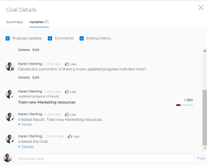

# Aktualisieren von Zielen im Abschnitt „Zieldetails“ in Adobe Workfront Goals

<!--Audited for P&P only: 4/2025-->

Sie können Informationen zu einzelnen Zielen aktualisieren, indem Sie auf das Bedienfeld „Zieldetails“ zugreifen.

>[!NOTE]
>
>Sie können keine Ziele mit dem Status „Geschlossen“ aktualisieren.

## Zugriffsanforderungen

+++ Erweitern Sie , um die Zugriffsanforderungen für die -Funktion in diesem Artikel anzuzeigen.

Sie müssen über Folgendes verfügen:

<table style="table-layout:auto">
<col>
</col>
<col>
</col>
<tbody>
 <tr> 
   <td role="rowheader">Adobe Workfront-Plan*</td> 
   <td> 
   
Für die neue Plan- und Lizenzstruktur:
  <ul><li>Ein Ultimate-Plan </li></ul>
   

Für die aktuelle Plan- und Lizenzstruktur: 
<ul><li> Ein Profi oder höher </li>
  <li>Eine Adobe Workfront-Ziellizenz zusätzlich zu einer Workfront-Lizenz.</li></ul>

   </td> 
  </tr>
 <tr>
 <td role="rowheader">Adobe Workfront-Lizenz*</td>
 <td>
 
Neue Lizenz: Mitwirkende oder höher

 Oder
 
Aktuelle Lizenz: Anfrage oder höher
 
Weitere Informationen finden Sie unter <a href="../../administration-and-setup/add-users/access-levels-and-object-permissions/wf-licenses.md" class="MCXref xref">Übersicht über Adobe Workfront-Lizenzen</a>.
 </td>
 </tr>
 <tr>
 <td role="rowheader">Produkt*</td>
 <td>
  
 Neue Produktanforderung: Workfront

  Oder
  
Aktuelle Produktanforderung: Zusätzlich zu einer Workfront-Lizenz müssen Sie eine Lizenz für Adobe Workfront Goals erwerben. 
 
Weitere Informationen finden Sie unter <a href="../../workfront-goals/goal-management/access-needed-for-wf-goals.md" class="MCXref xref">Voraussetzungen für die Verwendung von Workfront-Zielen</a>. 
 </td>
 </tr>
 <tr>
 <td role="rowheader">Zugriffsebene*</td>
 <td> 
Zugriff auf Ziele bearbeiten
 </td>
 </tr>
 <tr data-mc-conditions="">
 <td role="rowheader">Objektberechtigungen</td>
 <td>
  

  
Anzeigen von oder höheren Berechtigungen für das Ziel, um es anzuzeigen

  
Verwalten von Berechtigungen für das Ziel, um es zu bearbeiten

  
Informationen zum Freigeben von Zielen finden Sie <a href="../../workfront-goals/workfront-goals-settings/share-a-goal.md" class="MCXref xref">Freigeben eines Ziels in Workfront Goals</a>. 

  
 </td>
 </tr>
 <tr>
   <td role="rowheader">
Layout-Vorlage
</td>
   <td> 
Allen Benutzenden, einschließlich Workfront-Administratoren, muss eine Layout-Vorlage zugewiesen werden, die den Bereich Ziele im Hauptmenü enthält. 
  
</td>
  </tr>
</tbody>
</table>

*Weitere Informationen finden Sie unter [Zugriffsanforderungen in der Dokumentation zu Workfront](/help/quicksilver/administration-and-setup/add-users/access-levels-and-object-permissions/access-level-requirements-in-documentation.md).

+++

## Aktualisieren von Zielen im Abschnitt „Zieldetails“

Über eine Liste von Zielen können Sie auf ein einzelnes Ziel zugreifen.

<!--

Updating goals in the Goal Details panel differs depending on where you access the goal from. 

### Update goals in the Goal Details panel in the Production environment

1. Click the **Main Menu** icon  > **Goals** in the upper-right corner.

   (!-- Add this when Shell is available to all: or (if available), click the **Main Menu** icon  in the upper-left corner)
   --)

   This opens the Goals area in Workfront. 

1. Click the name of a goal in the Goal List, then click the name of a goal.

   This opens the Goal Details panel on the right.
   

   >[!TIP]
   >
   >You can also click the name of a goal in the Goal Alignment, Check-in, or Pulse sections. 
   >
   ><!-- drafted for goal redesign:
   >Add this to the TIP above with goal redesign: 
   >
   >The Check-in and Pulse sections have been removed from the Preview environment.
   >

1. On the Summary tab, click the **More icon** , then click any of the following options:

   1. **Edit**. For information about editing goals, see [Edit goals in Adobe Workfront Goals](../../workfront-goals/goal-management/edit-goals.md).
   1. **Copy**. For information about copying goals, see [Copy goals in Adobe Workfront Goals](../../workfront-goals/goal-management/copy-goals.md).
   1. **Activate**. This option is available only for drafted and inactive goals.

      For information about activating goals, see [Access and open goals in Adobe Workfront Goals](../../workfront-goals/goal-management/access-goals-in-wf-goals.md). 
   
   1. **Close**, then click**Close Goal**. This option is available only for active goals.

      For information about closing goals, see [Close and reopen goals in Adobe Workfront Goals](../../workfront-goals/goal-management/close-and-reopen-goals.md). 
   
   1. **Deactivate**. This option is available only for active goals. This deactivates the goal immediately.

      For information about deactivating goals, see [Delete and deactivate goals in Adobe Workfront Goals](../../workfront-goals/goal-management/delete-and-deactivate-goals.md).
   
   1. **Delete**, then click **Yes, Delete**.

      For information about deleting goals, see [Delete and deactivate goals in Adobe Workfront Goals](../../workfront-goals/goal-management/delete-and-deactivate-goals.md).

      >[!NOTE]
      >
      >Deleted goals cannot be recovered.

   1. **Reopen**, then click **Reopen**. This option is available only for closed goals that are from a current time period.

      For information about reopening goals, see [Close and reopen goals in Adobe Workfront Goals](../../workfront-goals/goal-management/close-and-reopen-goals.md). 
   
   1. (Conditional) If you clicked any of the options between steps a-i above except Delete or Reopen, click **Save**.    
   
      (!--ensure this is accurate)--)

1. Click **Align to another goal** in the upper-right of the Summary tab, then specify the name of a goal in the **Align to** **another goal** field that you want to align the current goal to. The current goal becomes the child of the goal you align it to. For information about child and parent goals, see [Align goals by connecting them in Adobe Workfront Goals](../../workfront-goals/goal-alignment/align-goals-by-connecting-them.md). 
1. Click **Add results**. Results drive the progress of your goal. For information about adding results, see [Add results to goals in Adobe Workfront Goals](../../workfront-goals/results-and-activities/add-results-to-goals.md).

1. Click **Add activities**. Activities drive the progress of your goal. For information about adding activities, see [Add activities to goals in Adobe Workfront Goals](../../workfront-goals/results-and-activities/add-activities-to-goals.md). 

1. Click the **Updates** tab. Here, you can view goal comments and review the entire editing history of the goal, activities, and results, to understand who changed what and when.

   

1. (Optional) Deselect any of the following options if you want to not display them in the Updates tab.&nbsp;They are selected by default: 

   | Option |Description  |
   |---|---|
   | Progress Updates |Displays information about the history of progress updates on results and activities.  |
   | Comments |Displays comments made by users on the goal.  |
   | Editing History |Displays information about creating and updating the goal, results, and activities.  |

1. (Optional) Click **Details** under a progress or an editing history update to display additional information about the update.

   

-->

1. Klicken Sie in der Liste Ziel auf den Namen eines Ziels und dann auf den Namen eines Ziels.

   Dadurch wird der **Zieldetails** auf der linken Seite geöffnet.

   

1. Klicken Sie oben rechts auf **Bearbeiten** Symbol  und dann auf **Alle bearbeiten** oder **Überblick**

   Oder

   Beginnen Sie, Informationen in eines der bearbeitbaren Felder im Abschnitt „Zieldetails“ einzugeben. Der Abschnitt kann nun bearbeitet werden.

   >[!IMPORTANT]
   >
   >Nicht alle Felder, die im Abschnitt „Zieldetails“ angezeigt werden, können bearbeitet werden. Workfront berechnet einige der Felder und ist schreibgeschützt.

1. Aktualisieren oder überprüfen Sie die folgenden Felder:

   * **Beschreibung**: Informationen zum Ziel hinzufügen oder aktualisieren.
   * **Fortschritt**: Gibt an, wie viel Prozent des Ziels bisher erreicht wurde. Sie können den Fortschritt eines Ziels nicht manuell aktualisieren. Das Ziel Fortschritt ist eine Berechnung aller Fortschrittsindikatoren.
   * **Bedingung**: Gibt an, ob das Ziel neu ist und noch nicht aktualisiert wurde, ob es auf dem Ziel liegt, termingerecht abgeschlossen zu werden, oder ob es zurückliegt. Die Bedingung eines Ziels kann nicht aktualisiert werden. Die Bedingung des Ziels wird von Workfront automatisch berechnet.\
     Weitere Informationen über Zielbedingung und Fortschritt finden Sie unter
     [Übersicht über den Zielfortschritt und die Bedingung in Adobe Workfront Goals](../goal-management/calculate-goal-progress.md).
   * **Status**: Der Status eines Ziels kann nicht manuell aktualisiert werden. Weitere Informationen finden Sie unter [Zielstatusübersicht in Adobe Workfront-](../goal-management/goal-status-overview.md).
   * **Zielinhaber**: Klicken Sie darauf, um den Namen des Zielinhabers zu aktualisieren. Beginnen Sie mit der Eingabe des Namens eines Benutzers, Teams, einer Gruppe oder des Namens Ihrer Organisation und wählen Sie ihn aus, wenn er in der Liste angezeigt wird. Für ein Ziel kann nur ein Besitzer vorhanden sein.
   * **Übergeordnetes Ziel**: Geben Sie den Namen eines Ziels ein, das Sie als übergeordnetes Element des ausgewählten Ziels festlegen möchten. Der Fortschritt des ausgewählten Ziels aktualisiert automatisch den Fortschritt des übergeordneten Ziels.

     >[!TIP]
     >
     >Sie können die folgenden Informationen zu einem übergeordneten Ziel nicht aktualisieren:
     >    * Zeitraum des übergeordneten Ziels
     >    * Fortschritt des übergeordneten Ziels
     >    * Verantwortlicher des übergeordneten Ziels.
     >      
     >Sie müssen diese Informationen zum übergeordneten Ziel selbst aktualisieren.

   * **Zeitraum**: Klicken Sie darauf, um den Zeitraum für das Ziel zu aktualisieren\
     Oder\
     Wählen Sie **Benutzerdefinierte Datumswerte aktivieren** **aus, um ein Datum für die Start-** Enddaten **Ziels**.
   * **Abschließende Anmerkungen**: Dieses Feld ist nur für Ziele mit dem Status Geschlossen sichtbar. Geschlossene Ziele können nicht bearbeitet werden. Wenn Sie ein geschlossenes Ziel erneut öffnen, werden die Abschlussnotizen dauerhaft gelöscht.

