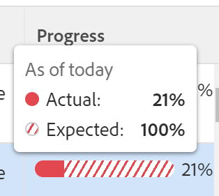
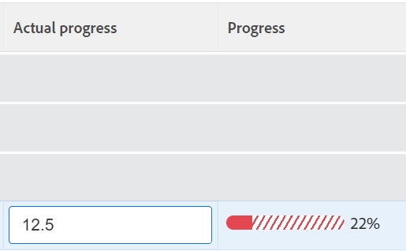

# Überprüfen von Zielen mit Problemen in Adobe Workfront Goals

<!--Audited: 4/2025-->

<!--

(NOTE: the status of goals in "red" used to be called At Risk. Now, it is "in trouble") 

-->

Ziele mit dem Status In Schwierigkeiten laufen Gefahr, nicht erreicht zu werden, und werden in den Adobe Workfront-Zielen durch einen roten Fortschrittsbalken dargestellt. Sie sollten Ihre Ziele oft überprüfen und verstehen, warum der Fortschritt verzögert ist. Informationen zum Zielfortschritt finden Sie unter [Übersicht über den Zielfortschritt und die Bedingung in Adobe Workfront-](../../workfront-goals/goal-management/calculate-goal-progress.md).

## Zugriffsanforderungen

>[!NOTE]
>
>Ihr Unternehmen kann sich dafür entscheiden, Adobe Workfront Goals weiterhin zu verwenden, wenn es dieses Paket in der Vergangenheit erworben hat. Weitere Informationen erhalten Sie bei Ihrer Kundenbetreuung.
>
>Adobe Workfront Goals ist nicht mehr erhältlich.

+++ Erweitern, um die Zugriffsanforderungen für die in diesem Artikel beschriebene Funktionalität anzuzeigen. 

<table style="table-layout:auto">
<col>
</col>
<col>
</col>
<tbody>
 <tr>
  <td> 
Adobe Workfront-Paket
 </td> 
   <td> 
   
Adobe Workfront Ultimate

<b>NOTIZ</b>

Wenden Sie sich an Ihren Workfront-Support-Mitarbeiter, wenn Sie ein anderes Workfront-Paket haben.

   </td> 
  </tr>
 <tr>
 <td role="rowheader">Adobe Workfront-Lizenz</td>
 <td>
 
Mitwirkende oder höher

Anfragende oder höher
</td>
 </tr>
  <tr>
 <td role="rowheader">Konfiguration der Zugriffsebene</td>
 <td> 
Zugriff auf Ziele bearbeiten
 </td>
 </tr>
 <tr data-mc-conditions="">
 <td role="rowheader">Objektberechtigungen</td>
 <td>
  

  
Anzeigen von oder höheren Berechtigungen für das Ziel, um es anzuzeigen

  
Verwalten von Berechtigungen für das Ziel, um es zu bearbeiten

  
 </td>
 </tr>
<tr>
   <td role="rowheader">
Layout-Vorlage
</td>
   <td> 
Allen Benutzern, einschließlich Systemadministratoren, muss eine Layout-Vorlage zugewiesen werden, die den Bereich Ziele im Hauptmenü enthält. 
  
</td>
  </tr>
</tbody>
</table>

Weitere Informationen finden Sie unter [Zugriffsanforderungen in der Dokumentation zu Workfront](/help/quicksilver/administration-and-setup/add-users/access-levels-and-object-permissions/access-level-requirements-in-documentation.md).

+++

<!--
Old:
<table style="table-layout:auto">
<col>
</col>
<col>
</col>
<tbody>
 <tr> 
   <td role="rowheader">Adobe Workfront plan*</td> 
   <td> 
   
For the new plan and license structure:
  <ul><li>An Ultimate plan </li></ul>
   

For the current plan and license structure: 
<ul><li> A Pro or higher </li>
  <li>An Adobe Workfront Goals license in addition to a Workfront license.</li></ul>

   </td> 
  </tr>
 <tr>
 <td role="rowheader">Adobe Workfront license*</td>
 <td>
 
New license: Contributor or higher

 Or
 
Current license: Request or higher
 
For more information, see <a href="../../administration-and-setup/add-users/access-levels-and-object-permissions/wf-licenses.md" class="MCXref xref">Adobe Workfront licenses overview</a>.
 </td>
 </tr>
 <tr>
 <td role="rowheader">Product*</td>
 <td>
  
 New product requirement: Workfront

  Or
  
Current product requirement: In addition to a Workfront license, you must purchase a license for Adobe Workfront Goals. 
 
For information, see <a href="../../workfront-goals/goal-management/access-needed-for-wf-goals.md" class="MCXref xref">Requirements to use Workfront Goals</a>. 
 </td>
 </tr>
 <tr>
 <td role="rowheader">Access level</td>
 <td> 
Edit access to Goals
</td>
 </tr>
 <tr data-mc-conditions="">
 <td role="rowheader">Object permissions</td>
 <td>
  

  
View or higher permissions to the goal to view it

  
Manage permissions to the goal to edit it

  
For information about sharing goals, see <a href="../../workfront-goals/workfront-goals-settings/share-a-goal.md" class="MCXref xref">Share a goal in Workfront Goals</a>. 

  
 </td>
 </tr>
 <tr>
   <td role="rowheader">
Layout template
</td>
   <td> 
All users, including Workfront administrators,  must be assigned a layout template that includes the Goals area in the Main Menu. 
  
</td>
  </tr>
</tbody>
</table>
-->

## Empfehlungen zur Vermeidung von Zielen, um einen Fortschritt von In Schwierigkeiten zu erreichen

Bevor Ziele einen Fortschritt von „In Schwierigkeiten“ erreichen, können Sie sie häufig überwachen und ihren Fortschritt anpassen, wenn sie einen Fortschritt von „Gefährdet“ erreichen. Gefährdete Ziele laufen Gefahr, in Schwierigkeiten zu geraten. Weitere Informationen zum Zielfortschritt finden Sie unter [Übersicht über den Zielfortschritt und die Bedingung in Adobe Workfront Goals](../../workfront-goals/goal-management/calculate-goal-progress.md)

Bevor Ihre Ziele einen Fortschritt von In Schwierigkeiten erreichen, empfehlen wir Folgendes:

* Überprüfen Sie Ziele mit dem Status „Gefährdet“, die Ihnen häufig zugewiesen sind, sowie organisatorische Ziele, die Ihren Teams, Gruppen oder Ihrer Organisation zugewiesen sind und die vom Fortschritt Ihrer Ziele betroffen sein könnten. Gefährdete Ziele laufen Gefahr, zu Zielen in Schwierigkeiten zu werden. Die gefährdeten Ziele sind durch eine gelbe Fortschrittsleiste gekennzeichnet. Verwenden Sie die Liste „Ziele“, um Ziele anzuzeigen, die zu Ihnen, Ihren Teams, Gruppen oder Ihrer Organisation gehören.

## Überprüfen von in Schwierigkeiten geratenen Zielen in der Zielliste

Sie können Ziele in jedem Abschnitt der Workfront-Ziele überprüfen. Informationen zu den Workfront-Zielen finden Sie in [Übersicht über die Adobe Workfront-Ziele](../../workfront-goals/goal-review-and-workfront-goals-sections/overview-of-wf-goals-sections.md).

In diesem Artikel wird beschrieben, wie Sie Ziele in der Zielliste überprüfen.

{{step1-to-goals}}

Dadurch wird der Bereich Workfront-Ziele geöffnet. Der Abschnitt „Target-Liste“ wird standardmäßig angezeigt.

1. (Empfohlen) Passen Sie die folgenden Filter für den Bereich „Zielliste“ an, um gefährdete Ziele zu überprüfen:

   * Klicken Sie auf **Unternehmen**, dann auf **Meine Teams**, dann auf **Meine Gruppen**, dann auf **Persönliche** Ziele, um Ziele anzuzeigen, die zu Ihrer Organisation, Ihren Teams, Gruppen und dann zu Ihren eigenen Zielen gehören.

     >[!TIP]
     >
     >Unter Adobe Workfront-Ziele zeigt der Unternehmensfilter die Ziele an, für die Ihr Unternehmen als Eigentümer ausgewählt wurde.
     >
     >
     >Mit diesem Feld können Sie nicht nach Firmen suchen. Standardmäßig ist nur Ihr Unternehmen ausgewählt, das Eigentümer Ihrer Workfront-Instanz ist.

   * Klicken Sie für jede der oben ausgewählten Organisationseinheiten auf **Neuer Filter** > **Fortschritt** > **In Schwierigkeiten** >**Anwenden.**
   * (Optional) Wählen Sie den Zeitraum aus, für den Sie Ziele anzeigen möchten.

     Die Fortschrittsbalkenanzeige wird für jedes Ziel in der Zielliste in rot angezeigt.

     Weitere Informationen zum Filtern von Zielen anhand aller anderen Kriterien im rechten Bereich finden Sie unter [Filtern von Informationen in Adobe Workfront-Zielen](../../workfront-goals/goal-management/filter-information-wf-goals.md).

1. Bewegen Sie den Mauszeiger über die Fortschrittsleistenanzeige, um den tatsächlichen Fortschrittsprozentsatz und den erwarteten Wert für den aktuellen Tag anzuzeigen.

   

1. (Optional) Verwenden Sie die Filter, um Ziele zu finden, die zu einem bestimmten Eigentümer gehören.

   In Schwierigkeiten befindliche Ziele für die ausgewählten Benutzer werden in der Liste Ziele angezeigt.

1. Klicken Sie auf einen Zielnamen, um die Zielseite zu öffnen, und klicken Sie dann **linken Bereich** Fortschrittsanzeigen“. In der Spalte „Tatsächlicher Fortschritt“ der Liste „Fortschrittsindikatoren“ können Sie anzeigen, welche Fortschrittsanzeige dazu führt, dass das Ziel hinter dem **liegt** und den Fortschritt der Anzeige inline aktualisieren.

   Informationen zum Aktualisieren von Ergebnissen und Aktivitäten finden Sie unter [Aktualisieren des Zielfortschritts in Adobe Workfront Goals](../goal-review-and-workfront-goals-sections/check-in-goals.md)

   

   >[!NOTE]
   >
   >Sie können nur Ergebnisse und Aktivitäten in der Liste Fortschrittsindikatoren aktualisieren. Sie müssen die Fortschrittsanzeigen der untergeordneten Ziele aktualisieren, indem Sie auf die Ziele zugreifen, und Sie müssen die Aufgaben in den verbundenen Projekten aktualisieren, um den Fortschritt der Projekte zu aktualisieren.

