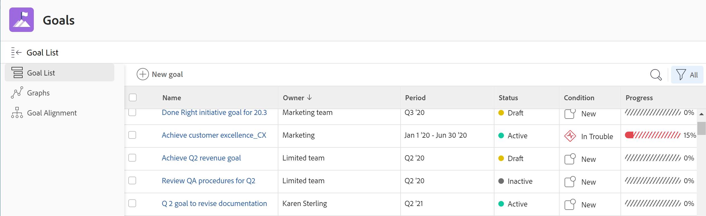

# Überblick über die Abschnitte zu Adobe Workfront-Zielen

>[!IMPORTANT]
>
>Ihr Unternehmen muss über Folgendes verfügen, um die in diesem Artikel beschriebenen Funktionen nutzen zu können:
>
>* Für die neue Plan- und Lizenzstruktur:
>
>   * Der Ultimate Workfront-Plan
>    
>* Für die aktuelle Plan- und Lizenzstruktur:
>
>   * Ein Pro- oder höher-Workfront-Plan
>   * Eine Adobe Workfront-Ziellizenz zusätzlich zu einer Workfront-Lizenz.
>
>Wenden Sie sich an Ihren Workfront Account Manager, um mehr über eine Workfront Goals-Lizenz zu erfahren.
> 
>Weitere Informationen zum Zugriff auf Workfront-Ziele finden Sie unter [Voraussetzungen für die Verwendung von Workfront-Zielen](/help/quicksilver/workfront-goals/goal-management/access-needed-for-wf-goals.md).

Nachdem Ihnen der Workfront-Administrator Zugriff auf Workfront-Ziele gewährt hat, können Sie Ziele, die Sie oder eine andere Person in Ihrem Unternehmen erstellt haben, im Bereich Workfront-Ziele anzeigen.

Sie können auf Ziellisten oder einzelne Ziele zugreifen und sie über mehrere Abschnitte von Workfront-Zielen verwalten. Welcher Abschnitt Sie verwenden, hängt vom Zweck ab, den Sie beim Arbeiten mit Zielen erreichen möchten.

Sie können Filter anwenden, um nur die Ziele anzuzeigen, die in jedem Abschnitt für Sie wichtig sind.

>[!TIP]
>
>In einem Abschnitt aktualisierte Filter werden automatisch auf die Abschnitte Zielliste, Diagramme und Zielausrichtung angewendet. Auf diese Weise können Sie sie nur einmal aktualisieren. Weitere Informationen finden Sie unter [Filtern von Informationen in Adobe Workfront Goals](../../workfront-goals/goal-management/filter-information-wf-goals.md).

Im Folgenden finden Sie einen kurzen Überblick über die Abschnitte der Workfront-Ziele und die verfügbaren Optionen zum Verwalten von Zielen. Weitere Informationen zu zusätzlichen Aktionen, die Sie in den einzelnen Abschnitten der Workfront-Produktziele ausführen können, finden Sie in den folgenden Artikeln:

* [Erstellen von Zielen in Adobe Workfront-Zielen](../../workfront-goals/goal-management/create-goals.md)
* [Aktualisieren des Zielfortschritts in Adobe Workfront Goals](../../workfront-goals/goal-review-and-workfront-goals-sections/check-in-goals.md)
* [Filtern von Informationen in Adobe Workfront Goals](../../workfront-goals/goal-management/filter-information-wf-goals.md)

## Liste der Ziele

Sie können die Zielliste verwenden, um Ziele zu überprüfen, die zu Ihnen, Ihren Teams, Gruppen oder Ihrer Organisation gehören. Sie können Ziele in jedem Status und aus jedem Zeitraum anzeigen.

Informationen zum Navigieren in der Zielliste und Verwalten von [ finden Sie unter „Verwalten von Zielen in der Zielliste von Adobe Workfront](../../workfront-goals/goal-review-and-workfront-goals-sections/manage-goals-in-goal-list.md).

Verwenden Sie die Liste „Ziele“ für Folgendes:

* Ziele anzeigen, die zu Ihnen, Ihren Teams, Gruppen oder Ihrer Organisation gehören.
* Überprüfen Sie Ziele und deren Informationen (z. B. Name, Eigentümer, Fortschritt oder Bedingung).
* Neue Ziele hinzufügen.

  Weitere Informationen finden Sie unter [Erstellen von Zielen in Adobe Workfront](../../workfront-goals/goal-management/create-goals.md).

* Rufen Sie die Seite eines Ziels auf und bearbeiten und aktualisieren Sie das Ziel, seine Ergebnisse oder Aktivitäten

  Weitere Informationen finden Sie unter [Bearbeiten von Zielen in Adobe Workfront](../../workfront-goals/goal-management/edit-goals.md).

* Ziele bearbeiten.

## Diagramme

Im Abschnitt Diagramme können Sie sich einen ganzheitlichen Überblick über den Zustand der Ziele verschaffen, die Ihnen oder Ihrem Unternehmen gehören. Sie können Fortschrittsinformationen zu Zielen in jedem Status aus jedem Zeitraum in diesem Abschnitt anzeigen.

Weitere Informationen zur Verwendung des Abschnitts Diagramme finden Sie unter [Überprüfen von Diagrammen zum Verständnis der Trends beim Zielfortschritt in Adobe Workfront Goals](../../workfront-goals/goal-review-and-workfront-goals-sections/review-goal-graphs.md).

Verwenden Sie den Abschnitt Diagramme für Folgendes:

* Zeigen Sie die Leistung von Zielen an, die Ihnen, Ihren Teams, Gruppen oder Ihrer Organisation gehören.
* Die Anzahl der Ziele mit einem bestimmten Fortschrittsstatus anzeigen.
* Wissen, wie Ihre Ziele wöchentlich funktionieren.

## Ziel-Ausrichtung

Wenn Ihre Ziele aufeinander abgestimmt sind, können Sie im Abschnitt „Zielausrichtung“ alle Ziele in Ihrer Organisation und ihre Ausrichtung zueinander anzeigen und überprüfen. Ausgerichtete Ziele werden hier auf verbundenen Karten angezeigt, um ihre Ausrichtung zueinander zu veranschaulichen. Übergeordnete Ziele werden zuerst angezeigt und untergeordnete Ziele werden dahinter gestapelt. In diesem Abschnitt können Sie Ziele in jedem Status und zu jedem beliebigen Zeitraum anzeigen.

Informationen zum Navigieren im Abschnitt „Zielausrichtung“ zum Verwalten von Zielen finden Sie [Navigieren im Abschnitt „Zielausrichtung“ in Adobe Workfront-](../../workfront-goals/goal-alignment/navigate-goal-alignment-chart.md).

Informationen zum Ausrichten von Zielen finden Sie in den folgenden Artikeln:

* [Ziele ausrichten, indem Sie sie in Adobe Workfront Goals miteinander verbinden](../../workfront-goals/goal-alignment/align-goals-by-connecting-them.md)
* [Ausrichten von Zielen durch Konvertieren von Ergebnissen und Aktivitäten in Ziele](../../workfront-goals/goal-alignment/align-goals-by-converting-results-activities.md)

Gehen Sie im Abschnitt Zielausrichtung wie folgt vor:

* Zeigen Sie Ziele, die Ihnen oder Ihrem Unternehmen gehören, in einem Kartenformat an.
* Die Zielhierarchie und ausgerichtete Unterziele anzuzeigen.
* Rufen Sie die Zielseite auf und aktualisieren Sie das Ziel, seine Ergebnisse oder Aktivitäten.

<!--
## Pulse

 The Pulse section has been removed from the Preview environment and will be removed from Workfront Goals with the 23.1 release. Use the Goal List area to review goals that you or your teams are responsible for. 

You can use the Pulse section to review and request updates to goals that might influence the progress of your goals. These could be your own goals, or goals that belong to your teams, groups, or your organization. You can view goals in any status and from any time period in this section.

>[!TIP]
>
>Only goals that have been checked in on at least once display in the Pulse section.

For information about reviewing goals using the Pulse section, see [Review goals in the Adobe Workfront Goals Pulse section](../../workfront-goals/goal-review-and-workfront-goals-sections/review-goals-in-pulse.md).

Use the Pulse section to do the following:

* View goals that belong to your teams, groups, or organization. 
* Review goal progress and updates, including aligned goals, their results, and activities. 
* Make or ask for updates to a goal by adding a comment. 
* Access the Goal Details panel and edit and update the goal, its results, or activities.
* Add new goals. 
* Check in on goals.

  >[!TIP]
  >
  >Clicking Check in opens the Check-in section in the left panel.

## Check-in

 The Check-in section has been removed from the Preview environment and will be removed from Workfront Goals with the 23.1 release. Use the Goal List area to review goals that you or your teams are responsible for.

You must have access to Edit Goals in your access level before you can access the Check- in section. For information about granting access to Goals, see  [Grant access to Adobe Workfront Goals](../../administration-and-setup/add-users/configure-and-grant-access/grant-access-goals.md).

You can use the Check-in section to update active goals and any results and activities that you are the owner of. You can primarily view only goals in an Active status in this section. Children goals aligned to active parents also display in the Check-in section, regardless of their status.

>[!IMPORTANT]
>
>* A goal displays in the Check-in section only if it is assigned to you or if it has a result or activity that is assigned to you. 
>* If a goal assigned to you is the child goal of a parent that is not assigned to you and your goal (the child goal) is closed, inactive, or a draft, the parent goal does not display in your Check-in section. 
>

For information about managing goals in the Goal List, see [Manage goals in the Goal List of Adobe Workfront Goals](../../workfront-goals/goal-review-and-workfront-goals-sections/manage-goals-in-goal-list.md).

Use the Check-in section to do the following:

* Review goal progress and updates, including aligned goals, their results, and activities. 
* Update the progress on the results and activities that are assigned to you. For information about updating goals by checking in on them, see [Update goal progress in Adobe Workfront Goals](../../workfront-goals/goal-review-and-workfront-goals-sections/check-in-goals.md).

  >[!IMPORTANT]
  >
  >You can check in only on the results and activities assigned to you in the Check-in section, and not those that are assigned to other entities.

* Add a comment to a goal, then click Post to make or ask for updates to a goal. 
* Access the Goal Details panel and edit and update the goal, its results, or activities.
* Add new goals.
-->
