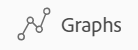
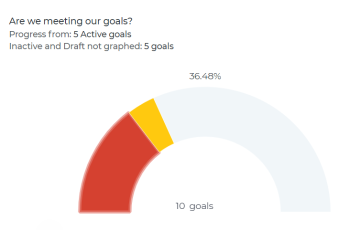
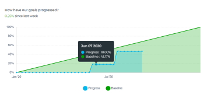

# Überprüfen von Diagrammen, um die Trends beim Zielfortschritt in Adobe Workfront Goals zu verstehen

<!--Audited for P&P only: 4/2025-->

Im Abschnitt Diagramme der Adobe Workfront-Ziele können Sie den Gesamtzustand Ihrer Ziele und den zeitlichen Fortschritt einsehen. Die Diagramme in diesem Abschnitt schlüsseln den Fortschritt nicht nach Zielen auf, sondern bieten Ihnen stattdessen eine ganzheitliche Momentaufnahme des Fortschrittsstatus aller Ziele sowie ihres Fortschrittstrends in einem bestimmten Zeitraum.

>[!IMPORTANT]
>
>Im Bereich Diagramme wird für einen ausgewählten Zeitraum eine Gesamtanzahl von Zielen angezeigt. Workfront-Ziele berücksichtigen jedoch nur Ziele mit dem Status Aktiv und Geschlossen bei der Berechnung des Gesamtstatus für den Zielfortschritt und des Prozentsatzes abgeschlossen.

## Zugriffsanforderungen

>[!NOTE]
>
>Ihr Unternehmen kann sich dafür entscheiden, Adobe Workfront Goals weiterhin zu verwenden, wenn es dieses Paket in der Vergangenheit erworben hat. Weitere Informationen erhalten Sie bei Ihrer Kundenbetreuung.
>
>Adobe Workfront Goals ist nicht mehr erhältlich.

+++ Erweitern, um die Zugriffsanforderungen für die in diesem Artikel beschriebene Funktionalität anzuzeigen. 

<table style="table-layout:auto">
<col>
</col>
<col>
</col>
<tbody>
 <tr>
  <td> 
Adobe Workfront-Paket
 </td> 
   <td> 
   
Adobe Workfront Ultimate

<b>NOTIZ</b>

Wenden Sie sich an Ihren Workfront-Support-Mitarbeiter, wenn Sie ein anderes Workfront-Paket haben.

   </td> 
  </tr>
 <tr>
 <td role="rowheader">Adobe Workfront-Lizenz</td>
 <td>
 
Mitwirkende oder höher

Anfragende oder höher
</td>
 </tr>
  <tr>
 <td role="rowheader">Konfiguration der Zugriffsebene</td>
 <td> 
Zugriff auf Ziele bearbeiten
 </td>
 </tr>
 <tr data-mc-conditions="">
 <td role="rowheader">Objektberechtigungen</td>
 <td>
  

  
Anzeigen von oder höheren Berechtigungen für das Ziel, um es anzuzeigen

  
Verwalten von Berechtigungen für das Ziel, um es zu bearbeiten

  
 </td>
 </tr>
<tr>
   <td role="rowheader">
Layout-Vorlage
</td>
   <td> 
Allen Benutzern, einschließlich Systemadministratoren, muss eine Layout-Vorlage zugewiesen werden, die den Bereich Ziele im Hauptmenü enthält. 
  
</td>
  </tr>
</tbody>
</table>

Weitere Informationen finden Sie unter [Zugriffsanforderungen in der Dokumentation zu Workfront](/help/quicksilver/administration-and-setup/add-users/access-levels-and-object-permissions/access-level-requirements-in-documentation.md).

+++

<!--
Old:
<table style="table-layout:auto">
<col>
</col>
<col>
</col>
<tbody>
 <tr> 
   <td role="rowheader">Adobe Workfront plan*</td> 
   <td> 
   
For the new plan and license structure:
  <ul><li>An Ultimate plan </li></ul>
   

For the current plan and license structure: 
<ul><li> A Pro or higher </li>
  <li>An Adobe Workfront Goals license in addition to a Workfront license.</li></ul>

   </td>  
  </tr>
 <tr>
 <td role="rowheader">Adobe Workfront license*</td>
 <td>
 
New license: Contributor or higher

 Or
 
Current license: Request or higher
 
For more information, see <a href="../../administration-and-setup/add-users/access-levels-and-object-permissions/wf-licenses.md" class="MCXref xref">Adobe Workfront licenses overview</a>.
 </td>
 </tr>
 <tr>
 <td role="rowheader">Product*</td>
 <td>
    
 New product requirement: Workfront

    Or
    
Current product requirement: In addition to a Workfront license, you must purchase a license for Adobe Workfront Goals. 
 
For information, see <a href="../../workfront-goals/goal-management/access-needed-for-wf-goals.md" class="MCXref xref">Requirements to use Workfront Goals</a>. 
 </td>
 </tr>
 <tr>
 <td role="rowheader">
Access level
</td>
 <td> 
Edit access to Goals
 </td>
 </tr>
 <tr data-mc-conditions="">
 <td role="rowheader">Object permissions</td>
 <td>
  

  
View or higher permissions to the goal to view it

  
Manage permissions to the goal to edit it

  
For information about sharing goals, see <a href="../../workfront-goals/workfront-goals-settings/share-a-goal.md" class="MCXref xref">Share a goal in Workfront Goals</a>. 

  
 </td>
 </tr>
 <tr>
   <td role="rowheader">
Layout template
</td>
   <td> 
All users, including Workfront administrators,  must be assigned a layout template that includes the Goals area in the Main Menu. 
  
</td>
  </tr>
</tbody>
</table>
-->

## Diagrammtypen in Workfront Goals

Die folgenden Diagramme sind im Abschnitt Diagramme für Workfront-Ziele verfügbar:

<table style="table-layout:auto"> 
 <col> 
 <col> 
 <tbody> 
  <tr> 
   <td role="rowheader">Diagramm zur Zielgesundheit</td> 
   <td> 
Ein Messdiagramm, das Folgendes anzeigt:
 
    <ul> 
     <li>Eine Gesamtzahl von Zielen für den ausgewählten Zeitraum. Ziele mit beliebigem Status werden berücksichtigt. </li> 
     <li>Der Fortschrittsstatus von Zielen mit dem Status Aktiv und Geschlossen.</li> 
    </ul> 
Informationen dazu, wie Workfront Goals den Fortschrittsstatus berechnet, finden Sie unter <a href="../../workfront-goals/goal-management/calculate-goal-progress.md" class="MCXref xref">Übersicht über den Zielfortschritt und die Bedingung in Adobe Workfront Goals</a>.
 </td> 
  </tr> 
  <tr> 
   <td role="rowheader">Die Grafik für den Zielfortschritt</td> 
   <td> 
Ein Liniendiagramm, das die an den Zielen vorgenommenen Aktualisierungen in wöchentlichen Schritten während der Dauer des Ziels anzeigt. Das Diagramm Zielfortschritt zeigt Folgendes an:
 
    <ul> 
     <li>Ein durchschnittlicher erwarteter und tatsächlicher abgeschlossener Prozentsatz aller aktiven und geschlossenen Ziele im ausgewählten Zeitraum. Der Fortschritt in Prozent abgeschlossen wird in wöchentliche Inkremente unterteilt, die durch -Knoten gekennzeichnet sind. </li> 
     <li>Der durchschnittliche Gesamtfortschritt für aktive und geschlossene Ziele seit der Vorwoche. </li> 
    </ul> 
Tipp: Das Diagramm zum Zielfortschritt zeigt möglicherweise keine Informationen an, wenn außerhalb des ausgewählten Zeitraums Aktualisierungen an den Zielen vorgenommen werden. 
 </td> 
  </tr> 
 </tbody> 
</table>

## Überprüfen des Zielfortschritts in Diagrammen

{{step1-to-goals}}

Dadurch wird der Bereich Workfront-Ziele geöffnet.

1. Klicken Sie **linken** auf „Diagramme“.

   

   Der Abschnitt Diagramme wird angezeigt.

   Standardmäßig werden die im Abschnitt Diagramme angezeigten Ziele durch die folgenden Kriterien eingeschränkt:

   * Die auf den Bereich Diagramme angewendeten Filter.
   * Ziele mit dem Status Aktiv und Entwurf

1. (Optional) Wählen Sie den Typ der Informationen aus, die angezeigt werden sollen, indem Sie die Filter in der oberen rechten Ecke des Abschnitts Diagramme aktualisieren.

   Weitere Informationen zum Filtern von Zielen finden Sie unter [Filtern von Informationen in Adobe Workfront-Zielen](../../workfront-goals/goal-management/filter-information-wf-goals.md).

   >[!TIP]
   >
   >Wenn Sie ausgewählt haben, mehr als einen Zeitraum anzuzeigen, werden für jeden Zeitraum ein Konsistenzdiagramm (Messgerät) sowie ein Fortschrittsdiagramm (Linie) angezeigt.

1. Überprüfen Sie die Informationen in der folgenden Tabelle, wenn Sie die Zielintegritätstabelle überprüfen.

   

   | Gesamtzahl der Ziele | Die Zahl am unteren Rand des Diagramms gibt die Anzahl aller Ziele im ausgewählten Zeitraum in allen ausgewählten Status an. |
   |---|---|
   | Durchschnittlicher Prozentsatz abgeschlossen | Am oberen Rand des Diagramms gibt diese Zahl den durchschnittlichen Prozentsatz der abgeschlossenen aktiven und geschlossenen Ziele in dem ausgewählten Zeitraum an. |
   | Ziele und ihr Fortschritt | Die Anzahl der Ziele für jedes Fortschrittsstatussegment, wenn Sie den Mauszeiger über die Segmente des Diagramms bewegen. Nur Ziele mit dem Status Aktiv oder Geschlossen werden in den Segmenten gezählt. |

1. Überprüfen Sie die Informationen in der folgenden Tabelle, wenn Sie die Tabelle für den Zielfortschritt überprüfen.

   

   <table style="table-layout:auto"> 
    <col> 
    <col> 
    <tbody> 
     <tr> 
      <td>Baseline-Fortschritt</td> 
      <td>Die grüne Steigungslinie gibt den erwarteten Gesamtdurchschnitt der abgeschlossenen aktiven und geschlossenen Ziele für den ausgewählten Zeitraum in Prozent an. Es wird erwartet, dass alle Ziele innerhalb eines Zeitraums abgeschlossen werden, sodass der grundlegende Fortschritt am Ende des Zeitraums immer 100 % beträgt. </td> 
     </tr> 
     <tr> 
      <td>Tatsächlicher Fortschritt</td> 
      <td> 
Die blaue Linie zeigt den tatsächlichen prozentualen Gesamtdurchschnitt der aktiven und geschlossenen Ziele für den ausgewählten Zeitraum in wöchentlichen Schritten an. Jede Woche während der Dauer des Ziels wird durch einen Knoten in der Zeile markiert. 
 </td> 
     </tr> 
    </tbody> 
   </table>

1. Bewegen Sie den Mauszeiger über einen Wochenknoten im Diagramm zum Zielfortschritt und überprüfen Sie Folgendes:

   * **Wochendatum**: Der Monat, Tag und das Jahr der ausgewählten Woche.
   * **Fortschritt**: Ein Durchschnitt des tatsächlichen Prozentsatzes der vollständigen Ziele für die ausgewählte Woche.
   * **Baseline**: Ein Durchschnitt des erwarteten Prozentsatzes der vollständigen Ziele für die ausgewählte Woche.

1. (Optional) Klicken Sie **Fortschritt** unten im Fortschrittsdiagramm, um die tatsächliche Gesamtfortschrittslinie zu entfernen

   ODER

   Klicken Sie **Baseline** am unteren Rand des Fortschrittsdiagramms, um den erwarteten Fortschritt aus dem Diagramm zu entfernen.

