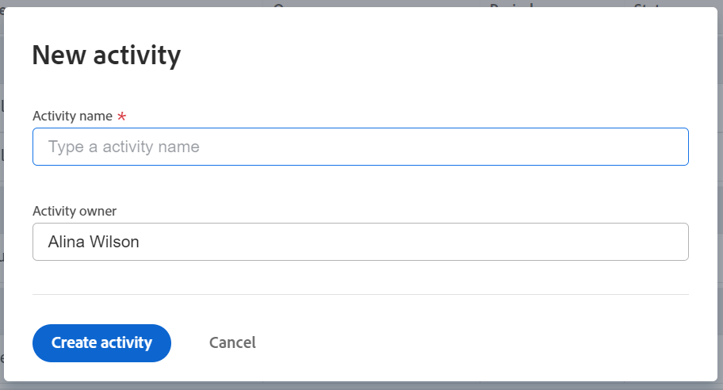

# Hinzufügen von Aktivitäten zu Zielen in Adobe Workfront-Zielen

Aktivitäten messen den Fortschritt eines Ziels. Ohne die Verknüpfung von Ergebnissen, Aktivitäten, Projekten oder aufeinander abgestimmten Zielen können Sie ein Ziel nicht aktivieren und den Fortschritt nicht aufzeichnen.

## Zugriffsanforderungen

Sie müssen über Folgendes verfügen:

<table style="table-layout:auto">
<col>
</col>
<col>
</col>
<tbody>
 <tr> 
   <td role="rowheader">Adobe Workfront-Plan*</td> 
   <td> 
   
Für den neuen Plan und die Lizenzstruktur:
  <ul><li>Ein ultimativer Plan </li>
  Oder
  <li>Eine zusätzliche Lizenz für Adobe Workfront Goals für die Prime- oder Select Adobe Workfront-Pläne. </li></ul> 

Für den aktuellen Plan und die Lizenzstruktur: 
<ul><li> A Pro oder höher </li>
  <li>Eine Adobe Workfront Goals-Lizenz zusätzlich zu einer Workfront-Lizenz.</li></ul>

   </td> 
  </tr>
 <tr>
 <td role="rowheader">Adobe Workfront-Lizenz*</td>
 <td>
 
Neue Lizenz: Mitarbeiter oder höher

 Oder
 
Aktuelle Lizenz: Anfrage oder höher
 
Weitere Informationen finden Sie unter <a href="../../administration-and-setup/add-users/access-levels-and-object-permissions/wf-licenses.md" class="MCXref xref">Übersicht über Adobe Workfront-Lizenzen</a>.
 </td>
 </tr>
 <tr>
 <td role="rowheader">Produkt*</td>
 <td>
 
 Neue Produktanforderungen, eine der folgenden: 

<ul>
<li>Ein Select- oder Prime-Adobe Workfront-Plan und eine zusätzliche Adobe Workfront Goals-Lizenz.</li>
<li>Ein Ultimate Workfront-Plan, der standardmäßig Workfront-Ziele enthält. </li></ul>
 
Oder

 
Aktuelle Produktanforderungen: Ein Workfront-Plan und eine zusätzliche Lizenz für Adobe Workfront Goals. 
 
Weitere Informationen finden Sie unter <a href="../../workfront-goals/goal-management/access-needed-for-wf-goals.md" class="MCXref xref">Voraussetzungen für die Verwendung von Workfront-Zielen</a>. 
 </td>
 </tr>
 <tr>
 <td role="rowheader">Zugriffsstufe*</td>
 <td> 
Zugriff auf Ziele bearbeiten
 </td>
 </tr>
 <tr data-mc-conditions="">
 <td role="rowheader">Objektberechtigungen</td>
 <td>
  

  
Anzeigen oder Anzeigen höherer Berechtigungen zum Ziel

  
Berechtigungen für das Ziel verwalten

  
Informationen zum Freigeben von Zielen finden Sie unter <a href="../../workfront-goals/workfront-goals-settings/share-a-goal.md" class="MCXref xref">Freigeben eines Ziels in Workfront-Zielen</a>. 

  
 </td>
 </tr>
 <tr>
   <td role="rowheader">
Layout-Vorlage
</td>
   <td> 
Allen Benutzern, einschließlich Workfront-Administratoren, muss eine Layoutvorlage zugewiesen werden, die den Bereich Ziele im Hauptmenü enthält. 
  
</td>
  </tr>
</tbody>
</table>

*Weitere Informationen finden Sie unter [Zugriffsanforderungen in der Workfront-Dokumentation](/help/quicksilver/administration-and-setup/add-users/access-levels-and-object-permissions/access-level-requirements-in-documentation.md).

## Voraussetzungen

Sie müssen über ein vorhandenes Ziel verfügen, um Aktivitäten hinzuzufügen.

Weitere Informationen zum Erstellen von Zielen finden Sie unter [Ziele in Adobe Workfront erstellen](../../workfront-goals/goal-management/create-goals.md).

>[!IMPORTANT]
>
>Ein Ziel darf nicht mehr als 1.000 Aktivitäten, Ergebnisse oder aufeinander abgestimmte Ziele haben.

Weitere Informationen zu Aktivitäten finden Sie unter [Erste Schritte mit Ergebnissen und Aktivitäten in Adobe Workfront-Zielen](../../workfront-goals/results-and-activities/get-started-with-results-and-activities.md).

## Aktivität zu einem Ziel hinzufügen

<!--
Adding activities to goals differs depending on which environment you use.

### Add an activity to a goal in the Production environment

1. Go to the goal for which you want to add an activity and click the name to open the **Goal Details** panel.
1. Click **Add activities**.

   

1. From the **Activity Type** drop-down menu, select the type of activity you want to associate with your goal.&nbsp;Select **Manual progress bar** or **Project**. Manual progress bar is the default selection. 
1. (Conditional) Depending on which activity type you selected, do the following:

   1. If you selected **Manual progress bar**:

      1. Start typing a name for your activity in the **Activity** field. 
      1. (Optional) If you want to set the activity owner as someone other than yourself, click your name in the **Owner** field and begin typing the name of the user that you want to assign as the activity owner, then click it when it appears in the drop-down list.

         >[!NOTE]
         >
         >You cannot assign a team or group as an activity owner.

         When you update the progress of an activity, the progress of the goal automatically updates.

   1. If you selected **Project**:

      1. Click the **Connect projects** field.

         Existing projects that you have access to View display in the Connect projects list. Projects that are in a status of Dead do not display in the list. 
      
      1. Click the name of a project to add it as an activity to the goal. You can select several projects at one time.

         Workfront uses the project percent complete of all the attached projects to calculate the progress of the goal.

         For more information about associating projects with goals, see [Add projects to goals in Adobe Workfront Goals](../../workfront-goals/results-and-activities/connect-projects-to-goals-overview.md).

         >[!TIP]
         >
         >   
         >   * The owner of the project becomes the owner of this activity. If the project has no owner, then the activity has no owner. 
         >   * You cannot manually update the progress of a project. Workfront calculates the progress of the project based on the project percent complete. When the project percent complete updates in Workfront this also updates the connected project in Workfront Goals including the percent complete of the goal. 
         >   
         >

1. Click **Save**.

   The activity is saved for the selected goal. After you activate the goal, the progress of the goal automatically updates when you update the progress of an activity or when the percent complete of a project updates. For information about activating a goal, see [Activate goals in Adobe Workfront Goals](../../workfront-goals/goal-management/activate-goals.md).

-->

1. Klicken Sie auf das **Hauptmenü**  und dann auf **Ziele**.
1. Klicken Sie in der Zielliste auf den Namen eines Ziels, um die Seite des Ziels zu öffnen.
1. Klicken Sie im linken Bereich auf **Fortschrittsanzeigen** .
1. Klicken Sie im Dropdownmenü Neue Fortschrittsanzeige auf **Aktivität erstellen**.

   Das Feld Neue Aktivität wird geöffnet.

   

1. Geben Sie im Feld Aktivitätsname einen Namen für die Aktivität ein. Dies ist ein Pflichtfeld.
1. (Optional) Entfernen Sie Ihren Namen aus dem Feld **Aktivitätsinhaber** , wenn Sie die Aktivität einem anderen Benutzer zuweisen möchten. Standardmäßig sind Sie Eigentümer einer von Ihnen erstellten Aktivität.

   >[!NOTE]
   >
   >Sie können ein Team, eine Gruppe oder das Unternehmen nicht als Aktivitätsinhaber zuweisen.

1. Klicken Sie auf **Aktivität erstellen** , um sie zu speichern und zum ausgewählten Ziel hinzuzufügen.

   Die Aktivität wird im Abschnitt Fortschrittsindikatoren der Zielseite unter Aktivitätsgruppierung angezeigt.

