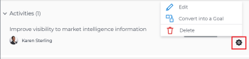

# Ergebnisse und Aktivitäten in Adobe Workfront-Zielen bearbeiten

Nachdem Ihnen Ihr Adobe Workfront-Administrator den richtigen Zugriff auf Adobe Workfront-Ziele gewährt hat, können Sie Ziele, Ergebnisse und Aktivitäten erstellen und bearbeiten.

Informationen zum Erstellen von Zielen, Ergebnissen und Aktivitäten finden Sie in den folgenden Artikeln:

* [Erstellen von Zielen in Adobe Workfront-Zielen](../../workfront-goals/goal-management/create-goals.md)
* [Erste Schritte mit Ergebnissen und Aktivitäten in Adobe Workfront-Zielen](../../workfront-goals/results-and-activities/get-started-with-results-and-activities.md)
* [Hinzufügen von Ergebnissen zu Zielen in Adobe Workfront-Zielen](../../workfront-goals/results-and-activities/add-results-to-goals.md)
* [Hinzufügen von Aktivitäten zu Zielen in Adobe Workfront-Zielen](../../workfront-goals/results-and-activities/add-activities-to-goals.md)

## Zugriffsanforderungen

<!--drafted for P&P release: replace the table below with this: 

<table style="table-layout:auto">
 <col>
 </col>
 <col>
 </col>
 <tbody>
  <tr>
   <td role="rowheader">Adobe Workfront plan*</td>
   <td>
   
Current plan: Select or higher

   Or
   
Legacy plan: Pro or higher

   
   </td>
  </tr>
  <tr>
   <td role="rowheader">Adobe Workfront license*</td>
   <td>
   
Current license: Contributor or higher

   Or
   
Legacy license: Request or higher
 
For more information, see <a href="../../administration-and-setup/add-users/access-levels-and-object-permissions/wf-licenses.md" class="MCXref xref">Adobe Workfront licenses overview</a>.
 </td>
  </tr>
  <tr>
   <td role="rowheader">Product</td>
   <td>
   
 Current product requirement: If you have the Select or Prime Adobe Workfront plan, you must also buy an additional Adobe Workfront Goals license.  Workfront Goals are included in the Ultimate Workfront Plan.

   Or
   
Legacy product requirement: You must purchase an additional license for the Adobe Workfront Goals to access functionality described in this article. 
 
For information, see <a href="../../workfront-goals/goal-management/access-needed-for-wf-goals.md" class="MCXref xref">Requirements to use Workfront Goals</a>. 
 </td>
  </tr>
  <tr>
   <td role="rowheader">Access level*</td>
   <td> 
Edit access to Goals
 
<b>NOTE</b>
If you still don't have access, ask your Workfront administrator if they set additional restrictions in your access level. For information on how a Workfront administrator can change your access level, see:

     <ul>
      <li> 
<a href="../../administration-and-setup/add-users/configure-and-grant-access/create-modify-access-levels.md" class="MCXref xref">Create or modify custom access levels</a> 
 </li>
      <li> 
<a href="../../administration-and-setup/add-users/configure-and-grant-access/grant-access-goals.md" class="MCXref xref">Grant access to Adobe Workfront Goals</a> 
 </li>
     </ul> 
 </td>
  </tr>
  <tr data-mc-conditions="">
   <td role="rowheader">Object permissions</td>
   <td>
    

     
View or higher permissions to the goal to view it

     
Manage permissions to the goal to edit it

     
For information about sharing goals, see <a href="../../workfront-goals/workfront-goals-settings/share-a-goal.md" class="MCXref xref">Share a goal in Workfront Goals</a>. 

    
 </td>
  </tr>
 </tbody>
</table>

-->
Sie müssen über Folgendes verfügen:

<table style="table-layout:auto"> 
 <col> 
 <col> 
 <tbody> 
  <tr> 
   <td role="rowheader">Adobe Workfront-Plan*</td> 
   <td> 
Pro oder höher
 </td> 
  </tr> 
  <tr> 
   <td role="rowheader">Adobe Workfront-Lizenz*</td> 
   <td> 
Anforderung oder höher
 
Weitere Informationen finden Sie unter <a href="../../administration-and-setup/add-users/access-levels-and-object-permissions/wf-licenses.md" class="MCXref xref">Übersicht über Adobe Workfront-Lizenzen</a>.
 </td> 
  </tr> 
  <tr> 
   <td role="rowheader">Produkt</td> 
   <td> 
Sie müssen eine zusätzliche Lizenz für die Adobe Workfront Goals erwerben, um auf die in diesem Artikel beschriebene Funktion zugreifen zu können. 
 
Weitere Informationen finden Sie unter <a href="../../workfront-goals/goal-management/access-needed-for-wf-goals.md" class="MCXref xref">Voraussetzungen für die Verwendung von Workfront-Zielen</a>. 
 </td> 
  </tr> 
  <tr> 
   <td role="rowheader">Konfigurationen auf Zugriffsebene*</td> 
   <td> 
Zugriff auf Ziele bearbeiten
 
<b>NOTIZ</b>

Wenn Sie immer noch keinen Zugriff haben, fragen Sie Ihren Workfront-Administrator, ob er zusätzliche Zugriffsbeschränkungen für Ihre Zugriffsebene festlegt. Informationen dazu, wie ein Workfront-Administrator Ihre Zugriffsstufe ändern kann, finden Sie unter:
 
     <ul> 
      <li> 
<a href="../../administration-and-setup/add-users/configure-and-grant-access/create-modify-access-levels.md" class="MCXref xref">Benutzerdefinierte Zugriffsebenen erstellen oder ändern</a> 
 </li> 
      <li> 
<a href="../../administration-and-setup/add-users/configure-and-grant-access/grant-access-goals.md" class="MCXref xref">Zugriff auf Adobe Workfront-Ziele gewähren</a> 
 </li> 
     </ul> 
 </td> 
  </tr> 
  <tr data-mc-conditions=""> 
   <td role="rowheader">Objektberechtigungen</td> 
   <td> 
    
 
     
Berechtigungen für das Ziel verwalten
 
     
Informationen zum Freigeben von Zielen finden Sie unter <a href="../../workfront-goals/workfront-goals-settings/share-a-goal.md" class="MCXref xref">Freigeben eines Ziels in Workfront-Zielen</a>. 
 
    
 </td> 
  </tr> 
 </tbody> 
</table>

*Wenden Sie sich an Ihren Workfront-Administrator, um zu erfahren, welchen Plan, welchen Lizenztyp oder welchen Zugriff Sie haben.

## Voraussetzungen

Sie müssen über Folgendes verfügen, bevor Sie beginnen können:

* Eine Layout-Vorlage, die den Bereich Ziele im Hauptmenü enthält.

## Überlegungen beim Bearbeiten von Ergebnissen und Aktivitäten

<!--
According to Vazgen, access levels will add more considerations.)
-->

* Sie können Ergebnisse und Aktivitäten bearbeiten, die zu von Ihnen erstellten Zielen oder Zielen gehören, für die Sie über die Berechtigung zum Verwalten verfügen.
* Sie können den Fortschritt von Projekten, die mit Zielen verknüpft sind, nicht als Aktivitäten aus Workfront-Zielen bearbeiten. Der Projektfortschritt wird aktualisiert, sobald die Aufgaben im Projekt abgeschlossen sind. Sie können Projekte aus dem Ziel entfernen, indem Sie sie trennen. Weitere Informationen finden Sie im Abschnitt &quot;Projekte trennen&quot;im Artikel [Entfernen von Ergebnissen, Aktivitäten und Projekten aus Zielen in Adobe Workfront Goals](../../workfront-goals/results-and-activities/remove-results-activities-from-goals.md).

   >[!NOTE]
   >
   >Wenn die folgenden Projektinformationen auf Projektebene aktualisiert werden, aktualisiert Workfront Goals sie automatisch auf der Zielebene:
   >
   >   
   >   
   >   * Projektbesitzer
   >   * Projektname
   >   * Abschluss des Projekts in Prozent

   >   
   >   
   >Informationen zum Verbinden von Projekten mit Zielen finden Sie unter [Hinzufügen von Projekten zu Zielen in Adobe Workfront-Zielen](../../workfront-goals/results-and-activities/connect-projects-to-goals-overview.md).

* Sie können Ergebnisse und Aktivitäten aus Zielen löschen, wenn sie für den Zielfortschritt nicht mehr relevant sind. Gelöschte Ergebnisse und Aktivitäten können nicht wiederhergestellt werden. Informationen zum Löschen von Ergebnissen und Aktivitäten finden Sie unter [Entfernen von Ergebnissen, Aktivitäten und Projekten aus Zielen in Adobe Workfront Goals](../../workfront-goals/results-and-activities/remove-results-activities-from-goals.md).
* Sie können Ergebnisse und Aktivitäten bearbeiten, die mit Zielen verknüpft sind - auch in der Vergangenheit.
* Bei der Bearbeitung von Ergebnissen und Aktivitäten werden deren Einstellungen aktualisiert und der Fortschritt nicht aktualisiert. Sie müssen den Fortschritt der Ergebnisse und Aktivitäten aktualisieren. Informationen zur Aktualisierung des Fortschritts bei Zielen, Ergebnissen und Aktivitäten finden Sie unter [Aktualisieren des Zielfortschritts in Adobe Workfront-Zielen](../../workfront-goals/goal-review-and-workfront-goals-sections/check-in-goals.md).

## Ergebnisse bearbeiten

<!--
Editing results differs depending on which environment you use.

### Edit results in the Production environment

1. Go to the goal for which you want to edit a result and click the goal name to open the **Goal Details** panel.
1. Click **Results**.
1. Click the **gear icon**  to the right of the result you want to edit.

   

1. Click **Edit** to edit the following information:

   | Field |Description|
   |---|---|
   | Name |The name of the result. |
   | Owner |The owner of result.  |
   | Value |How you measure the progress of the result. |
   | Initial |The original value of the result. |
   | Target |The desired value when the result is completed. |

1. Click **Save**.
-->

1. Klicken Sie auf **Hauptmenü** , dann **Ziele**.
1. Klicken Sie in der Zielliste auf den Namen eines Ziels, um die Zielseite zu öffnen.
1. Klicken **Fortschrittsanzeigen** im linken Bereich.
1. Wählen Sie in der Liste der Fortschrittsindikatoren ein Ergebnis aus und klicken Sie auf die Schaltfläche **Bearbeiten** icon .

   Das Feld &quot;Ergebnis bearbeiten&quot;wird geöffnet.

   

1. Bearbeiten Sie die folgenden Informationen:
   * **Ergebnisname**: Der Name des Ergebnisses. Verwenden Sie einen beschreibenden Namen, der zeigt, welches Ergebnis Sie benötigen, um das Ziel zu erreichen.
   * **Ergebniseigentümer**: Der Eigentümer des Ergebnisses. Der Inhaber muss ein aktiver Workfront-Benutzer sein.
   * **Werttyp**: Messen des Fortschritts des Ergebnisses.
   * **Anfangswert**: Der Originalwert des Ergebnisses.
   * **Zielwert**: Der gewünschte Wert, wenn das Ergebnis abgeschlossen ist.
Weitere Informationen zu Ergebnisfeldern finden Sie unter [Hinzufügen von Ergebnissen zu Zielen](../results-and-activities/add-results-to-goals.md).
1. Klicken Sie auf **Speichern**.

## Aktivitäten bearbeiten

<!--
Editing activities differs depending on which environment you use.

### Edit activities in the Production environment

>[!TIP]
>
>You cannot edit the Activity Type after you saved an activity on a goal.

1. Go to the goal for which you want to edit an activity and click the goal name to open the **Goal Details** panel.
1. Click **Activities**.
1. Click the **gear icon**  to the right of the activity you want to edit .

   

1. Click **Edit** to edit the following information:

   | Field |Description |
   |---|---|
   | Name |The name of the activity. |
   | Owner |The owner of activity.  |

1. Click **Save**.
-->

1. Klicken Sie auf **Hauptmenü** , dann **Ziele**.
1. Klicken Sie in der Zielliste auf den Namen eines Ziels, um die Zielseite zu öffnen.
1. Klicken **Fortschrittsanzeigen** im linken Bereich.
1. Wählen Sie eine Aktivität in der Liste der Fortschrittsindikatoren aus und klicken Sie auf die Schaltfläche **Bearbeiten** icon .

   Das Feld Aktivität bearbeiten wird geöffnet.

   

1. Bearbeiten Sie die folgenden Informationen:
   * **Aktivitätsname**: Der Name der Aktivität. Verwenden Sie einen beschreibenden Namen, der zeigt, welche Aktivität Sie durchführen sollten, um anzugeben, dass das Ziel abgeschlossen ist.
   * **Aktivitätsinhaber:** Der Eigentümer der Aktivität. Der Inhaber muss ein aktiver Workfront-Benutzer sein.\
      Weitere Informationen zu Aktivitätsfeldern finden Sie unter [Hinzufügen von Aktivitäten zu Zielen](../results-and-activities/add-activities-to-goals.md).
1. Klicken Sie auf **Speichern**.

