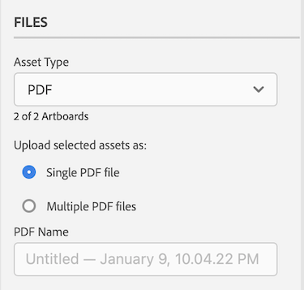
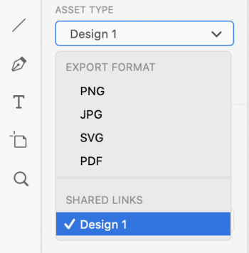

# Hochladen [!DNL XD] Zeichenflächen als Korrekturabzüge in [!DNL Workfront]

Sie können Ihre Zeichenflächen als Korrekturabzüge direkt in [!DNL Adobe Workfront] hochladen, um sie einer gründlichen Überprüfung und Genehmigung zu unterziehen.

## Zugriffsanforderungen

+++ Erweitern Sie , um die Zugriffsanforderungen für die -Funktion in diesem Artikel anzuzeigen.

Sie müssen über folgenden Zugriff verfügen, um die Schritte in diesem Artikel ausführen zu können:

<table style="table-layout:auto"> 
 <col> 
 <col> 
 <tbody> 
  <tr> 
   <td role="rowheader">[!DNL Adobe Workfront] Plan*</td> 
   <td> 
Aktueller Plan: [!UICONTROL Pro] oder höher
 
oder
 
Legacy-Plan: [!UICONTROL Premium]
 
Weitere Informationen zum Proofing-Zugriff für die verschiedenen Pläne finden Sie unter .
 </td> 
  </tr> 
  <tr> 
   <td role="rowheader">[!DNL Adobe Workfront] Lizenz*</td> 
   <td> 
Aktueller Plan: [!UICONTROL Work] oder [!UICONTROL Proof]
 
Legacy-Plan: Beliebig (Proofing muss für den Benutzer aktiviert sein)
 </td> 
  </tr> 
  <tr> 
   <td role="rowheader">Produkt</td> 
   <td>Sie müssen zusätzlich zu einer [!DNL Workfront] über eine [!DNL Adobe Creative Cloud]-Lizenz verfügen.</td> 
  </tr> 
  <tr> 
   <td role="rowheader">Proof-Berechtigungsprofil </td> 
   <td>[!UICONTROL Manager] oder höher</td> 
  </tr> 
  <tr> 
   <td role="rowheader">Objektberechtigungen</td> 
   <td> 
Zugriff auf [!UICONTROL-Dokumente] bearbeiten
 
Informationen zum Anfordern zusätzlicher Zugriffsberechtigungen finden Sie unter <a href="../../workfront-basics/grant-and-request-access-to-objects/request-access.md" class="MCXref xref">Anfordern von Zugriffsberechtigungen für Objekte </a>.
 </td> 
  </tr> 
 </tbody> 
</table>

&#42;Um herauszufinden, über welchen Plan, welche Rolle oder welches Profil für Korrekturabzugsberechtigungen Sie verfügen, wenden Sie sich an Ihren [!DNL Workfront] oder [!DNL Workfront Proof].

+++

## Voraussetzungen

* Sie müssen das [!DNL Adobe Workfront for XD]-Plug-in installieren, bevor Sie Korrekturabzüge in [!DNL Adobe XD] hochladen können.

  Anweisungen finden Sie unter [Installieren [!DNL Adobe Workfront for XD]](/help/quicksilver/workfront-integrations-and-apps/adobe-workfront-for-creative-cloud/wf-adobe-xd-install.md).

## Hochladen eines statischen Korrekturabzugs

1. Klicken Sie **[!UICONTROL oben rechts auf]** Menü“ und wählen Sie dann **[!UICONTROL Arbeitsliste]** aus. Sie können auch das Menü verwenden, um zu übergeordneten Objekten zu navigieren.

   

1. Wechseln Sie zu dem Arbeitselement, in das Sie einen statischen Korrekturabzug hochladen möchten.
1. Klicken Sie auf **[!UICONTROL Symbol]** Dokument in der Navigationsleiste.

1. Klicken Sie **[!UICONTROL Neue Datei]** unten im Plug-in.
1. Wählen Sie die Zeichenflächen aus, die Sie hochladen möchten.

   >[!TIP]
   >
   >* Zeichenflächen werden im Korrekturabzug in der Reihenfolge angezeigt, in der sie ausgewählt wurden. Die erste ausgewählte Zeichenfläche ist die erste Seite im Korrekturabzug usw.
   >* Um schnell mehrere Zeichenflächen auszuwählen, klicken Sie auf die gewünschten Zeichenflächen und ziehen Sie die Maus über diese. Auf diese Weise können Sie die Reihenfolge der Zeichenflächen im Korrekturabzug nicht steuern.

1. Aktivieren Sie **[!UICONTROL Korrekturabzug erstellen]**.

1. Benennen Sie den Korrekturabzug.

1. Wählen Sie den gewünschten Typ der Korrekturabzugsgenehmigung aus:

   <table style="table-layout:auto"> 
    <col> 
    <col> 
    <tbody> 
     <tr> 
      <td role="rowheader">[!UICONTROL Basic]: </td> 
      <td> 
Grundlegende Genehmigungsprozesse sind Ad-hoc-Prozesse und können bei Bedarf verschiedene Validierungsverantwortliche enthalten: 
 
       <ul> 
        <li> 
(Optional) Fügen Sie <strong>Genehmigende Personen</strong> in das Feld ein.
 </li> 
       </ul> </td> 
     </tr> 
     <tr> 
      <td role="rowheader">[!UICONTROL Automated]</td> 
      <td> 
Automatisierte Genehmigungsprozesse werden von Administratoren vorkonfiguriert und umfassen spezifische Validierungsverantwortliche und Phasen. Weitere Informationen finden Sie unter <a href="../../review-and-approve-work/proofing/proofing-overview/automated-workflow.md" class="MCXref xref">Automatisierter Workflow - Übersicht</a>.
 
       <ul> 
        <li> 
Wählen Sie aus dem Dropdown-Menü eine [!UICONTROL Workflow Template] aus.
 </li> 
       </ul> </td> 
     </tr> 
    </tbody> 
   </table>

{{adjust-proof-settings}}

1. (Optional) Geben Sie einen Kommentar im Bereich **[!UICONTROL Aktualisierungen]** ein.

   

1. Wählen Sie im Dropdown-Menü **[!UICONTROL Asset-Typ]** das Exportformat aus.

1. (Optional) Wenn Sie PDF als Asset-Typ auswählen und mehr als ein Zeichenblatt ausgewählt haben, wählen Sie aus, ob Sie Ihre Zeichenblätter als **[!UICONTROL Einzelne PDF-]** oder **M[!UICONTROL mehrere PDF-Dateien exportieren]**.

1. (Optional) Benennen Sie die PDF.

   

1. Klicken Sie **[!UICONTROL Hochladen]**.\
   Das Dokument wird im Bereich [!UICONTROL Dokumente] im Plug-in und im Desktop-Programm angezeigt.

## Hochladen eines interaktiven Korrekturabzugs {#upload-an-interactive-proof}

Mit dem Plug-in [!DNL Workfront for Adobe] können Sie einen interaktiven Korrekturabzug für Ihre Zeichenflächen erstellen. Es handelt sich um einen zweistufigen Prozess. Zunächst müssen Sie einen interaktiven Link erstellen und dann den Korrekturabzug in ein Arbeitselement hochladen.

### Erstellen eines interaktiven Links für Ihre Zeichenfläche  {#create-an-interactive-link-for-your-art-board}

1. Öffnen Sie Ihre Zeichenfläche und klicken Sie **[!UICONTROL oben]** auf dem Bildschirm auf „Freigeben“.
1. Geben Sie die Link-Einstellungen an:

   1. Benennen Sie den Link.
   1. Ansichtseinstellung wählen.
   1. Stellen Sie im Abschnitt **[!UICONTROL Link-Zugriff]** sicher, **[!UICONTROL Alle mit diesem Link]** ausgewählt ist.

      Sie müssen diese Art des Zugriffs aktivieren, um einen interaktiven Korrekturabzug zu generieren.

   1. Klicken Sie **[!UICONTROL Link erstellen]**.

1. Klicken Sie oben links **[!UICONTROL Bildschirm auf Zurück]** Design“. Fahren Sie mit dem Abschnitt [Hochladen eines interaktiven Korrekturabzugs](#upload-an-interactive-proof) unten fort.

   >[!NOTE]
   >
   >Möglicherweise müssen Sie das Plug-in-Bedienfeld in der linken unteren Ecke des Bildschirms erneut öffnen.

### Hochladen eines interaktiven Korrekturabzugs

1. Klicken Sie **[!UICONTROL oben rechts auf]** Menü“ und wählen Sie dann **[!UICONTROL Arbeitsliste]** aus. Sie können auch das Menü verwenden, um zu übergeordneten Objekten zu navigieren.

   

1. Wechseln Sie zu dem Arbeitselement, in das Sie einen interaktiven Korrekturabzug hochladen möchten.
1. Klicken Sie auf **[!UICONTROL Symbol]** Dokument in der Navigationsleiste.

1. Klicken Sie **[!UICONTROL Neue Datei]** unten im Plug-in.
1. Aktivieren Sie **[!UICONTROL Korrekturabzug erstellen]**.

1. Wählen Sie den gewünschten Typ der Korrekturabzugsgenehmigung aus:

   <table style="table-layout:auto"> 
    <col> 
    <col> 
    <tbody> 
     <tr> 
      <td role="rowheader">[!UICONTROL Basic]: </td> 
      <td> 
Grundlegende Genehmigungsprozesse sind Ad-hoc-Prozesse und können bei Bedarf verschiedene Validierungsverantwortliche enthalten: 
 
       <ul> 
        <li> 
(Optional) Fügen Sie <strong>Genehmigende Personen</strong> in das Feld ein.
 </li> 
       </ul> </td> 
     </tr> 
     <tr> 
      <td role="rowheader">[!UICONTROL Automated]</td> 
      <td> 
Automatisierte Genehmigungsprozesse werden von Administratoren vorkonfiguriert und umfassen spezifische Validierungsverantwortliche und Phasen. Weitere Informationen finden Sie unter <a href="../../review-and-approve-work/proofing/proofing-overview/automated-workflow.md" class="MCXref xref">Automatisierter Workflow - Übersicht</a>.
 
       <ul> 
        <li> 
Wählen Sie aus dem Dropdown-Menü eine [!UICONTROL Workflow Template] aus.
 </li> 
       </ul> </td> 
     </tr> 
    </tbody> 
   </table>

{{adjust-proof-settings}}

1. (Optional) Geben Sie einen Kommentar im Bereich **[!UICONTROL Aktualisierungen]** ein.

   

1. Wählen Sie **[!UICONTROL Dropdown-Menü]** Asset-Typ“ den soeben erstellten Link auf der Registerkarte **Freigegebene Links** aus. Weitere Informationen finden Sie unter [Erstellen eines interaktiven Links für Ihre Zeichenfläche](#create-an-interactive-link-for-your-artboard).\
   

1. Klicken Sie **[!UICONTROL Hochladen]**.

   Das Dokument wird im Bereich [!UICONTROL Dokumente] im Plug-in und im Desktop-Programm angezeigt.

   >[!IMPORTANT]
   >
   >Benutzer müssen Zugriff auf den [!UICONTROL Desktop Proofing Viewer] haben, um interaktive Korrekturabzüge überprüfen und genehmigen zu können. Weitere Informationen finden Sie unter [Installieren des [!UICONTROL Desktop Proofing Viewers]](../../review-and-approve-work/proofing/use-the-desktop-proofing-viewer/installing-desktop-proofing-viewer.md).

## Hochladen einer neuen Korrekturabzugsversion

Sie können eine neue Version eines Korrekturabzugs hochladen. Das Plug-in speichert den Korrekturabzugs-Workflow, der für die vorherige Version festgelegt wurde. Sie können dies jedoch bei Bedarf ändern.

1. Klicken Sie **[!UICONTROL oben rechts auf]** Menü“ und wählen Sie dann **[!UICONTROL Arbeitsliste]** aus. Sie können auch das Menü verwenden, um zu übergeordneten Objekten zu navigieren.

   

1. Wechseln Sie zu dem Arbeitselement, auf das Sie ein Dokument hochladen möchten.
1. Klicken Sie auf **[!UICONTROL Symbol]** Dokument in der Navigationsleiste.

1. Klicken Sie **[!UICONTROL Neue Version]** am unteren Rand des Plug-ins.
1. Aktivieren Sie **[!UICONTROL Korrekturabzug erstellen]**.
1. Wählen Sie die Zeichenflächen aus, die Sie hochladen möchten.

   >[!NOTE]
   >
   >Wenn Sie eine neue Version einer SVG-, PNG- oder JPG-Datei hochladen möchten, können Sie nur eine Zeichenfläche hochladen.

1. Wählen Sie den gewünschten Typ der Korrekturabzugsgenehmigung aus:

   <table style="table-layout:auto"> 
    <col> 
    <col> 
    <tbody> 
     <tr> 
      <td role="rowheader">[!UICONTROL Basic]: </td> 
      <td> 
Grundlegende Genehmigungsprozesse sind Ad-hoc-Prozesse und können bei Bedarf verschiedene Validierungsverantwortliche enthalten: 
 
       <ul> 
        <li> 
(Optional) Fügen Sie <strong>Genehmigende Personen</strong> in das Feld ein.
 </li> 
       </ul> </td> 
     </tr> 
     <tr> 
      <td role="rowheader">[!UICONTROL Automated]</td> 
      <td> 
Automatisierte Genehmigungsprozesse werden von Administratoren vorkonfiguriert und umfassen spezifische Validierungsverantwortliche und Phasen. Weitere Informationen finden Sie unter <a href="../../review-and-approve-work/proofing/proofing-overview/automated-workflow.md" class="MCXref xref">Automatisierter Workflow - Übersicht</a>.
 
       <ul> 
        <li> 
Wählen Sie aus dem Dropdown-Menü eine [!UICONTROL Workflow Template] aus.
 </li> 
       </ul> </td> 
     </tr> 
    </tbody> 
   </table>

{{adjust-proof-settings}}

1. Wählen Sie im Dropdown-Menü **[!UICONTROL Asset-Typ]** das Exportformat aus.

   

1. (Optional) Geben Sie einen Kommentar im Bereich **[!UICONTROL Aktualisierungen]** ein.

   

1. (Optional) Wenn Sie PDF als Asset-Typ auswählen und mehr als ein Zeichenblatt ausgewählt haben, wählen Sie aus, ob Sie Ihre Zeichenblätter als **[!UICONTROL Einzelne PDF-]** oder **M[!UICONTROL mehrere PDF-Dateien exportieren]**.

1. (Optional) Benennen Sie die PDF.

   

1. Klicken Sie **[!UICONTROL Hochladen]**.\
   Das Dokument wird im Bereich [!UICONTROL Dokumente] im Plug-in und im Desktop-Programm angezeigt.
