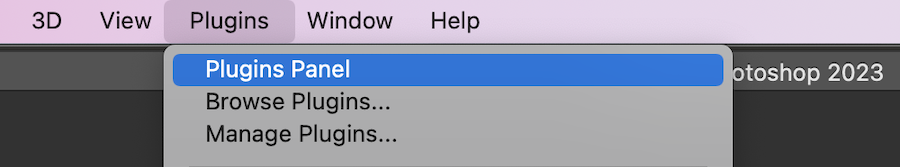

# Installieren und Öffnen von [!DNL Adobe Workfront for Photoshop]

Sie können das [!DNL Adobe Workfront for Photoshop]-Plug-in über die [!DNL Adobe Marketplace] installieren. Das Plug-in unterstützt die folgenden Sprachen:

* Englisch
* Französisch
* Deutsch
* Italienisch
* Spanisch
* Portugiesisch
* Japanisch
* Vereinfachtes Chinesisch
* Traditionelles Chinesisch
* Koreanisch

## Zugriffsanforderungen

+++ Erweitern Sie , um die Zugriffsanforderungen für die -Funktion in diesem Artikel anzuzeigen.

<table style="table-layout:auto"> 
 <col> 
 <col> 
 <tbody> 
  <tr> 
   <td role="rowheader">Zusätzliche Produkte</td> 
   <td>
Sie müssen zusätzlich zu einer [!DNL Adobe Creative Cloud] über eine [!DNL Workfront]-Lizenz verfügen.
</td> 
  </tr> 
 </tbody> 
</table>

Weitere Informationen finden Sie unter [Zugriffsanforderungen in der Dokumentation zu Workfront](/help/quicksilver/administration-and-setup/add-users/access-levels-and-object-permissions/access-level-requirements-in-documentation.md).

+++

## Voraussetzungen

* Sie müssen die [!DNL Adobe Photoshop] App installieren, bevor Sie das [!DNL Workfront] Plug-in installieren.

## Installieren des [!DNL Adobe Workfront for Photoshop]-Plug-ins für Ihr Unternehmen

Wenn Sie [!DNL Adobe Admin Console] sind, können Sie das Plug-in in [!DNL Creative Cloud] Bereitstellungspakete aufnehmen. Weitere Informationen finden Sie unter [Einbeziehen von Plug-ins in Ihr Paket](https://helpx.adobe.com/in/enterprise/using/manage-extensions.html).

[Sehen Sie sich hier eine Videoanleitung an](https://www.youtube.com/watch?v=zzvXNLIBzrc){target=_blank}.

[!DNL Adobe Admin Console]-Administratoren können auch Pakete erstellen, die nur Plug-ins enthalten, um sie an Benutzer zu verteilen. Weitere Informationen finden Sie unter [Erstellen von [!UICONTROL [!DNL Adobe Workfront] for [!DNL Creative Cloud]] packages für Ihre Benutzerinnen und Benutzer in der [!DNL Adobe Admin Console]](/help/quicksilver/administration-and-setup/configure-integrations/create-plugin-only-packages.md)

## [!DNL Adobe Workfront for Photoshop] Plug-in einzeln installieren

Sie können das [!DNL Adobe Workfront for Photoshop]-Plug-in über die [!DNL Adobe Exchange] selbst installieren.

1. Navigieren Sie zur [Adobe Workfront für Photoshop-](https://adobe.com/go/cc_plugins_discover_plugin?pluginId=37722a55&workflow=share) auf der Adobe Exchange.
1. Klicken Sie im angezeigten Dialogfeld auf **[!DNL Adobe Creative Cloud] Desktop-Programm öffnen**.
1. Sobald [!DNL Adobe Photoshop] Plug-in-Manager geöffnet ist, klicken Sie auf **[!UICONTROL Installieren]**.
1. Lesen Sie die Informationen im Dialogfeld und klicken Sie dann auf **[!UICONTROL OK]**.

1. Im folgenden Abschnitt finden Sie Informationen zum Öffnen des Plug-ins.

## [!DNL Adobe Workfront for Photoshop] öffnen

1. Öffnen Sie [!DNL Photoshop].

1. Erstellen Sie eine neue Datei oder öffnen Sie eine vorhandene.

1. Klicken Sie im oberen Menü auf **[!UICONTROL Plug-ins]** > **[!UICONTROL Plug-ins-Bedienfeld]**.

   

1. Wählen Sie im **[!UICONTROL Plug-ins]** Bedienfeld die Registerkarte **[!UICONTROL Plug-ins]** und suchen Sie nach **[!UICONTROL Workfront für Adobe Photoshop]**.

   >[!TIP]
   >
   >   Wenn das Plug-in nach dem Öffnen über das [!UICONTROL Plug-ins-Bedienfeld] nicht angezeigt wird, befindet es sich möglicherweise hinter der Photoshop-App. Versuchen Sie, die Photoshop zu minimieren, um das Plug-in zu finden.

1. Fahren Sie mit dem folgenden Abschnitt fort, um Informationen zur Anmeldung beim Plug-in zu erhalten.

## Anmelden bei [!DNL Adobe Workfront for Photoshop]

1. Wählen Sie **[!UICONTROL Menü]** Plug-ins“ im oberen Bereich des Bildschirms **[!UICONTROL Plug-in-Bedienfeld]**.
1. Wählen Sie **[!DNL Adobe Workfront for Photoshop]** aus.
1. Geben Sie Ihre Domain ein und klicken Sie dann auf **[!UICONTROL Anmelden]**. Eine Browser-Seite wird geöffnet. Möglicherweise müssen Sie Photoshop die Berechtigung zum Öffnen des Browsers erteilen.

   >[!TIP]
   >
   >* Öffnen Sie einen Browser, navigieren Sie zu Ihrer [!DNL Workfront] und kopieren Sie den ersten Teil der URL, um Ihre Domain zu finden:\
   >
   >
   >* Wenn Ihre Workfront-Instanz mit Experience Cloud integriert ist, bitten Sie Ihren Administrator, Ihnen die Workfront-Domain bereitzustellen, die Sie unter Produkt > Workfront in der Admin Console finden.

1. Geben Sie im Browser Ihre [!DNL Workfront] ein und klicken Sie dann auf **[!UICONTROL Anmelden]**. Wenn Ihr Unternehmen Single Sign-on (SSO) verwendet, werden Sie zur Anmeldeseite Ihres SSO-Anbieters weitergeleitet.

   >[!NOTE]
   >
   >Wenn Sie sich kürzlich angemeldet haben, werden Sie möglicherweise nicht zur Eingabe Ihrer [!DNL Workfront]-Anmeldedaten aufgefordert.

   Befolgen Sie die Anweisungen, um sich bei [!DNL Workfront] anzumelden.

   >[!NOTE]
   >
   >* [!DNL Workfront] stellt mithilfe von OAuth 2.0 eine Verbindung zu [!DNL Adobe Creative Cloud] her, einem sicheren Standard, der von den meisten Web-basierten Integrationen für die Authentifizierung und Autorisierung von Benutzern verwendet wird.
   >* Wenn Sie aufgefordert werden, die [Domain oder den Host] Ihres [!DNL Workfront] Kontos einzugeben, geben Sie sie in folgendem Format ein: *yourCompany&#39;sDomain.my.workfront.com*. Die Domain Ihres Unternehmens ist normalerweise der Name Ihres Unternehmens.

1. Klicken Sie **[!UICONTROL Zugriff zulassen]**, um die Anmeldung abzuschließen.
1. Kehren Sie zu [!UICONTROL Adobe Photoshop] zurück, um Ihre Arbeit anzuzeigen.
