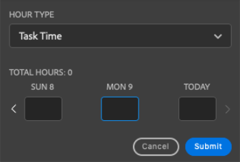

# Zeit mit dem [!DNL Adobe Workfront]-Plug-in erfassen

Sie können Zeit für Projekte, Aufgaben und Probleme, an denen Sie arbeiten, direkt in einer der folgenden [!DNL Adobe Creative Cloud]-Anwendungen protokollieren:

{{cc-app-list}}

## Zugriffsanforderungen

+++ Erweitern Sie , um die Zugriffsanforderungen für die -Funktion in diesem Artikel anzuzeigen.

Sie müssen über folgenden Zugriff verfügen, um die Schritte in diesem Artikel ausführen zu können:

<table style="table-layout:auto"> 
 <col> 
 <col> 
 <tbody> 
  <tr> 
   <!--<td role="rowheader">[!DNL Adobe Workfront] plan*</td> 
   <td> 
[!UICONTROL Pro] or higher
 </td> 
  </tr> 
  <tr data-mc-conditions=""> 
   <td role="rowheader">[!DNL Adobe Workfront] license*</td> 
   <td> 
[!UICONTROL Work] or [!UICONTROL Plan]
 </td> 
  </tr> 
  <tr> 
   <td role="rowheader">Product</td> 
   <td>You must have an [!DNL Adobe Creative Cloud] license in addition to a [!DNL Workfront] license.</td> 
  </tr> -->
  <tr> 
   <td role="rowheader">Konfigurationen der Zugriffsebene*</td> 
   <td> 
[!UICONTROL Bearbeiten] Zugriff auf Aufgaben oder Probleme
 
Hinweis: Wenn Sie immer noch keinen Zugriff haben, fragen Sie Ihren [!DNL Workfront], ob er zusätzliche Einschränkungen in Ihrer Zugriffsebene festgelegt hat. Informationen dazu, wie [!DNL Workfront]-Admins Ihre Zugriffsebene ändern können, finden Sie unter <a href="../../administration-and-setup/add-users/configure-and-grant-access/create-modify-access-levels.md" class="MCXref xref">Erstellen oder Ändern benutzerdefinierter Zugriffsebenen</a>.
 </td> 
  </tr> 
  <tr> 
   <td role="rowheader">Objektberechtigungen</td> 
   <td> 
Berechtigung [!UICONTROL Stunden protokollieren] für die Aufgabe oder das Problem
 
Informationen zum Anfordern zusätzlicher Zugriffsberechtigungen finden Sie unter <a href="../../workfront-basics/grant-and-request-access-to-objects/request-access.md" class="MCXref xref">Anfordern von Zugriffsberechtigungen für Objekte </a>.
 </td> 
  </tr> 
 </tbody> 
</table>

&#42;Wenden Sie sich an Ihren [!DNL Workfront], um herauszufinden, über welchen Plan, welchen Lizenztyp oder welchen Zugriff Sie verfügen.

+++

## Voraussetzungen

{{cc-install-prereq}}

## Zeit mit dem Adobe Workfront-Plug-in erfassen

Der [!DNL Workfront] legt fest, welche projektspezifischen Stundentypen verfügbar sind, wie in [Verwalten von Stundentypen](../../administration-and-setup/set-up-workfront/configure-timesheets-schedules/hour-types.md) beschrieben.

So protokollieren Sie die Zeit mit dem Workfront-Plug-in:

1. Klicken Sie **[!UICONTROL oben rechts auf]** Menü“ und wählen Sie dann **[!UICONTROL Arbeitsliste]** aus. Sie können auch das Menü verwenden, um zu übergeordneten Objekten zu navigieren.

   

1. Wählen Sie in **[!UICONTROL Arbeitsliste]** das Arbeitselement aus, zu dem Sie die Zeit protokollieren möchten.
1. Klicken Sie **[!UICONTROL der]** auf „Zeit“.

   

1. (Optional) Wählen Sie **[!UICONTROL Stundentyp]** aus dem Dropdown-Menü aus.
1. Geben Sie die Zeit in Stunden für den gewünschten Tag ein.

   

1. Klicken Sie **[!UICONTROL Senden]**.
