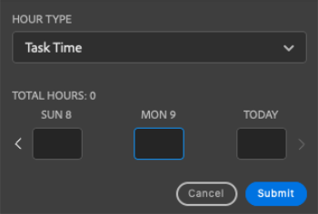

# Zeit mit dem [!DNL Adobe Workfront]-Plug-in erfassen

Sie können Zeit für Projekte, Aufgaben und Probleme, an denen Sie arbeiten, direkt in einer der folgenden [!DNL Adobe Creative Cloud]-Anwendungen protokollieren:

{{cc-app-list}}

## Zugriffsanforderungen

+++ Erweitern, um die Zugriffsanforderungen für die in diesem Artikel beschriebene Funktionalität anzuzeigen.

<table style="table-layout:auto"> 
 <col> 
 <col> 
 <tbody> 
  <tr> 
  <!--
   <td role="rowheader">[!DNL Adobe Workfront] package</td> 
   <td> Any</td> 
  </tr> 
  <tr data-mc-conditions=""> 
   <td role="rowheader">[!DNL Adobe Workfront] license</td> 
   <td>
   
Standard

    
Work or higher
 </td> 
  </tr>
  -->
  <tr> 
   <td role="rowheader">Zusätzliche Produkte</td> 
   <td>Sie müssen zusätzlich zu einer [!DNL Workfront] über eine [!DNL Adobe Creative Cloud]-Lizenz verfügen.</td> 
  </tr> 
  <tr> 
   <td role="rowheader">Konfigurationen der Zugriffsebene</td> 
   <td> 
[!UICONTROL Bearbeiten] Zugriff auf Aufgaben oder Probleme
</td> 
  </tr> 
  <tr> 
   <td role="rowheader">Objektberechtigungen</td> 
   <td> 
Berechtigung [!UICONTROL Stunden protokollieren] für die Aufgabe oder das Problem
 </td> 
  </tr> 
 </tbody> 
</table>

Weitere Informationen finden Sie unter [Zugriffsanforderungen](/help/quicksilver/administration-and-setup/add-users/access-levels-and-object-permissions/access-level-requirements-in-documentation.md) in der Dokumentation zu Workfront.

+++

## Voraussetzungen

{{cc-install-prereq}}

## Erfassen der Zeit mit dem Adobe Workfront-Plug-in

Der [!DNL Workfront] legt fest, welche projektspezifischen Stundentypen verfügbar sind, wie in [Verwalten von Stundentypen](../../administration-and-setup/set-up-workfront/configure-timesheets-schedules/hour-types.md) beschrieben.

So protokollieren Sie die Zeit mit dem Workfront-Plug-in:

1. Klicken Sie **[!UICONTROL oben rechts auf]** Menü“ und wählen Sie dann **[!UICONTROL Arbeitsliste]** aus. Sie können auch das Menü verwenden, um zu übergeordneten Objekten zu navigieren.

   

1. Wählen Sie in **[!UICONTROL Arbeitsliste]** das Arbeitselement aus, zu dem Sie die Zeit protokollieren möchten.
1. Klicken Sie **[!UICONTROL der]** auf „Zeit“.

   

1. (Optional) Wählen Sie **[!UICONTROL Stundentyp]** aus dem Dropdown-Menü aus.
1. Geben Sie die Zeit in Stunden für den gewünschten Tag ein.

   

1. Klicken Sie auf **[!UICONTROL Senden]**.
