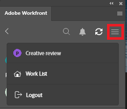

# Hochladen von Testsendungen aus [!DNL Photoshop]

Sie können bestimmte Photoshop-Dokumentvorgabentypen als Korrekturabzüge direkt in [!DNL Adobe Workfront] hochladen, um sie gründlich zu überprüfen und zu genehmigen.

>[!IMPORTANT]
>
>Bei der Datei muss es sich um eine Fotodokumentvorgabe handeln, wie unter [Vorlagen und Vorgaben in Photoshop](https://helpx.adobe.com/de/photoshop/using/create-documents.html) beschrieben.

## Zugriffsanforderungen

+++ Erweitern Sie , um die Zugriffsanforderungen für die -Funktion in diesem Artikel anzuzeigen.

Sie müssen über folgenden Zugriff verfügen, um die Schritte in diesem Artikel ausführen zu können:

<table style="table-layout:auto"> 
 <col> 
 <col> 
 <tbody> 
  <tr> 
   <td role="rowheader">[!DNL Adobe Workfront] Plan*</td> 
   <td> 
Aktueller Plan: [!UICONTROL Pro] oder höher
 
oder
 
Legacy-Plan: [!UICONTROL Premium]
 
Weitere Informationen zum Proofing-Zugriff für die verschiedenen Pläne finden Sie unter .
 </td> 
  </tr> 
  <tr> 
   <td role="rowheader">[!DNL Adobe Workfront] Lizenz*</td> 
   <td> 
Aktueller Plan: [!UICONTROL Work] oder [!UICONTROL Proof]
 
Legacy-Plan: Beliebig (Proofing muss für den Benutzer aktiviert sein)
 </td> 
  </tr> 
  <tr> 
   <td role="rowheader">Produkt</td> 
   <td>Sie müssen zusätzlich zu einer [!DNL Workfront] über eine [!DNL Adobe Creative Cloud]-Lizenz verfügen.</td> 
  </tr> 
  <tr> 
   <td role="rowheader">Proof-Berechtigungsprofil </td> 
   <td>[!UICONTROL Manager] oder höher</td> 
  </tr> 
  <tr> 
   <td role="rowheader">Objektberechtigungen</td> 
   <td> 
Zugriff auf [!UICONTROL -Dokumente] bearbeiten
 
Weitere Informationen zum Anfordern von Zugriff finden Sie unter <a href="../../workfront-basics/grant-and-request-access-to-objects/request-access.md" class="MCXref xref">Anfordern von Zugriff auf Objekte</a>.
 </td> 
  </tr> 
 </tbody> 
</table>

&#42;Wenden Sie sich an Ihren Workfront- oder Workfront Proof-Administrator, um herauszufinden, über welchen Plan, welche Rolle oder welches Proof-Berechtigungsprofil Sie verfügen.

+++

## Voraussetzungen

* Sie müssen [!DNL Adobe Workfront for Photoshop] installieren, bevor Sie Korrekturabzüge von [!DNL Adobe Photoshop] hochladen können.

  Anweisungen finden Sie unter [Installieren [!DNL Adobe Workfront for Photoshop]](../../workfront-integrations-and-apps/adobe-workfront-for-creative-cloud/wf-cc-install-ps.md).

## Hochladen eines einfachen Korrekturabzugs

1. Klicken Sie **[!UICONTROL oben rechts auf]** Menü“ und wählen Sie dann **[!UICONTROL Arbeitsliste]** aus. Sie können auch das Menü verwenden, um zu übergeordneten Objekten zu navigieren.

   

1. Wechseln Sie zu dem Arbeitselement, in das Sie einen Korrekturabzug hochladen möchten.
1. Klicken Sie auf das **[!UICONTROL Dokument]**-Symbol  in der Navigationsleiste.
1. Klicken Sie **[!UICONTROL Neue Datei]** am unteren Rand des [!DNL Workfront] Bedienfelds.
1. Aktivieren Sie den **[!UICONTROL Korrekturabzug erstellen]**.
1. (Optional) Geben Sie einen Namen für den Korrekturabzug in das Textfeld **[!UICONTROL Korrekturabzugsname]** ein.
1. Wählen Sie im **[!UICONTROL Korrekturabzugsgenehmigungen]** die Option **[!UICONTROL Standard]** aus.
1. (Optional) Fügen Sie genehmigende Personen hinzu.
1. (Optional) Geben Sie einen Kommentar im Bereich **[!UICONTROL Aktualisierungen]** ein.

   

1. Wählen Sie **[!UICONTROL Asset-Typ]** aus dem Dropdown-Menü aus.

1. (Optional) Wählen Sie **[!UICONTROL Externe Datei hinzufügen]**, um eine Datei von Ihrem Computer hinzuzufügen.
1. Klicken Sie **[!UICONTROL Hochladen]** und konfigurieren Sie dann alle gewünschten Exportoptionen basierend auf dem oben ausgewählten Asset-Typ.

   \
   Das Dokument wird im Bereich [!UICONTROL Dokumente] im [!DNL Workfront] in [!DNL Photoshop] und im [!DNL Workfront]-Desktop-Programm angezeigt.

## Hochladen eines automatisierten Korrekturabzugs

1. Klicken Sie **[!UICONTROL oben rechts auf]** Menü“ und wählen Sie dann **[!UICONTROL Arbeitsliste]** aus. Sie können auch das Menü verwenden, um zu übergeordneten Objekten zu navigieren.

   

1. Wechseln Sie zu dem Arbeitselement, in das Sie einen Korrekturabzug hochladen möchten.
1. Klicken Sie auf das **[!UICONTROL Dokument]**-Symbol  in der Navigationsleiste.

1. Klicken Sie **[!UICONTROL Neue Datei]** am unteren Rand des [!DNL Workfront] Bedienfelds.
1. Aktivieren Sie den **[!UICONTROL Korrekturabzug erstellen]**.
1. (Optional) Geben Sie einen Namen für den Korrekturabzug in das Textfeld **[!UICONTROL Korrekturabzugsname]** ein.
1. Wählen Sie im **[!UICONTROL Korrekturabzugsgenehmigungen]** die Option **[!UICONTROL Automated]** aus.
1. (Optional) Geben Sie in das Feld **[!UICONTROL Workflow]** Vorlage) den Namen einer Workflow-Vorlage für Korrekturabzüge ein.

{{adjust-proof-settings}}

>[!NOTE]
>
> Wenn die Workflow-Vorlage leere Pflichtfelder enthält, werden die Einstellungen für automatisierte Korrekturabzüge automatisch geöffnet. Diese Felder müssen ausgefüllt werden, damit der Korrekturabzug hochgeladen werden kann.

1. (Optional) Geben Sie einen Kommentar im Bereich **[!UICONTROL Aktualisierungen]** ein.

   

1. Wählen Sie **[!UICONTROL Asset-Typ]** aus dem Dropdown-Menü aus.
1. (Optional) Wählen Sie **[!UICONTROL Externe Datei hinzufügen]**, um eine Datei von Ihrem Computer hinzuzufügen.
1. Klicken Sie **[!UICONTROL Hochladen]** und konfigurieren Sie dann alle gewünschten Exportoptionen basierend auf dem oben ausgewählten Asset-Typ.
Das Dokument wird im Bereich [!UICONTROL Dokumente] im [!DNL Workfront] in [!DNL Photoshop] und im [!DNL Workfront]-Desktop-Programm angezeigt.

## Hochladen einer neuen Korrekturabzugsversion

Sie können eine neue Version eines Korrekturabzugs hochladen. Das Plug-in speichert den Korrekturabzugs-Workflow, der für die vorherige Version festgelegt wurde. Sie können dies jedoch bei Bedarf ändern.

1. Klicken Sie **[!UICONTROL oben rechts auf]** Menü“ und wählen Sie dann **[!UICONTROL Arbeitsliste]** aus. Sie können auch das Menü verwenden, um zu übergeordneten Objekten zu navigieren.

   

1. Wechseln Sie zu dem Arbeitselement, auf das Sie ein Dokument hochladen möchten.
1. Klicken Sie auf das **[!UICONTROL Dokument]**-Symbol  in der Navigationsleiste.

1. Klicken Sie **[!UICONTROL Neue Version]** am unteren Rand des [!DNL Workfront] Bedienfelds.
1. Aktivieren Sie den **[!UICONTROL Korrekturabzug erstellen]**.

1. Wählen Sie im Abschnitt *[!UICONTROL *Korrekturabzugsgenehmigungen]* die Option **[!UICONTROL Standard]** oder **[!UICONTROL Automated]**.

1. Fügen Sie **[!UICONTROL Prüfer]** oder eine **[!UICONTROL Workflow-Vorlage]** basierend auf dem in Schritt 7 ausgewählten Validierungstyp hinzu.

1. (Optional) Geben Sie einen Kommentar im Bereich **[!UICONTROL Aktualisierungen]** ein.
1. Wählen Sie **[!UICONTROL Asset-Typ]** aus dem Dropdown-Menü aus.
1. Klicken Sie **[!UICONTROL Hochladen]** und konfigurieren Sie dann alle gewünschten Exportoptionen basierend auf dem oben ausgewählten Asset-Typ.
Das Dokument wird im Bereich [!UICONTROL Dokumente] im [!DNL Workfront] in [!DNL Photoshop] und im [!DNL Workfront]-Desktop-Programm angezeigt.
