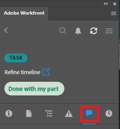

# Aktualisieren Sie Ihre Arbeit mit dem [!DNL Adobe Workfront]-Plug-in

Sie können Ihre Arbeit in einem der folgenden [!DNL Adobe Creative Cloud]-Programme aktualisieren:

{{cc-app-list}}

## Zugriffsanforderungen

+++ Erweitern, um die Zugriffsanforderungen für die in diesem Artikel beschriebene Funktionalität anzuzeigen.

<table style="table-layout:auto"> 
 <col> 
 </col> 
 <col> 
 </col> 
 <tbody> 
  <tr> 
  <!--
   <td role="rowheader">[!DNL Adobe Workfront] package</td> 
   <td>Any</td> 
  </tr> 
  <tr data-mc-conditions=""> 
   <td role="rowheader">[!DNL Adobe Workfront] license</td> 
   <td> 
   
Standard

   
Work or higher
 </td> 
  </tr>
  -->
  <tr> 
   <td role="rowheader">Zusätzliche Produkte</td> 
   <td>Sie müssen zusätzlich zu einer [!DNL Workfront] über eine [!DNL Adobe Creative Cloud]-Lizenz verfügen.</td> 
  </tr> 
  <tr> 
   <td role="rowheader">Objektberechtigungen</td> 
   <td> 
[!UICONTROL View] Zugriff auf das Objekt, das Sie aktualisieren möchten. 
</td> 
  </tr> 
 </tbody> 
</table>

Weitere Informationen finden Sie unter [Zugriffsanforderungen](/help/quicksilver/administration-and-setup/add-users/access-levels-and-object-permissions/access-level-requirements-in-documentation.md) in der Dokumentation zu Workfront.

+++

## Voraussetzungen

{{cc-install-prereq}}

## Update posten

Sie können Ihre Arbeit in jedem der folgenden Bereiche im Plug-in aktualisieren:

<table style="table-layout:auto"> 
 <col> 
 <col> 
 <tbody> 
  <tr> 
   <td> 
    <ul> 
     <li>Projekte</li> 
     <li>Aufgaben</li> 
     <li>Teilaufgaben</li> 
    </ul> </td> 
   <td> 
    <ul> 
     <li>Probleme</li> 
     <li>Dokumente</li> 
    </ul> </td> 
  </tr> 
 </tbody> 
</table>

So posten Sie eine Aktualisierung:

1. Klicken Sie **[!UICONTROL oben rechts auf]** Menü“ und wählen Sie dann **[!UICONTROL Arbeitsliste]** aus. Sie können auch das Menü verwenden, um zu übergeordneten Objekten zu navigieren.

   

1. Wählen Sie in **[!UICONTROL Arbeitsliste]** das Arbeitselement aus, an das Sie eine Aktualisierung posten möchten.
1. Klicken **[!UICONTROL in]** Navigationsleiste auf „Aktualisieren“.\
   

1. Klicken Sie auf **[!UICONTROL Neues Update]**.
1. Geben Sie Ihr Update ein.
1. (Optional) Um einen Benutzer zu taggen, geben Sie das @-Symbol und den Namen des Benutzers ein und wählen Sie dann seinen Namen aus dem Dropdown-Menü aus.
1. Klicken Sie auf **[!UICONTROL Absenden]**. Aktualisierungen werden in Echtzeit mit der Adobe Workfront-Webanwendung synchronisiert.
