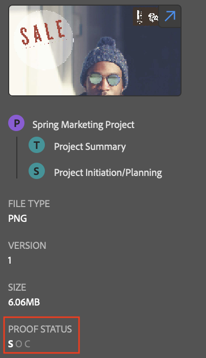

# Anzeigen von Arbeitselementinformationen mithilfe des Plug-ins [!DNL Adobe Workfront]

Sie können Informationen zu Projekten, Aufgaben, Problemen und Dokumenten aus den folgenden [!DNL Adobe Creative Cloud]-Anwendungen anzeigen:

{{cc-app-list}}

## Zugriffsanforderungen

Sie müssen über folgenden Zugriff verfügen, um die Schritte in diesem Artikel ausführen zu können:

<table style="table-layout:auto"> 
 <col> 
 </col> 
 <col> 
 </col> 
 <tbody> 
  <!--<tr> 
   <td role="rowheader">[!DNL Adobe Workfront] plan*</td> 
   <td> 
[!UICONTROL Pro] or higher
 </td> 
  </tr> 
  <tr data-mc-conditions=""> 
   <td role="rowheader">[!DNL Adobe Workfront] license*</td> 
   <td> 
[!UICONTROL Work] or [!UICONTROL Plan]
 </td> 
  </tr> -->
  <tr> 
   <td role="rowheader">Produkt</td> 
   <td>Sie müssen zusätzlich zu einer [!DNL Workfront] -Lizenz über eine [!DNL Adobe Creative Cloud] -Lizenz verfügen.</td> 
  </tr> 
  <tr> 
   <td role="rowheader">Konfigurationen auf Zugriffsebene*</td> 
   <td> 
Zugriff auf Projekte, Aufgaben oder Probleme in der [!UICONTROL Ansicht]
 
Hinweis: Wenn Sie immer noch keinen Zugriff haben, fragen Sie Ihren [!DNL Workfront] -Administrator, ob er zusätzliche Zugriffsbeschränkungen für Ihre Zugriffsebene festlegt. Informationen dazu, wie ein [!DNL Workfront] -Administrator Ihre Zugriffsebene ändern kann, finden Sie unter <a href="../../administration-and-setup/add-users/configure-and-grant-access/create-modify-access-levels.md" class="MCXref xref">Benutzerdefinierte Zugriffsebenen erstellen oder ändern</a>.
 </td> 
  </tr> 
  <tr> 
   <td role="rowheader">Objektberechtigungen</td> 
   <td> 
Zeigen Sie den Zugriff auf das Objekt an, das Sie anzeigen möchten. 
 
Weitere Informationen zum Anfordern von zusätzlichem Zugriff finden Sie unter <a href="../../workfront-basics/grant-and-request-access-to-objects/request-access.md" class="MCXref xref">Anfordern des Zugriffs auf Objekte </a>.
 </td> 
  </tr> 
 </tbody> 
</table>

&#42;Wenden Sie sich an Ihren [!DNL Workfront] -Administrator, um zu erfahren, welchen Plan, welchen Lizenztyp oder welchen Zugriff Sie haben.

## Voraussetzungen

{{cc-install-prereq}}

## Details und benutzerdefinierte Formulardaten anzeigen

1. Klicken Sie oben rechts auf das Symbol **[!UICONTROL Menü]** und wählen Sie dann **[!UICONTROL Arbeitsliste]** aus. Sie können auch über das Menü zu übergeordneten Objekten navigieren.

   

1. Wählen Sie das Arbeitselement aus, das Sie anzeigen möchten.

   >[!TIP]
   >
   >Verwenden Sie das Symbol **[!UICONTROL Menü]** , um zu den übergeordneten Objekten des Arbeitselements zu gelangen.

1. Klicken Sie in der Navigationsleiste auf das Symbol **[!UICONTROL Details]**  , um Folgendes anzuzeigen:

   * [!UICONTROL Beschreibung]
   * [!UICONTROL Geplantes Abschlussdatum]
   * [!UICONTROL Status]
   * [!UICONTROL Zugeordneter ]
   * [!UICONTROL Projekteigentümer] (nur Projekte)
   * Benutzerdefinierte Formulardaten

## Dokumentdetails anzeigen

1. Klicken Sie oben rechts auf das Symbol **[!UICONTROL Menü]** und wählen Sie dann **[!UICONTROL Arbeitsliste]** aus. Sie können auch über das Menü zu übergeordneten Objekten navigieren.

   

1. Wählen Sie das Arbeitselement aus, das Sie anzeigen möchten.

   >[!TIP]
   >
   >Verwenden Sie das Symbol **[!UICONTROL Menü]** , um zu den übergeordneten Objekten des Arbeitselements zu gelangen.

1. Klicken Sie in der Navigationsleiste auf das Symbol **[!UICONTROL Dokument]**  und doppelklicken Sie dann auf ein Dokument, um es anzuzeigen:

   * [!UICONTROL Beschreibung]
   * [!UICONTROL Dateityp]
   * [!UICONTROL Testversand-Status] (nur für Testsendungen verfügbar)
   * [!UICONTROL Version]
   * [!UICONTROL size]
   * Benutzerdefinierte Formulardaten

## Testversanddetails anzeigen

1. Klicken Sie oben rechts auf das Symbol **[!UICONTROL Menü]** und wählen Sie dann **[!UICONTROL Arbeitsliste]** aus. Sie können auch über das Menü zu übergeordneten Objekten navigieren.

   

1. Wählen Sie das Arbeitselement aus, das Sie anzeigen möchten.

   >[!TIP]
   >
   >Verwenden Sie das Symbol **[!UICONTROL Menü]** , um zu den übergeordneten Objekten des Arbeitselements zu gelangen.

1. Klicken Sie in der Navigationsleiste auf das Symbol **[!UICONTROL Dokument]**  und doppelklicken Sie dann auf einen Testversand.

1. Klicken Sie auf das Pfeilsymbol in der oberen rechten Ecke der Miniaturansicht, um die Testversanddetails in [!DNL Workfront] zu öffnen.

## Status eines Testversands anzeigen

1. Klicken Sie oben rechts auf das Symbol **[!UICONTROL Menü]** und wählen Sie dann **[!UICONTROL Arbeitsliste]** aus. Sie können auch über das Menü zu übergeordneten Objekten navigieren.

   

1. Wählen Sie das Arbeitselement aus, das Sie anzeigen möchten.

   >[!TIP]
   >
   >Verwenden Sie das Symbol **[!UICONTROL Menü]** , um zu den übergeordneten Objekten des Arbeitselements zu gelangen.

1. Klicken Sie in der Navigationsleiste auf das Symbol **[!UICONTROL Dokument]**  und doppelklicken Sie dann auf einen Testversand.

1. Scrollen Sie nach unten, um den aktuellen Status des Testversands anzuzeigen. Weitere Informationen zu den Details &quot;Gesendet&quot;, &quot;Geöffnet&quot;, &quot;Kommentar&quot;, &quot;Entscheidung&quot;(SOCD) finden Sie unter [Übersicht über Dokumentdetails](/help/quicksilver/documents/managing-documents/document-details-overview.md).

## Anzeigen von Unteraufgaben und Problemen

1. Klicken Sie oben rechts auf das Symbol **[!UICONTROL Menü]** und wählen Sie dann **[!UICONTROL Arbeitsliste]** aus. Sie können auch über das Menü zu übergeordneten Objekten navigieren.

   

1. Wählen Sie das Arbeitselement aus, das Sie anzeigen möchten.

   >[!TIP]
   >
   >Verwenden Sie das Symbol **[!UICONTROL Menü]** , um zu den übergeordneten Objekten des Arbeitselements zu gelangen.

1. Klicken Sie auf das Symbol **[!UICONTROL Problem]**  oder auf das Symbol **Unteraufgabe** .

1. Wählen Sie die Aufgabe oder das Problem aus und klicken Sie dann in der Navigationsleiste auf das Symbol **[!UICONTROL Details]**  , um Folgendes anzuzeigen:

   * [!UICONTROL Geplantes Abschlussdatum]
   * [!UICONTROL Status]
   * [!UICONTROL Zugeordneter ]
   * Benutzerdefinierte Formulardaten
