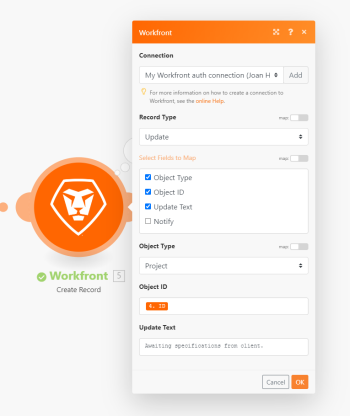

# Adobe Workfront-Integrationsmethoden

Sie können [!DNL Adobe Workfront] mit Anwendungen von Drittanbietern sowie anderen [!DNL Adobe]-Produkten integrieren. Diese Integrationen können den Nutzen von [!DNL Workfront] erweitern und an die Anforderungen Ihres Unternehmens anpassen. Sie können eine oder alle dieser Integrationen verwenden, je nachdem, welche für eine bestimmte Aufgabe am nützlichsten ist.

## Integrierte Integrationen

Workfront bietet verschiedene Integrationen, die Sie direkt in Workfront oder über ein anderes Programm konfigurieren können, indem Sie das Workfront-Add-in für dieses Programm installieren. Diese integrierten Integrationen decken viele gängige Anwendungsfälle ab und konzentrieren sich auf die Erweiterung und Verknüpfung von Benutzererlebnissen für Endbenutzer.

Die integrierten Workfront-Integrationen konzentrieren sich größtenteils auf persönliche Produktivität und Zusammenarbeit. Diese Integrationen reduzieren Unterbrechungen im Workflow einzelner Benutzer und ermöglichen ihnen, Workfront-Benachrichtigungen zu empfangen, auf Informationen zuzugreifen und auf Workfront-Arbeitselemente zu reagieren, ohne die integrierte Anwendung verlassen zu müssen.

Vorteile integrierter Integrationen können die folgenden sein:

* Viele dieser integrierten Integrationen sind ohne zusätzliche Kosten verfügbar. (Andere erfordern einen zusätzlichen Kauf.)
* Integrierte Integrationen decken viele der von Unternehmen am häufigsten verwendeten Apps ab, z. B. [!DNL Slack], [!DNL Google Drive] oder [!DNL Adobe] Produkte wie die [!DNL Adobe Creative Cloud] oder [!DNL Adobe Experience Manager] Assets. Wenn Ihr Unternehmen diese Apps bereits verwendet, wird die Integration problemlos in den vorhandenen Workflow Ihrer Benutzer integriert.
* Die Integration von [!DNL Workfront] mit einer häufig verwendeten Anwendung kann die Akzeptanz bei Ihren Benutzenden steigern.

>[!INFO]
>
>**Beispiel:**
>
>Mit dem [!DNL Workfront for Microsoft Teams integration] können Sie [!DNL Microsoft Teams] Benachrichtigungen über Ihre [!DNL Workfront] Arbeitselemente erhalten. Ohne [!DNL Microsoft Teams] verlassen zu müssen, können Sie Aktionen wie das Genehmigen, Kommentieren oder Ändern des Status von Arbeitselementen durchführen. Alle Änderungen, die Sie von [!DNL Microsoft Teams] an Arbeitselementen vornehmen, werden auch in [!DNL Workfront] übernommen.

Weitere Informationen zu integrierten Integrationen, einschließlich einer Liste der derzeit verfügbaren integrierten Integrationen, finden Sie unter [[!DNL Adobe Workfront] Integrierte Integrationen - Übersicht](../workfront-integrations-and-apps/built-in-integrations-non-admin.md).

## Benutzerdefinierte OAuth2-Programme

Adobe-[!DNL Workfront]-Administratoren können OAuth2-Programme für Ihre Instanz von [!DNL Workfront] erstellen, die anderen Programmen den Zugriff auf [!DNL Workfront] ermöglichen. Ihre Benutzer können dann diesen anderen Anwendungen die Berechtigung erteilen, auf ihre [!DNL Workfront] Daten zuzugreifen. Auf diese Weise können Sie Workfront mit Anwendungen Ihrer Wahl integrieren, einschließlich Ihrer eigenen internen Anwendungen.

>[!NOTE]
>
>Im Kontext von OAuth2 bezieht sich „Erstellen einer App“ auf den Prozess der Erstellung einer solchen Zugriffsverknüpfung zwischen einer App und einem Server wie Workfront.

Die Erstellung eines [!UICONTROL OAuth2]-Programms kann u. a. die folgenden Vorteile bieten:

* Benutzer können diese Integrationen direkt in [!DNL Workfront] verwenden, ähnlich wie bei integrierten Integrationen.
* Das Einrichten oder Verwenden einer [!UICONTROL OAuth2]-Anwendung erfordert keine zusätzlichen technischen Kenntnisse, wie z. B. Vertrautheit mit der [!DNL Workfront] API.
* Ihr Unternehmen kann Software verwenden, die nicht als [!DNL Workfront] integrierte Anwendung angeboten wird. Sie können diese Software mithilfe einer [!UICONTROL OAuth2]-Anwendung weiterhin mit [!DNL Workfront] integrieren, auch wenn die Software unternehmenseigen ist.

Weitere Informationen finden Sie unter [Erstellen von OAuth2-Programmen für Workfront-Integrationen](../administration-and-setup/configure-integrations/create-oauth-application.md).

## [!DNL Workfront] API

[!DNL Workfront] bietet eine öffentliche API (Anwendungsprogrammierschnittstelle), mit der Sie Ihr Workfront-Erlebnis erweitern und verbessern können. Das Ziel der [!DNL Workfront]-API besteht darin, die Erstellung eigener Integrationen mit [!DNL Workfront] zu vereinfachen, indem eine REST-fähige Architektur eingeführt wird, die über HTTP ausgeführt werden kann. Die [!DNL Workfront]-API erfordert einige technische Kenntnisse, ist jedoch ein sehr leistungsfähiges Tool zum Abrufen, Erstellen und Ändern von Daten. Sie können API-Aufrufe anpassen, um sehr spezifische Funktionen auszuführen.

Darüber hinaus bietet [!DNL Workfront] eine Ereignisabonnement-API. Wenn eine Aktion auf einem [!DNL Workfront] stattfindet, das von Ereignisabonnements unterstützt wird, können Sie [!DNL Workfront] so konfigurieren, dass eine Antwort an Ihren gewünschten Endpunkt gesendet wird. Dies bedeutet, dass Drittanbieteranwendungen Aktualisierungen von [!DNL Workfront] Interaktionen bald nach ihrem Auftreten über die [!DNL Workfront]-API erhalten können.

Die Verwendung der [!DNL Workfront]-API bietet u. a. folgende Vorteile:

* Sie können die [!DNL Workfront]-API verwenden, um eine Verbindung zu fast jedem anderen Webservice oder jeder App herzustellen, der bzw. die eine öffentliche API bietet. Daher ist es möglich, [!DNL Workfront] mit nahezu jedem Web-Service oder jeder App zu integrieren, den bzw. die Sie verwenden möchten.
* Die Flexibilität der [!DNL Workfront]-API erstreckt sich auch auf die proprietäre Software Ihres Unternehmens. Sie können [!DNL Workfront] Daten in Ihrer eigenen Software verwenden und ändern.
* Da APIs für Software so üblich sind, sind Ihre internen Entwickler wahrscheinlich mit ihnen vertraut. [!DNL Workfront] verwendet eine REST-ful-API, den gängigsten API-Typ, wodurch Entwickler sich noch schneller mit dem Thema vertraut machen können.

>[!INFO]
>
>**Beispiel:**
>
>Der folgende API-Aufruf fügt einen Kommentar mit der angegebenen ID in den Aktualisierungsverlauf der Aufgabe ein.
>
>```
>https://`<your domain>`.workfront.com/attask/api-internal/note?noteText=<text of comment>&noteObjCode=TASK&objID=<task ID>&apiKey=<your API key>
>```

Weitere Informationen zur [!DNL Workfront]-API finden Sie unter [API-Grundlagen](../wf-api/general/api-basics.md).

Weitere Informationen zu Ereignisabonnements finden Sie unter [Ereignisabonnement-API](../wf-api/general/event-subs-api.md).

## [!DNL Adobe Workfront Fusion]

[!DNL Workfront Fusion] ermöglicht die Automatisierung von Workflows. Mit der [!DNL Workfront Fusion for Work Automation and Integration] Lizenz können Sie diese Automatisierungen über mehrere Apps und Web-Services hinweg erstellen und Szenarien erstellen, in denen die Apps zusammenarbeiten, um eine Aufgabe auszuführen. Ein Szenario ist eine visuelle Darstellung der Aufgabe oder des Workflows, die mithilfe von Modulen erstellt wird, bei denen es sich um diskrete Aufgaben wie „Dokument herunterladen“ oder „Projekt erstellen“ handelt. Sie verketten Module, um den Workflow zu definieren, und dann wird der Workflow automatisch ausgeführt, wenn eine Trigger-Bedingung erfüllt ist.

Zu den Vorteilen für [!DNL Workfront Fusion] zählen:

* [!DNL Workfront Fusion] erfordert nicht so viel technisches Wissen wie die API, da die visuelle Benutzeroberfläche beim Verstehen und Einrichten des Workflows hilft. Dies bedeutet, dass sie von Personen außerhalb eines Entwicklungs-Teams verwendet werden können, was Ihrer Organisation Zeit und Geld sparen kann.
* Da [!DNL Workfront Fusion] über die API funktioniert, kann es auf die meisten Apps und Web-Services zugreifen. Viele Apps verfügen über Module für API-Aufrufe. Alternativ können Sie die HTTP-, SOAP- oder JSON-Module verwenden, um mit Web-Services zu interagieren, die keinen dedizierten [!DNL Workfront Fusion]-Connector haben.

>[!INFO]
>
>**Beispiel:**
>
>Das folgende [!DNL Workfront] Modul in [!DNL Workfront Fusion] ist eingerichtet, um dem ausgewählten Projekt einen Kommentar hinzuzufügen. Nachdem das Modul ausgeführt wurde, ist der Kommentar im Aktualisierungsverlauf des Projekts in Workfront sichtbar.
>
>

Weitere Informationen zu [!DNL Workfront Fusion] finden Sie unter [[!DNL Adobe Workfront Fusion]](https://experienceleague.adobe.com/en/docs/workfront-fusion/using/home).
