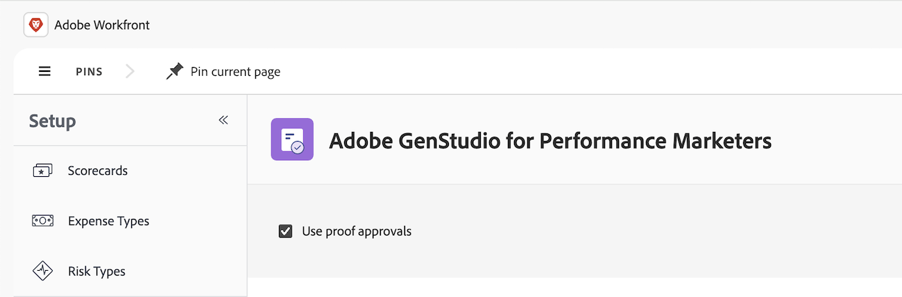

# Erste Schritte mit der Integration von GenStudio for Performance Marketing und Workfront Proof

Durch die Integration zwischen GenStudio for Performance Marketing und Workfront Proof können Sie

* Verwenden von Workfront-Korrekturabzugsvorlagen zum Definieren von Prüfungs- und Genehmigungs-Workflows

* Überprüfen und Genehmigen von GenStudio for Performance Marketing-Entwurfsinhalten im Workfront Proofing Viewer

* Anzeigen von Überprüfungsentscheidungen in GenStudio for Performance Marketing zur endgültigen Genehmigung und Veröffentlichung

Weitere Informationen zur Überprüfung und Genehmigung in GenStudio for Performance Marketing finden Sie unter [Integration von Workfront Proof mit GenStudio for Performance Marketing](https://experienceleague.adobe.com/de/docs/genstudio-for-performance-marketing/user-guide/approve/proof-integration).

## Zugriffsanforderungen

+++ Erweitern Sie , um die Zugriffsanforderungen für die -Funktion in diesem Artikel anzuzeigen.

<table style="table-layout:auto"> 
 <col> 
 <col> 
 <tbody> 
 <tr> 
   <td role="rowheader">Adobe Workfront-Plan</td> 
   <td> 
   
Beliebig
 
   </td> 
  </tr> 
  <tr> 
   <td role="rowheader">Adobe Workfront-Lizenz</td> 
   <td> 
   
Aktuell: Standard 
 
   
Legacy: Plan 
</td> 
  </tr> 
  <tr> 
   <td role="rowheader">Produkt</td> 
   <td> 
   
 Sie müssen über GenStudio for Performance Marketing verfügen und dem Produkt müssen Sie als Benutzer in der Admin Console hinzugefügt werden. 
 </td> 
  </tr> 
  <tr> 
   <td role="rowheader">Konfigurationen der Zugriffsebene</td> 
   <td> 
Zugriff auf Projekte bearbeiten
 </td> 
  </tr> 
 </tbody> 
</table>

Weitere Informationen zu den Informationen in dieser Tabelle finden Sie unter [Zugriffsanforderungen in der Dokumentation zu Workfront](/help/quicksilver/administration-and-setup/add-users/access-levels-and-object-permissions/access-level-requirements-in-documentation.md).

+++

## Integrationsanforderungen

* Workfront und GenStudio for Performance Marketing müssen in derselben IMS-Organisation bereitgestellt werden.

* Benutzende können nur zu einer Workfront-Instanz in der IMS-Organisation gehören.

* Die Workfront-Instanz muss für das einheitliche Adobe-Erlebnis aktiviert sein.

* Die Integration muss im Bereich &quot;Workfront-Setup“ aktiviert werden.

## Integration in Workfront aktivieren

Sie müssen Systemadministrator sein, um diese Integration zu aktivieren.

1. Klicken Sie oben links auf **[!UICONTROL Hauptmenü]**-Symbol  und dann auf **[!UICONTROL Setup]** .
1. Klicken Sie im linken Bedienfeld auf **Überprüfen und** > **Adobe GenStudio**.
1. Aktivieren **Korrekturabzugsgenehmigungen verwenden**.
   

## Verwenden von Workfront-Korrekturabzugsvorlagen zur Definition von Genehmigungs-Workflows

Wenn der Prozess der Inhaltsüberprüfung in Ihrem Unternehmen häufig wiederholt wird oder von denselben Personen geprüft wird, können Sie Korrekturabzugsvorlagen verwenden, um Prüfungs- und Genehmigungs-Workflows zu automatisieren.

### Erstellen einer Testversandvorlage in Workfront

Sie können einfache, einstufige Vorlagen für nur einen oder zwei Prüfer erstellen oder automatisierte, mehrstufige Vorlagen für komplexe Prüfungen mit vielen Phasen und Abhängigkeiten erstellen.

Weitere Informationen zum Erstellen automatisierter Workflows und Vorlagen in Workfront finden Sie unter

* [Automatisierter Workflow - Übersicht](/help/quicksilver/review-and-approve-work/proofing/proofing-overview/automated-workflow.md)
* [Erstellen und Verwalten von automatisierten Workflow-Vorlagen](/help/quicksilver/administration-and-setup/manage-workfront/configure-proofing/create-manage-automated-workflow-templates.md)

### Auswählen oder Ändern der Vorlage in GenStudio for Performance Marketing

Wenn ein(e) Benutzende(r) eine Überprüfung in GenStudio for Performance Marketing startet, wählt er/sie einfach die gewünschte Vorlage aus. Benutzer können jederzeit problemlos jede Korrekturabzugs-Workflow-Vorlage ändern und Prüfer und Phasen hinzufügen oder entfernen.

Weitere Informationen finden Sie unter [Überprüfung und Genehmigung ](https://experienceleague.adobe.com/de/docs/genstudio-for-performance-marketing/user-guide/approve/request-review).

## Überprüfen und Genehmigen von GenStudio for Performance Marketing-Entwurfsinhalten im Workfront Proofing Viewer

Entwurfsinhalte können direkt in GenStudio for Performance Marketing im Workfront Proofing Viewer überprüft und genehmigt werden.

Mit dem Proofing Viewer können Sie

* Kommentare hinterlassen
* Markup-Entwurf, um anzuzeigen, was geändert werden muss
* Entscheidung treffen

Weitere Informationen finden Sie unter [Inhalt überprüfen und bearbeiten](https://experienceleague.adobe.com/de/docs/genstudio-for-performance-marketing/user-guide/approve/review-and-edit).

>[!IMPORTANT]
>
>Benutzer müssen den [Überprüfen interaktiver Inhalte mit dem Adobe Workfront-Überprüfungs-Tool“ installieren](/help/quicksilver/review-and-approve-work/proofing/reviewing-proofs-within-workfront/review-a-proof/review-proof-in-web-viewer-extension.md) bevor sie Entwürfe in GenStudio for Performance Marketing überprüfen können.

## Anzeigen von Überprüfungsentscheidungen in GenStudio for Performance Marketing zur endgültigen Genehmigung und Veröffentlichung

Sobald das Asset den Prüfungs- und Genehmigungsprozess durchlaufen hat, können Sie die Überprüfungsentscheidung anzeigen und den Inhalt direkt in GenStudio for Performance Marketing veröffentlichen.

Weitere Informationen finden Sie unter [Genehmigte Inhalte veröffentlichen](https://experienceleague.adobe.com/de/docs/genstudio-for-performance-marketing/user-guide/approve/publish-content).
