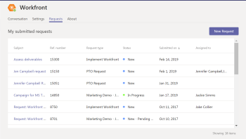

# Einsenden [!DNL Adobe Workfront] Anforderungen von [!DNL Microsoft] Teams

Nach der Installation des Team-Eigentümers [!DNL Adobe Workfront for Microsoft Teams], können Sie [!DNL Workfront] -Anfragen von [!DNL Microsoft Teams] -Konto. Dazu benötigen Sie ein Workfront-Konto mit Zugriff auf die Übermittlung von Anfragen. Informationen zur Installation [!DNL Workfront for Microsoft Teams], siehe [Installieren [!DNL Workfront for Microsoft Teams]](../../workfront-integrations-and-apps/using-workfront-with-microsoft-teams/install-workfront-ms-teams.md).

>[!NOTE]
>
>[!DNL Microsoft Teams] unterstützt nicht mehr [!DNL Internet Explorer]. So verwenden Sie die [!DNL Adobe Workfront for Microsoft Teams integration]müssen Sie einen anderen Webbrowser als [!DNL Internet Explorer].

## Zugriffsanforderungen

Sie müssen über folgenden Zugriff verfügen, um die Schritte in diesem Artikel ausführen zu können:

<table style="table-layout:auto"> 
 <col> 
 <col> 
 <tbody> 
  <tr> 
   <td role="rowheader">[!DNL Adobe Workfront] Plan*</td> 
   <td> 
Beliebig
 </td> 
  </tr> 
  <tr> 
   <td role="rowheader">[!DNL Adobe Workfront] license*</td> 
   <td> 
Arbeit, Plan, Überprüfung, Anforderung
 </td> 
  </tr> 
 </tbody> 
</table>

&#42;Wenden Sie sich an Ihren [!DNL Workfront] Administrator.

## Voraussetzungen

Ihre [!DNL Microsoft Teams] Teameigentümer muss installieren [!DNL Workfront] für [!DNL Microsoft Teams] bevor Sie sie verwenden können.

## Einsenden [!DNL Workfront] Anforderungen von [!DNL Microsoft Teams]

1. Klicken Sie auf **[!UICONTROL Weitere Apps]** in der linken Navigationsleiste in Microsoft Teams.

   

1. Klicken **[!DNL Workfront]** in der Liste, die angezeigt wird.
1. Klicken Sie auf **[!UICONTROL Anforderungen]** Registerkarte.
1. Klicken **[!UICONTROL Neue Anforderung]**.
1. Im **[!UICONTROL Anfragetyp auswählen]** auswählen, wählen Sie die Anforderungswarteschlange aus, an die Sie die Anforderung senden möchten.
1. (Optional) Wählen Sie eine Themengruppe oder ein Warteschlangenthema aus, wenn sie in der Anforderungswarteschlange verfügbar sind.
1. Geben Sie die folgenden Informationen an:

   (Je nachdem, wie die Anforderungswarteschlange eingerichtet wurde, können die angezeigten Optionen und Felder variieren. Eine vollständige Liste der möglichen Felder und eine Beschreibung finden Sie unter [Erstellen und Senden [!DNL Adobe Workfront] requests](../../manage-work/requests/create-requests/create-submit-requests.md).

   <table style="table-layout:auto"> 
    <col> 
    <col> 
    <tbody> 
     <tr> 
      <td role="rowheader">Betreff</td> 
      <td>Geben Sie einen Betreffnamen für die Anfrage ein.</td> 
     </tr> 
     <tr> 
      <td role="rowheader">Beschreibung</td> 
      <td>Geben Sie eine Beschreibung für die Anforderung ein.</td> 
     </tr> 
     <tr> 
      <td role="rowheader"> </td> 
      <td> 
Fügen Sie alle Dokumente hinzu, die Sie in die Anfrage aufnehmen möchten. Sie können Dokumente per Drag &amp; Drop anhängen oder indem Sie auf Datei auswählen klicken und das Dokument in Ihrem Dateisystem durchsuchen und auswählen.
 </td> 
     </tr> 
    </tbody> 
   </table>

1. (Optional) Wenn die Variable [!DNL Workfront] Administrator hat benutzerdefinierte Formulare an die Anforderungswarteschlange angehängt und die Informationen in den Feldern bereitgestellt, die in den benutzerdefinierten Formularen verfügbar sind.
1. Die benutzerdefinierten Formulare werden am unteren Rand der neuen Anforderung angezeigt.
1. Klicken **[!UICONTROL Einsenden]**.

   Die Anforderung wird in [!DNL Workfront], in der angegebenen Anforderungswarteschlange. Sie erhalten eine Bestätigung, dass die Anfrage erfolgreich eingereicht wurde.

## Ansicht [!DNL Workfront] -Anfragen, die Sie in [!DNL Microsoft Teams]

1. Klicken Sie auf **[!UICONTROL Weitere Apps]** in der linken Navigationsleiste in Microsoft Teams.

   

1. Klicken **[!DNL Workfront]** in der Liste, die angezeigt wird.
1. Klicken Sie auf **[!UICONTROL Anforderungen]** Registerkarte.

   

   Die von Ihnen eingereichten Anfragen werden in der [!UICONTROL Meine eingereichten Anfragen] der [!UICONTROL Anforderungen] Registerkarte. Sie können die auf diesem Tab angezeigten Informationen zu den von Ihnen gesendeten Anfragen nicht konfigurieren.

   Die folgenden Informationen zu Ihren gesendeten Anfragen finden Sie in der [!UICONTROL Meine eingereichten Anfragen] der [!UICONTROL Anforderungen] tab:

   * **[!UICONTROL Betreff]**: Der Name der Anforderung
   * **[!UICONTROL Referenznummer]**
   * **[!UICONTROL Anfragetyp]**: Der Name der Anforderungswarteschlange, an die Sie die Anforderung gesendet haben
   * **[!UICONTROL Status]**
   * **[!UICONTROL Gesendet am]**: Das Datum, an dem Sie die Anfrage gesendet haben
   * **[!UICONTROL Zugewiesen an]**

1. (Optional) Klicken Sie auf die Kopfzeile einer der Spalten in der Liste, um die Liste nach dieser Spalte zu sortieren. Standardmäßig [!DNL Workfront] sortiert die Liste nach [!UICONTROL Gesendet am] Datum, beginnend mit der zuletzt gesendeten Anfrage.
