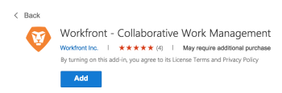
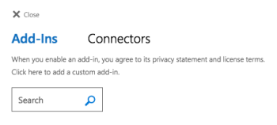

# Einrichten [!DNL Adobe Workfront for Outlook]

Die [!DNL Adobe Workfront] [!DNL Outlook] -Add-In ermöglicht Ihnen Folgendes [!DNL Workfront] Aufgaben direkt aus Outlook:

* Aktualisieren Sie ein vorhandenes Projekt, eine Aufgabe oder ein Problem mit Informationen aus einer E-Mail. Weitere Informationen finden Sie unter [Vorhandenes Objekt von einem [!DNL Outlook] email](../../workfront-integrations-and-apps/using-workfront-with-outlook/update-an-existing-object-from-an-outlook-email.md).
* Erstellen Sie eine [!DNL Workfront] Anfrage basierend auf einer E-Mail in [!DNL Outlook]. Weitere Informationen finden Sie unter [Erstellen einer Adobe Workfront-Anforderung aus einem [!DNL Outlook] email](../../workfront-integrations-and-apps/using-workfront-with-outlook/create-a-wf-request-from-an-outlook-email.md).
* Hinzufügen einer E-Mail als Aufgabe in Ihrer [!UICONTROL Meine Arbeit] Bereich. Weitere Informationen finden Sie unter [Hinzufügen einer [!DNL Outlook] E-Mail als Aufgabe an Ihre Arbeitsliste senden](../../workfront-integrations-and-apps/using-workfront-with-outlook/add-outlook-email-as-task-to-your-work-list.md).
* Antworten Sie auf Kommentare über die [!DNL Workfront] Add-in für [!DNL Outlook]. Informationen zur Beantwortung von Kommentaren von Workfront zu [!DNL Outlook], siehe [Antworten auf einen Kommentar von [!DNL Outlook]](../../workfront-integrations-and-apps/using-workfront-with-outlook/reply-to-a-comment-from-outlook.md).
* Erstellen Sie Aufgaben und Probleme von Grund auf neu oder erstellen Sie sie aus vorhandenen E-Mails (mithilfe der Drag &amp; Drop-Funktion). Weitere Informationen finden Sie unter [Hinzufügen einer [!DNL Outlook] E-Mail an ein Projekt als Aufgabe oder Problem senden](../../workfront-integrations-and-apps/using-workfront-with-outlook/add-outlook-email-to-project-as-task-or-issue.md).

Sie müssen die [!DNL Workfront] -Add-In für Ihre [!DNL Outlook] -Konto verwenden, bevor Sie [!DNL Workfront for Outlook].

Wenn Sie die [!DNL Workfront] mit Ihrem [!DNL Outlook] -Konto, kontaktieren Sie Ihre [!DNL Workfront] Administrator, um sicherzustellen, dass [!DNL Outlook] -Add-Ins für Ihre Organisation aktiviert sind.

Informationen zum Aktivieren der [!DNL Outlook] Integration für Ihr Unternehmen, siehe [Aktivieren [!DNL Adobe Workfront for Outlook]](../../administration-and-setup/configure-integrations/enable-workfront-for-outlook.md).

## Zugriffsanforderungen

Sie müssen über folgenden Zugriff verfügen, um die Schritte in diesem Artikel ausführen zu können:

<table style="table-layout:auto"> 
 <col> 
 <col> 
 <tbody> 
  <tr> 
   <td role="rowheader">[!DNL Adobe Workfront] Plan*</td> 
   <td> 
Beliebig
 </td> 
  </tr> 
  <tr> 
   <td role="rowheader">[!DNL Adobe Workfront] license*</td> 
   <td> 
[!UICONTROL Work], [!UICONTROL Plan]
 </td> 
  </tr> 
 </tbody> 
</table>

&#42;Wenden Sie sich an Ihren [!DNL Workfront] Administrator.

## Voraussetzungen

Ihre [!DNL Workfront] Administrator muss [!DNL Outlook for Office] mit [!DNL Workfront] bevor Sie diese Integration verwenden können.

## Systemanforderungen

Die folgenden Anwendungen sind verfügbar:

* **[!DNL Outlook]im Internet:** Die [!DNL Workfront] Add-In ist verfügbar bei Verwendung von [!DNL Outlook] von einem Webbrowser auf einem Desktop- oder Mobilgerät aus. Diese Funktion ist auch verfügbar, wenn Sie die [!DNL Outlook] Webanwendung.
* **[!DNL Outlook]Desktop Application:** Die [!DNL Workfront] -Add-In ist verfügbar, wenn Sie die [!DNL Windows] und [!DNL Mac] Desktop-Versionen von [!DNL Outlook] im [!DNL Office] Paket.

Die [!DNL Workfront] Add-in für [!DNL Outlook] wird in Umgebungen unterstützt, die die folgenden Anforderungen erfüllen:

* [Kundenanforderungen](#client-requirements-client-requirements)
* [Mail-Server-Anforderungen](#mail-server-requirements-mail-server-requirements)

### Kundenanforderungen {#client-requirements}

Wir unterstützen die folgenden Versionen von [!DNL Outlook]:

* [!DNL Outlook 2013] oder später [!DNL Windows]
*[!DNL  Outlook 2016] oder später [!DNL Windows]
* [!DNL Outlook] on [!DNL Mac] ([!DNL Microsoft 365])
* [!DNL Outlook] on [!DNL Windows] ([!DNL Microsoft 365])
* [!DNL Outlook] im Internet

Sie müssen mit einer [!DNL Exchange Server] oder [!DNL Office 365] über eine direkte Verbindung.

Beim Konfigurieren des Clients muss der Benutzer einen der folgenden Kontotypen auswählen:

* [!DNL Exchange]
* [!DNL Office 365]
* [!DNL Outlook.com]&#x200B;**&#x200B;**&#x200B; Wenn der Client für die Verbindung mit POP3 oder IMAP konfiguriert ist, wird die [!DNL Workfront] -Add-In wird nicht geladen.

### Mail-Server-Anforderungen {#mail-server-requirements}

Die Anforderungen an den E-Mail-Server werden standardmäßig erfüllt, wenn Sie eine Verbindung zu [!DNL Office 365] oder [!DNL Outlook.com]. Wenn Sie jedoch mit einer On-Premise-Installation von [!DNL Exchange Server]gelten folgende Anforderungen:

* Wir unterstützen [!DNL Exchange 2016 On-Premise]
* [!DNL Exchange Web Services] (EWS) muss aktiviert sein und dem Internet zugänglich gemacht werden.
* Der Server muss über ein gültiges Authentifizierungszertifikat verfügen, damit der Server gültige Identitäts-Token ausgibt. Neue Anlagen [!DNL Exchange Server] enthalten ein standardmäßiges Authentifizierungszertifikat.

   Weitere Informationen finden Sie unter [Digitale Zertifikate und Verschlüsselung in [!DNL Exchange 2016]](https://technet.microsoft.com/en-us/library/dd351044(v=exchg.160).aspx) und [Set-AuthConfig](https://technet.microsoft.com/en-us/library/jj215766(v=exchg.160).aspx).

* Um auf die [!DNL Workfront] -Add-in aus der [[!DNL Office] Store](https://store.office.com/), müssen Ihre Client-Zugriffsserver in der Lage sein, mit  [https://store.office.com](https://store.office.com/).

Weitere Informationen zu unterstützten Umgebungen finden Sie im Abschnitt [[!DNL Microsoft Office 365] Startseite](https://products.office.com/en-us/office-365-home).

## Installieren des Add-Ins

Weitere Informationen zur Einrichtung der [!DNL Workfront] Add-in für [!DNL Outlook], siehe [[!DNL Workfront] - Kollaboratives Arbeitsmanagement.](https://appsource.microsoft.com/en-us/product/office/WA104380943?tab=Overview)

* [[!DNL Workfront] für [!DNL Outlook 365]](#workfront-for-outlook-365-workfront-for-outlook-365)
* [[!DNL Workfront] für [!DNL Outlook] im Internet](#workfront-for-outlook-on-the-web-workfront-for-outlook-on-the-web)
* [[!DNL Workfront] für [!DNL Outlook] on [!DNL Windows] oder [!DNL Mac]](#workfront-for-outlook-on-windows-or-mac-workfront-for-outlook-on-windows-or-mac)

### [!DNL Workfront] für [!DNL Outlook 365] {#workfront-for-outlook-365}

1. In [!DNL Outlook 365], klicken Sie auf die **[!UICONTROL Add-Ins durchsuchen]** icon Klicken Sie oben auf der Benutzeroberfläche von Office 365 auf **[!UICONTROL Verwalten von Add-Ins]**.

1. Im **[!UICONTROL Suchen-Add-Ins]** Feld, suchen Sie nach **[!DNL Workfront]** dann drücken [!UICONTROL Eingabe].

1. Klicken **[!UICONTROL Hinzufügen]**.

### [!DNL Workfront] für [!DNL Outlook] im Internet {#workfront-for-outlook-on-the-web}

1. Öffnen [!DNL Microsoft Outlook] in einem Webbrowser.
1. Klicken Sie auf **[!UICONTROL Durchsuchen] Add-ins** icon .

   Informationen zum Suchen des Symbols finden Sie unter [Verwenden von Add-Ins in [!DNL Outlook] im Internet](https://support.microsoft.com/en-us/office/using-add-ins-in-outlook-on-the-web-8f2ce816-5df4-44a5-958c-f7f9d6dabdce#bkmk_addaddinsicon) in der Microsoft-Dokumentation.

1. Suchen Sie nach **[!DNL Workfront]** im **[!UICONTROL Suchen-Add-Ins]** Feld und drücken Sie dann **[!UICONTROL Eingabe]**.

   

1. Wenn es in der Liste angezeigt wird, klicken Sie auf **Hinzufügen**.

### [!DNL Workfront for Outlook] on [!UICONTROL Windows] oder [!DNL Mac] {#workfront-for-outlook-on-windows-or-mac}

1. Klicken **[!UICONTROL Startseite]** > **[!UICONTROL Store]** auf dem Band.

1. Suchen Sie nach **[!DNL Workfront]** im **[!UICONTROL Suche]** Feld und drücken Sie dann **[!UICONTROL Eingabe]**.

   

1. Klicken Sie auf den Umschalter, um die **[!UICONTROL [!DNL Workfront]Add-in]**.

## Anmelden bei [!DNL Workfront] von [!DNL Outlook]

1. In [!DNL Outlook], wählen Sie eine E-Mail-Nachricht aus und klicken Sie auf die **[!DNL Workfront]** im E-Mail-Header angezeigt.
1. Befolgen Sie die Anweisungen zum Anmelden bei [!DNL Workfront] unter Verwendung der erweiterten Authentifizierung, OAuth 2.0 oder Ihrer SAML-URL (Security Assertion Markup Language).

   Bevor sich Benutzer bei der [!DNL Workfront] Add-in mit SAML, einem [!DNL Workfront] administrator muss zuerst aktivieren [!DNL Office 365] -Add-Ins zur Authentifizierung mit einer SAML 2.0-Lösung. Weitere Informationen finden Sie im Abschnitt . [Konfigurieren [!DNL Adobe Workfront] mit SAML 2.0](../../administration-and-setup/add-users/single-sign-on/configure-workfront-saml-2.md#enable-saml-with-office-365) im Artikel [Konfigurieren [!DNL Adobe Workfront] mit SAML 2.0](../../administration-and-setup/add-users/single-sign-on/configure-workfront-saml-2.md).

   >[!NOTE]
   >
   >* Wenn Sie aufgefordert werden, die Domäne Ihrer [!DNL Workfront] -Konto angeben, geben Sie es in folgendem Format ein: *yourCompany&#39;sDomain.my.workfront.com*. Die Domäne Ihres Unternehmens ist normalerweise der Name Ihres Unternehmens.
   >* Die erweiterte Authentifizierung ist erst verfügbar, wenn eine [!DNL Workfront] -Administrator aktiviert sie für diese Integration.

