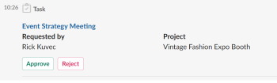

# Verwalten Sie Ihre Arbeit und Ihre Genehmigungen über [!DNL Slack]

Nach der Installation [!DNL Adobe Workfront for Slack]können Sie Folgendes tun:

* Auf die Listen Ihrer [!UICONTROL Startseite] Elemente aus [!DNL Slack]
* Überprüfen und akzeptieren Sie die Arbeit an Aufgaben und Problemen von [!DNL Slack]
* Überprüfen und treffen Sie Entscheidungen über Genehmigungen von [!DNL Slack]

Weitere Informationen zur Konfiguration [!DNL Workfront] mit [!DNL Slack], siehe [Konfigurieren [!DNL Adobe Workfront for Slack]](../../workfront-integrations-and-apps/using-workfront-with-slack/configure-workfront-for-slack.md).

## Zugriffsanforderungen

Sie müssen über Folgendes verfügen:

<table style="table-layout:auto"> 
 <col> 
 <col> 
 <tbody> 
  <tr> 
   <td role="rowheader"><a href="https://www.workfront.com/plans" target="_blank">[!DNL Adobe Workfront] Plan</a>*</td> 
   <td> 
[!UICONTROL Pro] oder höher
 </td> 
  </tr> 
 </tbody> 
</table>

&#42;Wenden Sie sich an Ihren Workfront-Administrator, um zu erfahren, welchen Plan, welchen Lizenztyp oder welchen Zugriff Sie haben.

## Voraussetzungen

Bevor Sie Ihre Arbeit und Ihre Genehmigungen in [!DNL Slack], müssen Sie

* Konfigurieren [!DNL Workfront for Slack]\
   Anweisungen zum Konfigurieren von [!DNL Workfront for Slack], siehe [Konfigurieren [!DNL Adobe Workfront for Slack]](../../workfront-integrations-and-apps/using-workfront-with-slack/configure-workfront-for-slack.md).

## Verwalten Sie Ihre Arbeit über [!DNL Slack]

1. Melden Sie sich bei Ihrer [!DNL Slack] -Instanz und melden Sie sich bei [!DNL Workfront] von [!DNL Slack].\
   Weitere Informationen zur Anmeldung bei [!DNL Workfront] von [!DNL Slack], siehe &quot;Anmelden bei [!DNL Workfront] von [!DNL Slack]&quot; Abschnitt in [Zugriff [!DNL Adobe Workfront] von [!DNL Slack]](../../workfront-integrations-and-apps/using-workfront-with-slack/access-workfront-from-slack.md).

1. Geben Sie von jedem Kanal aus den folgenden Befehl in das Meldungsfeld ein:

   `/workfront home`

   >[!NOTE]
   >
   >* Bei Befehlen wird zwischen Groß- und Kleinschreibung unterschieden.
   >* Sie können Ihren Befehl mit `/wf` anstelle von `/workfront`.

   Die Schaltflächen, über die Sie auf Listen Ihrer Aufgaben, Probleme und Genehmigungen zugreifen können, werden angezeigt. Wenn Sie auf eine der Schaltflächen klicken, werden die ersten 20 Elemente jeder Liste in [!DNL Slack].\
   

1. (Optional) Klicken Sie auf **[!UICONTROL Aufgaben]** , um alle Ihre Aufgaben anzuzeigen.

   Weitere Informationen zum Verwalten von Aufgaben finden Sie unter [!DNL Slack], siehe [Verwalten Ihrer Aufgaben über [!DNL Slack]](#manage-your-tasks-from-slack-manage-your-tasks-from-slack).

1. (Optional) Klicken Sie auf **[!UICONTROL Probleme]** um alle Probleme anzuzeigen.

   Weitere Informationen zum Verwalten von Problemen finden Sie unter [!DNL Slack], siehe [Verwalten Ihrer Probleme in [!DNL Slack]](#manage-your-issues-from-slack-manage-your-issues-from-slack).

1. (Optional) Klicken Sie auf **[!UICONTROL Genehmigungen]** um alle Genehmigungen anzuzeigen, die auf Ihre Entscheidung warten.\
   Weitere Informationen zur Verwaltung Ihrer Genehmigungen finden Sie unter [!DNL Slack], siehe [Verwalten von Genehmigungen über [!DNL Slack]](#manage-your-approvals-from-slack-manage-your-approvals-from-slack).

## Verwalten Sie Ihre Aufgaben über [!DNL Slack] {#manage-your-tasks-from-slack}

1. Melden Sie sich bei Ihrer [!DNL Slack] -Instanz und melden Sie sich bei [!DNL Workfront] von [!DNL Slack].\
   Informationen zur Anmeldung bei [!DNL Workfront] von [!DNL Slack], siehe &quot;Anmelden bei [!DNL Workfront] von [!DNL Slack]&quot; Abschnitt in [Zugriff [!DNL Adobe Workfront] von [!DNL Slack]](../../workfront-integrations-and-apps/using-workfront-with-slack/access-workfront-from-slack.md).

1. Geben Sie von jedem Kanal aus einen der folgenden Befehle in das Meldungsfeld ein:

   `/workfront home`Klicken Sie auf **[!UICONTROL Aufgaben]**

   Oder

   `/workfront tasks`

   >[!NOTE]
   >
   >* Bei Befehlen wird zwischen Groß- und Kleinschreibung unterschieden.
   >* Sie können Ihren Befehl mit `/wf` anstelle von `/workfront`.

   Die ersten 20 Aufgaben Ihrer Liste werden angezeigt.\
   

1. Klicken **[!UICONTROL +`<remaining number>` more]** um zusätzliche Aufgaben anzuzeigen.
1. Überprüfen Sie die folgenden Informationen zu Ihren Arbeitselementen:

   * **[!UICONTROL Name]**
   * **[!UICONTROL Projektname]** oder **[!DNL Parent Object Name]**

   * **[!DNL Planned Completion Date]** des Arbeitselements.
   * **[!DNL Assigned By Name]**: Dies ist der Name des Benutzers, der Ihnen die Aufgabe zugewiesen hat.
   * **[!UICONTROL Status]**

1. (Optional) Klicken Sie auf den Namen eines Elements, um es in Workfront auf einer separaten Browser-Registerkarte zu öffnen.
1. (Optional) Im **[!UICONTROL Status]** ein, wählen Sie einen neuen Status aus.
1. (Optional) Klicken Sie auf **[!UICONTROL Protokollzeit]** und wählen Sie anschließend eine **[!UICONTROL Stündentyp]** und einen Stundenwert für die Protokollzeit des Elements.

   >[!NOTE]
   >
   >* Sie können Stunden nur in Schritten von einer vollen oder halben Stunde, bis zu 12 Stunden und 30 Minuten protokollieren.
   >* Die Stunden, die Sie protokollieren, haben ein Eintragsdatum von heute. Sie können die Zeit nicht für ein vergangenes oder künftiges Datum protokollieren von [!DNL Slack].

   Sie erhalten eine Bestätigung, dass die Zeit protokolliert wurde.

1. (Optional) Klicken Sie auf **[!UICONTROL Arbeiten daran]** , um zu akzeptieren, an einer Aufgabe zu arbeiten. Die [!UICONTROL Arbeiten daran] Schaltfläche verschwindet.

## Probleme verwalten aus [!DNL Slack] {#manage-your-issues-from-slack}

1. Melden Sie sich bei Ihrer [!DNL Slack] -Instanz und melden Sie sich bei [!DNL Workfront] von [!DNL Slack].\
   Weitere Informationen zur Anmeldung bei [!DNL Workfront] von [!DNL Slack], siehe [Anmelden bei [!DNL Workfront] von [!DNL Slack]](../../workfront-integrations-and-apps/using-workfront-with-slack/access-workfront-from-slack.md#logging-in-to-workfront) section in [Access [!DNL Adobe Workfront] von [!DNL Slack]](../../workfront-integrations-and-apps/using-workfront-with-slack/access-workfront-from-slack.md).

1. Geben Sie von jedem Kanal aus einen der folgenden Befehle in das Meldungsfeld ein:

   `/workfront home`Klicken Sie auf **[!UICONTROL Probleme]**

   Oder

   `/workfront issues`

   >[!NOTE]
   >
   >* Bei Befehlen wird zwischen Groß- und Kleinschreibung unterschieden.
   >* Sie können Ihren Befehl mit `/wf` anstelle von `/workfront`.

   Die ersten 20 Probleme in Ihrer Liste werden angezeigt.\
   

1. Klicken **[!UICONTROL + verbleiben `<number>` more]** , um weitere Elemente anzuzeigen.
1. Überprüfen Sie die folgenden Informationen zu Ihren Arbeitselementen:

   * **[!UICONTROL Name]**
   * **[!UICONTROL Projekt]** Name oder übergeordneter Objektname
   * **[!UICONTROL Aufgrund von]** Datum: Dies ist das geplante Abschlussdatum des Arbeitselements.
   * **[!DNL Requested by]** Name: Dies ist der Primäre Kontakt (für Probleme) oder der Benutzer, der die Zuweisung vorgenommen hat (für Aufgaben).

1. (Optional) Klicken Sie auf den Namen des Problems, um es in Workfront in einer separaten Browser-Registerkarte zu öffnen.
1. (Optional) Klicken Sie auf **[!DNL Work on it]** , um mit der Arbeit an Problemen zu beginnen, die Sie noch nicht akzeptiert haben.

   Die [!UICONTROL Arbeiten daran] Schaltfläche verschwindet.

## Verwalten von Genehmigungen über [!DNL Slack] {#manage-your-approvals-from-slack}

1. Melden Sie sich bei Ihrer [!DNL Slack] -Instanz und melden Sie sich bei [!DNL Workfront] von [!DNL Slack].\
   Weitere Informationen zur Anmeldung bei [!DNL Workfront] von [!DNL Slack], siehe &quot;Anmelden bei [!DNL Workfront] von [!DNL Slack]&quot; Abschnitt in [Zugriff [!DNL Adobe Workfront] von [!DNL Slack]](../../workfront-integrations-and-apps/using-workfront-with-slack/access-workfront-from-slack.md).

1. Geben Sie von jedem Kanal aus einen der folgenden Befehle in das Meldungsfeld ein:

   `/workfront home`Klicken Sie auf **[!UICONTROL Genehmigungen]**

   Oder

   `/workfront approvals`

   >[!NOTE]
   >
   >* Bei Befehlen wird zwischen Groß- und Kleinschreibung unterschieden.
   >* Sie können Ihren Befehl mit `/wf` anstelle von `/workfront`.

   Die ersten 20 Elemente auf Ihrer **[!UICONTROL Genehmigungen]** Listenanzeige. Zusätzliche Informationen zu den Elementen werden ebenfalls angezeigt, z. B. der Name des Benutzers, der sie angefordert hat, oder der Name des Projekts, zu dem das Element gehört.

1. Klicken **[!UICONTROL + verbleiben `<number>` more]** , um weitere Elemente anzuzeigen.

   

   

   

1. Sie sollten Genehmigungen für die folgenden Objekte verwalten:

   * **Projekte**

      Klicken **[!UICONTROL Genehmigen]** oder **[!UICONTROL Ablehnen]** , um die Statusänderung eines Projekts zu akzeptieren oder abzulehnen.

   * **Aufgaben**

      Klicken **[!UICONTROL Genehmigen]** oder **[!UICONTROL Ablehnen]** , um die Statusänderung einer Aufgabe zu akzeptieren oder abzulehnen.

   * **Probleme**

      Klicken **[!UICONTROL Genehmigen]** oder **[!DNL Reject]** , um die Statusänderung eines Problems zu akzeptieren oder abzulehnen.

   * **Dokumente**

      Klicken **[!UICONTROL Genehmigen]** zur Genehmigung eines Dokuments, **[!UICONTROL Ablehnen]** ihn abzulehnen oder **[!UICONTROL Änderungen]** um anzugeben, dass Sie die Genehmigung erteilt haben, das Dokument jedoch zusätzliche Änderungen erfordert.\
      (Optional) Bewegen Sie den Mauszeiger über die Dokumentminiatur, um auf das Lupensymbol zu klicken und eine Vorschau des Dokuments anzuzeigen.

   * **Testsendungen**&#x200B; Klicken Sie auf den Testversand-Namen, um ihn in [!DNL Workfront] in einem separaten Tab und verwalten Sie die Validierung.
   * **Alle Anforderungen**

      Klicken **[!UICONTROL Zugriff gewähren]** um dem angeforderten Objekt erweiterte Berechtigungen zu erteilen, oder **[!UICONTROL Ignorieren]** , um die Zugriffsanfrage zu ignorieren.

1. (Optional) Klicken Sie auf den Namen des zur Genehmigung gesendeten Objekts, um es in [!DNL Workfront] in einer neuen Browser-Registerkarte.
