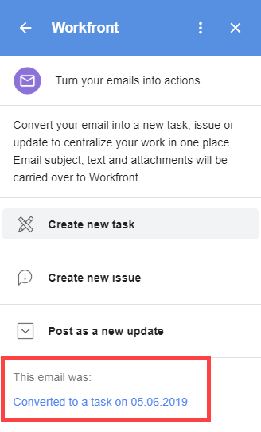

# Erstellen Sie eine [!DNL Adobe Workfront] Aufgabe in [!DNL G Suite] Verwenden von E-Mail-Inhalten

>[!NOTE]
>
>Es gibt eine [bekanntes Problem](https://experienceleague.adobe.com/docs/workfront-known-issues/issues/new-workfront-experience/wf-current/wf-integrations-error-when-opening-wf-for-gsuite.html?lang=en) mit der aktuellen Version von [!DNL Workfront for G Suite] funktioniert nicht erwartungsgemäß. Wir arbeiten an einer neuen Version und erwarten, dass sie an die [!DNL Google Marketplace] in naher Zukunft.

Sie können eine externe E-Mail konvertieren, die nicht von [!DNL Adobe Workfront]) zu [!DNL Workfront] Aufgabe.

Sie können auch eine externe E-Mail in eine Aktualisierung einer vorhandenen Aufgabe konvertieren. Weitere Informationen finden Sie unter [Aktualisieren von [!DNL Adobe Workfront] Element von [!DNL G Suite] mit E-Mail-Inhalt](../../workfront-integrations-and-apps/workfront-for-g-suite/update-wf-item-using-email-content.md).

Informationen zur Verwendung von [!DNL G Suite] , um mit Benachrichtigungs-E-Mails zu arbeiten, die von [!DNL Workfront], siehe [Verwalten [!DNL Adobe Workfront] Benachrichtigungsdetails von [!DNL G Suite]](../../workfront-integrations-and-apps/workfront-for-g-suite/manage-wf-email-notification-details-in-gsuite.md).

## Zugriffsanforderungen

Sie müssen über folgenden Zugriff verfügen, um die Schritte in diesem Artikel ausführen zu können:

<table style="table-layout:auto"> 
 <col> 
 <col> 
 <tbody> 
  <tr> 
   <td role="rowheader">[!DNL Adobe Workfront] Plan*</td> 
   <td> 
Beliebig
 </td> 
  </tr> 
  <tr> 
   <td role="rowheader">[!DNL Adobe Workfront] license*</td> 
   <td> 
[!UICONTROL Work], [!UICONTROL Plan]
 </td> 
  </tr> 
   </tbody> 
</table>

&#42;Wenden Sie sich an Ihren [!DNL Workfront] Administrator.

## Voraussetzungen

Bevor Sie eine [!DNL Workfront] Aufgabe in [!DNL G Suite], müssen Sie

* Installieren [!DNL Workfront for G suite]\
   Anweisungen finden Sie unter [Installieren [!DNL Adobe Workfront for G Suite]](../../workfront-integrations-and-apps/workfront-for-g-suite/install-workfront-for-gsuite.md).

## Erstellen Sie eine [!DNL Adobe Workfront] Aufgabe in [!DNL G Suite] Verwenden von E-Mail-Inhalten

1. Wenn die Variable [!UICONTROL Workfront für G Suite] nicht angezeigt wird, klicken Sie auf das [!DNL Workfront] icon  im [!DNL G Suite] Seitenleiste für Add-ons ganz rechts auf der Seite.
1. Öffnen Sie die E-Mail-Nachricht in [!DNL G Suite]klicken Sie auf eine Option in [!DNL Workfront for G Suite] zum Konvertieren der E-Mail in eine neue [!DNL Workfront] Aufgabe.

   

1. Wählen Sie eine **[!UICONTROL Neu erstellen]** -Option, um anzugeben, ob die Aufgabe Teil eines Projekts oder einer persönlichen Aufgabe sein wird, die von einem Projekt unabhängig ist.
1. Wenn Sie die Aufgabe an ein übergeordnetes Projekt anhängen möchten, klicken Sie auf **[!UICONTROL Projektname]**, geben Sie den Namen des Projekts ein, in dem Sie die Aufgabe durchführen möchten, und klicken Sie dann auf den Projektnamen, wenn er in der folgenden Liste angezeigt wird.
1. Nehmen Sie eine der folgenden Änderungen vor:

   <table style="table-layout:auto"> 
    <col> 
    <col> 
    <tbody> 
     <tr> 
      <td role="rowheader">[!UICONTROL Task Name]</td> 
      <td>Bearbeiten Sie einen beliebigen Teil dieses Textes, der sich aus der Betreffzeile der E-Mail ergibt.</td> 
     </tr> 
     <tr> 
      <td role="rowheader">[!UICONTROL Beschreibung]</td> 
      <td>Bearbeiten Sie einen beliebigen Teil dieses Textes, der aus dem Text der E-Mail stammt.</td> 
     </tr> 
     <tr data-mc-conditions=""> 
      <td role="rowheader">[!UICONTROL Zuweisen zu]</td> 
      <td>Klicken <strong>[!UICONTROL Zuweisen zu]</strong>, klicken Sie auf die <strong>[!UICONTROL Weisen Sie dies zu]</strong> eingeben und klicken Sie auf den Namen der Person, sobald er in der Liste unten angezeigt wird. Wiederholen Sie diesen Vorgang für jede Person, die Sie hinzufügen möchten, und klicken Sie dann auf <strong>[!UICONTROL Save]</strong>.</td> 
     </tr> 
     <tr data-mc-conditions=""> 
      <td role="rowheader">[!UICONTROL Geplante Dauer]</td> 
      <td> 
Klicken <strong>[!UICONTROL Geplante Dauer]</strong>und geben Sie die Anzahl der Tage ein, die die Aufgabe benötigen soll. 
 
Hinweis: Diese Option kann für Ihre Organisation auf unterschiedliche Weise konfiguriert werden. Beispielsweise müssen Sie für Ihre Organisation möglicherweise eine Anzahl von Stunden anstelle von Tagen eingeben. Wenn Sie weitere Informationen benötigen, lesen Sie den Abschnitt [!DNL Workfront] Administrator. Wenn Sie einen anderen Zeitraum als den konfigurierten Standard festlegen möchten, geben Sie <strong>m</strong>, <strong>h</strong>, <strong>d</strong>, <strong>w</strong>oder <strong>mo</strong> nach der Zahl, die Minuten, Stunden, Tage, Wochen oder Monate angibt.
 </td> 
     </tr> 
     <tr data-mc-conditions=""> 
      <td role="rowheader">[!UICONTROL Priority]</td> 
      <td>Klicken Sie auf den Dropdown-Pfeil und dann auf die gewünschte Priorität für die Aufgabe.</td> 
     </tr> 
     <tr data-mc-conditions=""> 
      <td role="rowheader">[!UICONTROL E-Mail-Anhänge einschließen]</td> 
      <td> 
(Nur verfügbar, wenn die E-Mail mindestens einen Anhang enthält.) Klicken Sie auf diese Option, um Anlagen in der E-Mail im Bereich [!UICONTROL Dokumente] der Aufgabe zu speichern. 
 
Wenn Sie keine Anlage speichern möchten, klicken Sie auf das X rechts neben ihrem Namen. 
 
Wenn die E-Mail Links zu Dokumenten in [!DNL Google Drive], werden sie im Tab [!UICONTROL Übersicht] der Aufgabe gespeichert, die Sie erstellen. 
 
Wichtig: Damit dies funktioniert, muss Ihr [!DNL Workfront] Administrator muss autorisieren [!DNL Google Drive] zum Arbeiten mit Dokumenten in [!DNL Workfront], wie im Abschnitt beschrieben <a href="../../administration-and-setup/configure-integrations/configure-document-integrations.md#configur" class="MCXref xref">Integrationen zum Verwalten von Dokumenten konfigurieren</a> im Artikel <a href="../../administration-and-setup/configure-integrations/configure-document-integrations.md" class="MCXref xref">Dokumentintegrationen konfigurieren</a>.
 
Wenn Sie diese Option aktivieren, bleibt sie für andere E-Mails aktiviert, die Sie in Aufgaben, Probleme und Updates konvertieren.
 </td> 
     </tr> 
     <tr data-mc-conditions=""> 
      <td role="rowheader">[!UICONTROL E-Mail-Datei einschließen]</td> 
      <td> 
Klicken Sie auf diese Option, um die ursprüngliche E-Mail als E-Mail-Datei (EML) zu speichern. zum Bereich [!UICONTROL Dokumente] der Aufgabe. Dort können Sie auf die Datei doppelklicken, um die E-Mail in Ihrer E-Mail-Anwendung zu öffnen.
 
Wenn Sie diese Option aktivieren, bleibt sie für andere E-Mails aktiviert, die Sie in Aufgaben, Probleme und Updates konvertieren.
 </td> 
     </tr> 
    </tbody> 
   </table>

1. Klicken **[!UICONTROL Aufgabe erstellen]**.

   Die **[!UICONTROL Details]** Registerkarte für die neue Aufgabe wird im [!DNL Workfront for G Suite] Bereich. Sie können auf **[!UICONTROL Updates]** und sofort mit den Mitarbeitern kommunizieren, ohne Ihre Eingaben zu verweigern.

   Am unteren Rand des **[!UICONTROL Details]** Registerkarte können Sie auch auf **[!UICONTROL Anzeigen in[!DNL Workfront]]** , um zur neuen Aufgabe in Workfront zu wechseln.

   Wenn Sie den Browser aktualisieren, wird eine Meldung mit einem Link am unteren Rand des [!DNL Workfront for G Suite] bestätigt, dass Sie die E-Mail in eine Aufgabe konvertiert haben:

   

   Sie können auf den Link klicken, um zur Detailansicht im [!DNL Workfront for G Suite] für die Aufgabe, die Sie erstellt haben.

   Sie können diese Schritte wiederholen, um dieselbe E-Mail in mehrere Aufgaben zu konvertieren. Wenn Sie Ihren Browser aktualisieren oder zu einem anderen Zeitpunkt zur E-Mail zurückkehren, werden alle Links, die Sie für die E-Mail erstellt haben, unten im [!UICONTROL Workfront für G Suite] Bereich.

1. (Optional) Fahren Sie mit der Aufgabe im [!DNL Workfront for G Suite] -Bedienfeld durch einen der folgenden Schritte:

   * So fügen Sie eine Aktualisierung zum **[!UICONTROL Updates]** Registerkarte, klicken Sie auf **[!UICONTROL Neue Aktualisierung starten]** und geben Sie die Aktualisierung ein.

   * So antworten Sie auf eine Aktualisierung der **[!UICONTROL Updates]** Registerkarte, klicken Sie auf **[!UICONTROL Antwort]** und geben Sie Ihre Antwort ein.

      Bei beiden der oben genannten Aktionen können Sie bestimmte Benutzer über Ihren Kommentar benachrichtigen. Klicken **[!UICONTROL Benachrichtigen]**, beginnen Sie mit der Eingabe des Namens eines Benutzers und klicken Sie dann auf den Namen, wenn er in der Dropdown-Liste angezeigt wird. Wiederholen Sie diesen Vorgang für andere Benutzer, die Sie benachrichtigen möchten, und klicken Sie dann auf **[!UICONTROL Post]**.

   * Klicken Sie auf **[!UICONTROL Dokumente]** um alle mit der Aufgabe gespeicherten Dokumente anzuzeigen.

Sie können diese Schritte wiederholen, um dieselbe E-Mail in mehrere Aufgaben zu konvertieren. Wenn Sie Ihren Browser aktualisieren oder zu einem anderen Zeitpunkt zur E-Mail zurückkehren, werden alle Links, die Sie für die E-Mail erstellt haben, unten im [!DNL Workfront for G Suite] Bereich.
