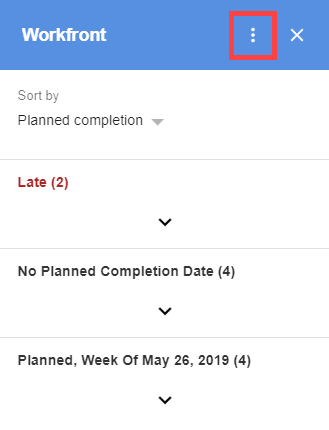

# Anmelden und Abmelden von [!DNL Adobe Workfront for G Suite]

>[!NOTE]
>
>Es gibt eine [bekanntes Problem](https://experienceleague.adobe.com/docs/workfront-known-issues/issues/new-workfront-experience/wf-current/wf-integrations-error-when-opening-wf-for-gsuite.html?lang=en) mit der aktuellen Version von [!DNL Workfront for G Suite] funktioniert nicht erwartungsgemäß. Wir arbeiten an einer neuen Version und erwarten, dass sie an die [!DNL Google Marketplace] in naher Zukunft.

## Zugriffsanforderungen

Sie müssen über folgenden Zugriff verfügen, um die Schritte in diesem Artikel ausführen zu können:

<table style="table-layout:auto"> 
 <col> 
 <col> 
 <tbody> 
  <tr> 
   <td role="rowheader">[!DNL Adobe Workfront] Plan*</td> 
   <td> 
Beliebig
 </td> 
  </tr> 
  <tr> 
   <td role="rowheader">[!DNL Adobe Workfront] license*</td> 
   <td> 
[!UICONTROL Work], [!UICONTROL Plan]
 </td> 
  </tr> 
   </tbody> 
</table>

&#42;Wenden Sie sich an Ihren [!DNL Workfront] Administrator.

## Voraussetzungen

Vor der Anmeldung oder Abmeldung von [!DNL Workfront for G Suite], müssen Sie

* Installieren [!DNL Workfront for G suite]\
   Anweisungen finden Sie unter [Installieren [!DNL Adobe Workfront for G Suite]](../../workfront-integrations-and-apps/workfront-for-g-suite/install-workfront-for-gsuite.md).

## Anmelden [!DNL Adobe Workfront for G Suite]

1. Klicken Sie auf [!DNL Workfront] icon  im [!DNL G Suite] Seitenleiste für Add-ons ganz rechts von [!DNL Gmail], [!DNL Google Calendar]oder [!DNL Google Drive].

   Wenn Sie die [!DNL Workfront for G Suite] -Add-on verwenden und dieses Symbol nicht angezeigt wird, sollten Sie die Browser-Seite aktualisieren.

1. Klicken **[!UICONTROL Anmelden]** im [!DNL Workfront for G Suite] -Add-on.
1. Geben Sie Ihre [!DNL Workfront] Domain-Adresse, z. B. *companyname.my.workfront.com*.
1. Befolgen Sie die Anweisungen zum Anmelden bei [!DNL Workfront].

   >[!NOTE]
   >
   >* [!DNL Workfront] verbindet [!DNL G Suite] mit OAuth 2.0, einem sicheren Standard, der von den meisten webbasierten Integrationen für die Authentifizierung und Autorisierung von Benutzern verwendet wird.
   >* Wenn Sie aufgefordert werden, die [Domäne oder Host] Ihrer [!DNL Workfront] -Konto angeben, geben Sie es in folgendem Format ein: *yourCompany&#39;sDomain.my.workfront.com*. Die Domäne Ihres Unternehmens ist normalerweise der Name Ihres Unternehmens.

## Abmelden von [!DNL Workfront for G Suite]

1. Wenn die Variable [!UICONTROL Workfront für G Suite] nicht angezeigt wird, klicken Sie auf das [!DNL Workfront] icon  im [!DNL G Suite] Seitenleiste für Add-ons ganz rechts auf der Seite.
1. Klicken Sie auf **[!UICONTROL Mehr Aktionen]** -Symbol oben im [!DNL Workfront for G Suite] Bereich.

   

1. Klicken **[!UICONTROL Abmelden]** im angezeigten Menü.

   Dadurch werden Sie nicht von [!DNL G Suite].
