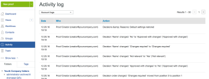

# Optionen für Genehmigungsentscheidungen konfigurieren in [!DNL Workfront Proof]

>[!IMPORTANT]
>
>Dieser Artikel bezieht sich auf die Funktionalität im eigenständigen Produkt [!DNL Workfront Proof]. Informationen zum Testen in [!DNL Adobe Workfront], siehe [Testversand](../../../review-and-approve-work/proofing/proofing.md).

Als [!DNL Workfront Proof] Administratoren, die einen &quot;Select&quot;- oder &quot;Premium&quot;-Bearbeitungsplan verwenden, können die Optionen für Genehmigungsentscheidungen auf folgende Weise für alle von [!DNL Workfront Proof] Benutzer in Ihrer Organisation:

* Ändern des Namens der Entscheidung
* Ändern der Reihenfolge der im Testversand-Viewer angezeigten Entscheidungen
* Entscheiden, welche Entscheidungen angezeigt werden sollen

In diesem Artikel wird Folgendes erläutert:

## Konfigurieren von Entscheidungseinstellungen

1. Klicken **[!UICONTROL Kontoeinstellungen]**.
1. Öffnen Sie die **[!UICONTROL Entscheidungen]** Registerkarte.
1. Nehmen Sie eine der folgenden Änderungen vor:

   * Um eine Entscheidung auszublenden, klicken Sie auf **[!UICONTROL Ausblenden]** rechts neben der Entscheidung, die Sie nicht benötigen.
   * Um eine Entscheidung umzubenennen, klicken Sie auf den Namen der Entscheidung, bearbeiten Sie sie und klicken Sie dann außerhalb des Felds auf (oder drücken Sie die Eingabetaste). [!DNL Workfront Proof] aktualisiert den Namen der Entscheidung für alle vorhandenen Testsendungen in Ihrem System.

      >[!IMPORTANT]
      >
      >Behalten Sie die Logik für eine Entscheidung bei, wenn Sie sie umbenennen. Beispielsweise könnte die Standardentscheidung &quot;Abgelehnt&quot;in &quot;Neue Version erforderlich&quot;geändert werden, sollte jedoch nicht in &quot;An Drucker senden&quot;geändert werden.

      Wenn Sie zur [!DNL Workfront Proof] Standardeinstellungen verwenden, können Sie auf Standardentscheidungen wiederherstellen klicken.

>[!NOTE]
>
>* Die den Entscheidungen zugrunde liegende Logik wird verwendet, um den Gesamtstatus eines Testversand-Workflows zu berechnen, wenn mehrere Entscheidungen verschiedener Ebenen vorliegen.
>* Die Entscheidungen &quot;Genehmigt&quot;und &quot;Mit Änderungen genehmigt&quot;werden in einem automatischen Workflow in der nächsten Phase Trigger.
>* Wenn Sie eine Entscheidung umbenennen und die Logik überprüfen möchten, können Sie auf **[!UICONTROL Aktivität]** im linken Navigationsbereich und überprüfen Sie Ihr Aktivitätsprotokoll, wo die ursprünglichen Entscheidungen in Klammern angezeigt werden.
>
>  >

## Entscheidungsgründe erstellen

Entscheidungsgründe sind eine gute Möglichkeit, zusätzliche Entscheidungsinformationen über einen Beweis zu erfassen.

1. Klicken **[!UICONTROL Einstellungen]** > **[!UICONTROL Kontoeinstellungen]**.

1. Öffnen Sie die **[!UICONTROL Entscheidungen]** Registerkarte.
Standardmäßig stehen allen Entscheidungsträgern für Ihre Testsendungen die entsprechenden Gründe zur Verfügung. Sie können dies jedoch auf Primäre Entscheidungsträger beschränken.
Je nach Ihren Anforderungen können Sie die Auswahl mehrerer Gründe zulassen oder aus einer Auswahlliste wählen. Sie können die Gründe auch als zwingend angeben, d. h. die Prüfer müssen einen Grund auswählen, bevor sie ihre Entscheidung auf einem Testversand speichern können.
   

1. Im **[!UICONTROL Gründe]** Abschnitt, klicken Sie auf **[!UICONTROL Neuer Grund]**.
   

1. Geben Sie einen Titel für den Abschnitt &quot;Gründe&quot;in das Feld ein, das unter **[!UICONTROL Grund]**.
1. Wenn Sie ein Textfeld einschließen möchten, wählen Sie **[!UICONTROL Textfeld einschließen]**.
1. Klicken Sie auf **[!UICONTROL Speichern]**.
   
Der wichtigste Schritt besteht darin, die Entscheidungen auszuwählen, für die die Gründe angezeigt werden sollen. Wenn Sie dies vergessen, werden die Gründe nicht auf Ihren Testsendungen angezeigt.

1. Markieren Sie die Kästchen in der **[!UICONTROL Anzeigegründe]** in der Entscheidungsliste oben auf der Seite. Sie können aus Ihren Gründen eine oder mehrere Entscheidungen auswählen.
   

## Erstellen einer Nachricht mit einer Beitragsentscheidung

Sie können eine Nachricht zur Beitragsentscheidung erstellen, die angezeigt wird, nachdem ein Prüfer seine Entscheidung über den Testversand gespeichert hat.

1. Klicken **[!UICONTROL Einstellungen]** > **[!UICONTROL Kontoeinstellungen]**.

1. Öffnen Sie die **[!UICONTROL Entscheidungen]** Registerkarte.
1. Im **[!UICONTROL Post-Entscheidungsnachricht]** Abschnitt, klicken Sie auf **[!UICONTROL Bearbeiten]** am Ende des **[!UICONTROL Nachricht]** Zeile.
Sie können auch entscheiden, ob die Nachricht allen Entscheidungsträgern angezeigt werden soll oder ob Sie sie auf den Primären Entscheidungsträger beschränken möchten.
   

1. Im **[!UICONTROL Nachricht anzeigen]** die Entscheidungen angeben, auf denen diese Nachricht angezeigt werden soll.
Wenn Sie nicht mindestens eine Entscheidung auswählen, wird die Nachricht nicht in Ihren Testsendungen angezeigt. Aktivieren Sie mindestens ein Kontrollkästchen in dieser Spalte.
   
