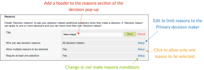
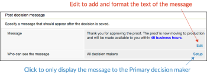

# Konfigurieren von Genehmigungsentscheidungsoptionen in [!DNL Workfront Proof]

>[!IMPORTANT]
>
>Dieser Artikel bezieht sich auf Funktionen im eigenständigen [!DNL Workfront Proof]. Informationen zu Proofing in [!DNL Adobe Workfront] finden Sie unter [Proofing](../../../review-and-approve-work/proofing/proofing.md).

Als [!DNL Workfront Proof]-Administrator können Sie mit einem Plan der Auswahl- oder Premium-Bearbeitung Genehmigungsentscheidungsoptionen für alle Korrekturabzüge, die von [!DNL Workfront Proof] Benutzern in Ihrer Organisation erstellt wurden, wie folgt konfigurieren:

* Name der Entscheidung ändern
* Reihenfolge der Entscheidungen ändern, die in der Korrekturabzugsansicht angezeigt werden
* Festlegen, welche Entscheidungen angezeigt werden sollen

In diesem Artikel wird Folgendes erläutert:

## Konfigurieren von Entscheidungseinstellungen

1. Klicken Sie **[!UICONTROL Kontoeinstellungen]**.
1. Öffnen Sie die **[!UICONTROL Entscheidungen]** .
1. Nehmen Sie eine der folgenden Änderungen vor:

   * Um eine Entscheidung auszublenden, klicken **[!UICONTROL rechts]** der Entscheidung auf „Ausblenden“, die Sie nicht benötigen.
   * Um eine Entscheidung umzubenennen, klicken Sie auf den Namen der Entscheidung, bearbeiten Sie sie und klicken Sie dann außerhalb des Felds (oder drücken Sie die Eingabetaste). [!DNL Workfront Proof] aktualisiert den Namen der Entscheidung für alle vorhandenen Korrekturabzüge in Ihrem System.

     >[!IMPORTANT]
     >
     >Behalten Sie die Logik für eine Entscheidung bei, wenn Sie sie umbenennen. Die Standardentscheidung „Abgelehnt“ könnte beispielsweise in „Neue Version erforderlich“ geändert werden, sie sollte jedoch nicht in „An Drucker senden“ geändert werden.

     Wenn Sie zu den [!DNL Workfront Proof] Standardeinstellungen zurückkehren möchten, können Sie auf Standardentscheidungen wiederherstellen klicken.

>[!NOTE]
>
>* Die Logik hinter den Entscheidungen wird verwendet, um den Gesamtstatus eines Korrekturabzugs-Workflows zu berechnen, wenn mehrere Entscheidungen mit verschiedenen Ebenen vorhanden sind.
>* Die Entscheidungen „Genehmigt“ und „Mit Änderungen genehmigt“ führen im nächsten Schritt in einem automatischen Workflow zum Trigger.
>* Wenn Sie eine Entscheidung umbenennen und die Logik überprüfen möchten, können Sie im linken Navigationsbereich auf **[!UICONTROL Aktivität]** klicken und Ihr Aktivitätsprotokoll überprüfen, in dem die ursprünglichen Entscheidungen in Klammern angezeigt werden.
>
>  >

## Entscheidungsgründe erstellen

Entscheidungsgründe sind eine gute Möglichkeit, zusätzliche Entscheidungsinformationen über einen Korrekturabzug zu erfassen.

1. Klicken Sie **[!UICONTROL Einstellungen]** > **[!UICONTROL Kontoeinstellungen]**.

1. Öffnen Sie die **[!UICONTROL Entscheidungen]** .
Standardmäßig sind die Gründe für alle Entscheidungsträger bei Ihren Testsendungen verfügbar, Sie können diese jedoch auf Primäre Entscheidungsträger beschränken.
Je nach Ihren Anforderungen können Sie die Auswahl mehrerer Gründe zulassen oder eine Auswahlliste daraus machen. Sie können Gründe auch als obligatorisch festlegen, d. h., dass Überprüfende einen Grund auswählen müssen, bevor sie ihre Entscheidung bei einem Korrekturabzug speichern dürfen.
   

1. Klicken Sie **[!UICONTROL Abschnitt &quot;]**&quot; auf **[!UICONTROL Neuer Grund]**.
   

1. Geben Sie einen Titel für den Abschnitt „Gründe“ in das Feld ein, das unter **[!UICONTROL Grund]** angezeigt wird.
1. Wenn Sie ein Textfeld einbeziehen möchten, wählen Sie **[!UICONTROL Textfeld einschließen]**.
1. Klicken Sie auf **[!UICONTROL Speichern]**.
   
Der wichtigste Schritt besteht darin, die Entscheidungen auszuwählen, für die Gründe angezeigt werden sollten. Wenn Sie dies vergessen, werden die Gründe nicht auf Ihren Testsendungen angezeigt.

1. Aktivieren Sie die Kontrollkästchen in der **[!UICONTROL Gründe anzeigen]** in der Entscheidungsliste oben auf der Seite. Sie können aus Ihren Gründen eine oder mehrere Entscheidungen auswählen.
   

## Erstellen einer Post-Entscheidungs-Nachricht

Sie können eine Nachricht für eine POST-Entscheidung erstellen, die angezeigt wird, nachdem ein Prüfer seine Entscheidung im Korrekturabzug gespeichert hat.

1. Klicken Sie **[!UICONTROL Einstellungen]** > **[!UICONTROL Kontoeinstellungen]**.

1. Öffnen Sie die **[!UICONTROL Entscheidungen]** .
1. Klicken Sie **[!UICONTROL Abschnitt]** Nach der Entscheidung ]**am Ende der Zeile**[!UICONTROL  Nachricht ]**auf**[!UICONTROL Bearbeiten.
Sie können auch entscheiden, ob die Nachricht allen Entscheidungsträgern angezeigt werden soll oder ob sie auf den Primären Entscheidungsträger beschränkt werden soll.
   

1. Geben **[!UICONTROL in der Spalte]**Nachricht anzeigen“ die Entscheidungen an, für die diese Nachricht angezeigt werden soll.
Wenn Sie nicht mindestens eine Entscheidung auswählen, wird die Nachricht nicht auf Ihren Korrekturabzügen angezeigt. Stellen Sie sicher, dass Sie mindestens ein Kästchen in dieser Spalte aktivieren.
   
