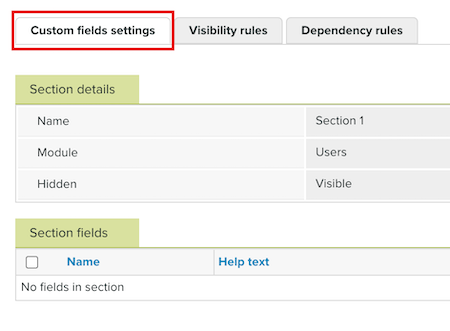

# Erstellen und Verwalten benutzerdefinierter Felder in [!DNL Workfront Proof]

<!-- Audited: 4/2025 -->

>[!IMPORTANT]
>
>Dieser Artikel bezieht sich auf Funktionen im eigenständigen [!DNL Workfront Proof]. Informationen zu Proofing in [!DNL Adobe Workfront] finden Sie unter [Proofing](../../../review-and-approve-work/proofing/proofing.md).

Für die Verwendung dieser Funktion ist ein Select- oder Premium-[!DNL Workfront] erforderlich. Weitere Informationen zu den verschiedenen verfügbaren Plänen finden Sie unter [Workfront-Pläne](https://business.adobe.com/products/workfront/pricing.html).

Mit benutzerdefinierten Feldern können Sie zusätzliche Daten erfassen, wenn Sie einen neuen Korrekturabzug, Benutzende oder Gast erstellen. Wenn ein(e) Benutzende(r) beispielsweise einen neuen Korrekturabzug erstellt, kann er/sie einen zusätzlichen Abschnitt enthalten, in dem eine Auftragsnummer, ein Abteilungscode oder eine Lieferantenreferenz erfasst werden können.

>[!NOTE]
>
>* Durch die Erfassung dieser Art von Informationen auf der Seite Neuer Korrekturabzug über benutzerdefinierte Felder können Sie auch die Länge Ihres Korrekturabzugsnamens reduzieren, da diese Details nicht im Namen enthalten sein müssen.
>
>* Nachdem ein benutzerdefiniertes Feld für einen Korrekturabzug, einen Benutzer oder einen Kontakt verwendet wurde, können Sie es nicht mehr löschen oder den Feldtyp bearbeiten. Sie können sie jedoch über die Seite „Benutzerdefinierte Feldeinstellungen“ ausblenden, sodass sie nicht für neue Elemente verwendet wird.
>
>* Wenn Sie einen benutzerdefinierten Feldabschnitt ausblenden, werden alle Felder innerhalb des Abschnitts ebenfalls ausgeblendet, selbst wenn die einzelnen Felder als sichtbar festgelegt sind.

## Erstellen benutzerdefinierter Felder

{{step1-to-proofing}}

1. Klicken Sie oben rechts auf der Seite auf &quot;**&quot;**.

1. Wählen Sie auf der **Kontoeinstellungen** die Registerkarte **Benutzerdefinierte Felder** aus.

1. Klicken Sie **[!UICONTROL Abschnitt Benutzerdefiniertes Feld hinzufügen]** auf der rechten Seite des Moduls (**Korrekturabzug**, **Benutzer** oder **Kontakte**), dem Sie das benutzerdefinierte Feld hinzufügen möchten. Die **Abschnittsdetails** wird geöffnet.

1. Geben Sie **benutzerdefinierten Feldabschnitt einen** Namen“ ein und klicken Sie dann auf **[!UICONTROL Speichern]**.

1. Klicken Sie auf die **[!UICONTROL Einstellungen für benutzerdefinierte Felder]**, um die Seite zu aktualisieren. Der Abschnitt Neues benutzerdefiniertes Feld wird unter dem zugewiesenen Modul angezeigt.

   

1. Klicken Sie auf den Namen des neuen Abschnitts für benutzerdefinierte Felder, um die Registerkarte **Abschnitt für benutzerdefinierte Felder** zu öffnen.

1. Klicken Sie oben rechts auf der Seite auf die Schaltfläche **[!UICONTROL Neues benutzerdefiniertes Feld]**. Die **Neues benutzerdefiniertes Feld** wird angezeigt.

1. Geben Sie die **Felddetails** an:

   * **Name**: Geben Sie den benutzerdefinierten Feldnamen ein.
   * **Hilfe**: Geben Sie einen Hilfetext ein, der in einer QuickInfo angezeigt wird.
   * **Obligatorisch**: Aktivieren Sie dieses Kontrollkästchen, um den Benutzer aufzufordern, das Feld auszufüllen.
   * **Durchsuchbar** (bedingt): Aktivieren Sie dieses Kontrollkästchen, um das benutzerdefinierte Feld durchsuchbar zu machen.
   * **Ausgeblendet**: Aktivieren Sie dieses Kontrollkästchen, um das benutzerdefinierte Feld auf den Seiten **Neuer Korrekturabzug**, **Neuer Gast** und **Neuer Benutzer** auszublenden.

1. Geben Sie den **Feldtyp** und Details an:

   * **Typ**: Wählen Sie den benutzerdefinierten Feldtyp aus.
   * **Listenelemente**: (Bedingt) Fügen Sie die Listenelemente hinzu, die im benutzerdefinierten Feld angezeigt werden.
   * **Standardwert**: Wählen Sie den Standardwert für dieses benutzerdefinierte Feld aus. Diese Option hängt vom ausgewählten benutzerdefinierten Feldtyp ab.

1. Klicken Sie auf **[!UICONTROL Speichern]**.

1. Nehmen Sie alle weiteren Änderungen an den Einstellungen für das Feld vor:

   * Ein- oder Ausblenden des benutzerdefinierten Feldabschnitts, indem Sie auf das Menü **Mehr**  rechts neben dem Namen des benutzerdefinierten Feldabschnitts klicken und dann auf **[!UICONTROL Abschnitt ausblenden]** oder **[!UICONTROL Abschnitt einblenden]**.
   * Ein- oder Ausblenden des benutzerdefinierten Felds, indem Sie auf das Menü **Mehr**  rechts neben dem Abschnittsnamen des benutzerdefinierten Felds klicken und dann auf **[!UICONTROL Benutzerdefiniertes Feld ausblenden]** oder **[!UICONTROL Benutzerdefiniertes Feld einblenden]**.
   * Ändern Sie die Reihenfolge der Felder mithilfe der Pfeile nach oben/unten, die rechts neben ihren Namen angezeigt werden (wenn Sie mehrere Felder in einem Abschnitt hinzugefügt haben).

1. Klicken Sie auf **[!UICONTROL Registerkarte „Sichtbarkeitsregeln]**.

   Mit Sichtbarkeitsregeln können Sie festlegen, welche zusätzlichen Felder basierend auf dem Ausfüllen des ersten benutzerdefinierten Felds angezeigt werden sollen. Wenn beispielsweise das abhängige Feld A und das steuernde Feld X ist, bedeutet dies, dass Feld A nur sichtbar ist, wenn Feld X ausgefüllt ist.

   Sie können Kontrollwerte verwenden, um die Werte im Kontrollfeld zu bestimmen, die bei Auswahl dazu führen, dass das abhängige Feld sichtbar wird. Angenommen, das abhängige Feld ist A und das Kontrollfeld ist X, und Sie legen die Kontrollwerte in X nur auf die Optionen 1 und 2 fest. Das bedeutet, dass Feld A nur sichtbar ist, wenn Feld X Option 1 oder 2 ausgewählt ist. Wenn Feld X-Optionen 3 oder 4 ausgewählt sind, wird Feld A nicht angezeigt.

   >[!NOTE]
   >
   >In einer Sichtbarkeitsregel können nur benutzerdefinierte Feldtypen wie „Liste“ und „Optionsfeld“ für das Kontrollfeld verwendet werden, während das abhängige Feld ein beliebiger Feldtyp sein kann.

   So fügen Sie eine Sichtbarkeitsregel hinzu:

   1. Klicken Sie **[!UICONTROL Neue Sichtbarkeitsregel]** für das Modul, dem Sie die Regel hinzufügen möchten.

   1. Wählen Sie die gewünschten Einstellungen für die Regel aus und klicken Sie dann auf **[!UICONTROL Speichern]**.

1. Öffnen Sie die **[!UICONTROL Abhängigkeitsregeln]**.

   Mit Abhängigkeitsregeln können Sie die im Feld „Abhängig“ verfügbaren Optionen bestimmen, wenn bestimmte Optionen im Feld „Steuerung“ ausgewählt sind. Wenn beispielsweise das abhängige Feld „B“ und das Kontrollfeld „Y“ ist, können Sie es wie folgt einrichten:

   * Wenn Option 1 im Feld Y ausgewählt ist, werden nur die Optionen 1 und 2 im Feld B angezeigt.

   * Wenn Option 2 im Feld Y gewählt wird, werden nur die Optionen 3 und 4 im Feld B angezeigt.

   >[!NOTE]
   >
   >Für die abhängigen und steuernden Felder in einer Abhängigkeitsregel können nur benutzerdefinierte Feldtypen vom Typ Liste und Optionsfeld verwendet werden.

   So fügen Sie eine Abhängigkeitsregel hinzu:

   1. Klicken Sie **[!UICONTROL Neue Abhängigkeitsregel]** für das Modul, dem Sie die Regel hinzufügen möchten.

   1. Wählen Sie die gewünschten Einstellungen für die Abhängigkeit aus und klicken Sie dann auf **[!UICONTROL Speichern]**.

## Verwalten von benutzerdefinierten Feldern

Sie können die Details Ihres Bereichs Benutzerdefiniertes Feld oder einzelner benutzerdefinierter Felder anzeigen und bearbeiten.

{{step1-to-proofing}}

1. Klicken Sie oben rechts auf der Seite auf &quot;**&quot;**.

1. Wählen Sie auf der **Kontoeinstellungen** die Registerkarte **Benutzerdefinierte Felder** aus.

1. Klicken Sie auf den Namen des Abschnitts für das benutzerdefinierte Feld oder auf ein einzelnes benutzerdefiniertes Feld.

1. (Bedingt) Wenn Sie einen benutzerdefinierten Feldabschnitt verwalten, nehmen Sie eine der folgenden Änderungen auf der Seite **[!UICONTROL Benutzerdefinierter Feldabschnitt]** vor:

   * Bearbeiten Sie den Namen des Abschnitts.
   * Verschieben Sie sie in ein anderes Modul.
   * Abschnitt aus-/einblenden.

1. (Bedingt) Wenn Sie ein benutzerdefiniertes Feld verwalten, nehmen Sie eine der folgenden Änderungen auf der Seite &quot;**[!UICONTROL Feld“]**:

   * Verschieben Sie das Feld in einen anderen Abschnitt.
   * Bearbeiten Sie den Namen des Felds.
   * Hilfetext bearbeiten.
   * Aktivieren/Deaktivieren Sie die **[!UICONTROL Obligatorisch]**-Einstellung für das Feld.
   * (Bedingt) Aktivieren/Deaktivieren der Einstellung **[!UICONTROL Durchsuchbar]** für das Feld.
   * Feld aus-/einblenden.
   * Bearbeiten Sie den Feldtyp.
   * Legen Sie einen Standardwert für das Feld fest bzw. bearbeiten Sie ihn.
   * Einrichten von Sichtbarkeits- und Abhängigkeitsregeln.
