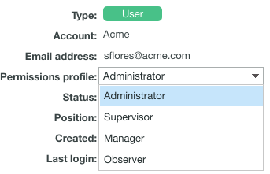

# Korrekturabzug-Berechtigungsprofile in [!DNL Workfront Proof]

>[!IMPORTANT]
>
>Dieser Artikel bezieht sich auf Funktionen im eigenständigen [!DNL Workfront Proof]. Informationen zu Proofing in [!DNL Adobe Workfront] finden Sie unter [Proofing](../../../review-and-approve-work/proofing/proofing.md).

Als [!DNL Workfront] oder [!DNL Workfront Proof] können Sie einem Benutzer ein Profil für Korrekturabzugsberechtigungen zuweisen , um die Korrekturabzugsfunktionen anzugeben, die dieser Benutzer für alle Korrekturabzüge im System haben wird. Informationen zum Konfigurieren des Berechtigungsprofils für Korrekturabzüge von Benutzenden finden Sie [Konfigurieren des Berechtigungsprofils für Korrekturabzüge in [!DNL Workfront Proof]](../../../workfront-proof/wp-acct-admin/account-settings/config-user-pref-in-wp.md).

>[!NOTE]
>
>Sie können auch Folgendes tun:
>
>* Gewähren Sie Benutzern bestimmte Rollen für einzelne Korrekturabzüge. Weitere Informationen zu Korrekturabzug-Rollen finden Sie unter [Verwalten von Korrekturabzug-Rollen in [!DNL Workfront Proof]](../../../workfront-proof/wp-work-proofsfiles/share-proofs-and-files/manage-proof-roles.md).
>* Erstellen Sie benutzerdefinierte Profile für Benutzer in Ihrer Organisation. Weitere Informationen finden Sie unter [Konfigurieren von benutzerdefinierten Profilen in [!DNL Workfront Proof]](../../../workfront-proof/wp-acct-admin/account-settings/configure-custom-profiles.md).
>

In der folgenden Tabelle werden die Berechtigungen angezeigt, die mit jedem Profil für Korrekturabzugsberechtigungen verfügbar sind.

| **Eigene Elemente** |  |  |  |  | **Elemente anderer Benutzer** |  |  | **admin** | **Abrechnung** |
|---|---|---|---|---|---|---|---|---|---|
|   | **Hinzufügen** | **Anzeigen** | **Bearbeiten** | **Löschen** | **Anzeigen** | **Bearbeiten** | **Löschen** | **Bearbeiten und Löschen** | **Bearbeiten** |
| Abrechnungs-Administrator |  |  |  |  |  |  |  |  |  |
| Admin |  |  |  |  |  |  |  |  |   |
| Supervisor |  |  |  |  |  |  |  |   |   |
| Managerin bzw. Manager |  |  |  |  |   |   |   |   |   |
| Beobachter |   |  |   |   |   |   |   |   |   |
| Besucher |   |  |   |   |   |   |   |   |   |

{style="table-layout:auto"}

Beachten Sie Folgendes zu Rollen und Berechtigungen:

* Zugewiesene Profilberechtigungen beziehen sich nur auf die Benutzer und Elemente in Ihrem eigenen Konto. Eine Ausnahme bilden Satellitenkonten, bei denen der Administrator und der Abrechnungsadministrator für die Hauptkonten (Hub) über die Hub-Kontoebene auf die Kontoeinstellungen und die Abrechnung dieser Konten zugreifen und diese verwalten kann.
* Rechnungsadministratoren und -administratoren können Benutzer löschen. Dies kann nur in den Kontoeinstellungen erfolgen.
* Wenn Abrechnungsadministratoren und -administratoren Korrekturabzüge anzeigen, die anderen Benutzern in ihrem Konto gehören, sehen sie diese in der Rolle eines Prüfers.
* Mit der Rolle „Schreibgeschützt“ können Rechnungsadministratoren und -administratoren auf Korrekturabzüge in Ordnern zugreifen, die für sie freigegeben sind, oder in Ordnern, die von ihnen erstellt wurden.

In den folgenden Abschnitten werden die einzelnen Profile und die mit dem Profil verbundenen Berechtigungen in einer standardmäßigen [!DNL Workfront Proof] beschrieben:

* [Abrechnungs-Administrator](#billing-administrator)
* [Administrator](#administrator)
* [Verantwortlicher](#supervisor)
* [Manager](#manager)
* [Beobachter](#observer)
* [Besucher](#visitor)
* [Gast](#guest)

## Abrechnungs-Administrator {#billing-administrator}

Abrechnungsadministratoren haben Zugriff auf [Kontoeinstellungen auf  [!DNL Workfront Proof]](../../../workfront-proof/wp-acct-admin/account-settings/account-settings.md) and [The [!DNL Workfront Proof] Abrechnungsseite](../../../workfront-proof/wp-billingsettings/manage-your-billing/wp-billing-page.md) und verfügen über die folgenden Berechtigungen:

 Kann Korrekturabzüge generieren, Dateien hochladen und Ordner erstellen. Weitere Informationen finden Sie unter [Erstellen von Korrekturabzügen in [!DNL Workfront Proof]](../../../workfront-proof/wp-work-proofsfiles/create-proofs-and-files/generate-proofs.md), [Hochladen von Dateien und Webinhalten in [!DNL Workfront Proof]](../../../workfront-proof/wp-work-proofsfiles/create-proofs-and-files/upload-files-web-content.md) und [Erstellen von Ordnern in [!DNL Workfront Proof]](../../../workfront-proof/wp-work-proofsfiles/organize-your-work/create-folders.md).

 Kann eigene Korrekturabzüge und Dateien, die er erstellt, anzeigen, bearbeiten und löschen.

 Kann Korrekturabzüge und Dateien, die von allen Benutzenden in der Organisation erstellt wurden, anzeigen, bearbeiten und löschen.

 Kann die öffentlichen Ordner anderer Benutzer löschen. Weitere Informationen finden Sie unter [Ordner in verwalten [!DNL Workfront Proof]](../../../workfront-proof/wp-work-proofsfiles/organize-your-work/manage-folders.md).

Hat Bearbeitungsrechte für alle im Konto erstellten Korrekturabzüge.

Kann als Besitzer der Dropzone festgelegt werden. Weitere Informationen finden Sie unter [Konfigurieren des Ablagebereichs in [!DNL Workfront Proof]](../../../workfront-proof/wp-acct-admin/account-settings/configure-dropzone-in-wp.md).

 Kann auf die Seite Abrechnung zugreifen und die Abrechnungsdetails bearbeiten. Weitere Informationen finden Sie unter [The [!DNL Workfront Proof] Billing Page](../../../workfront-proof/wp-billingsettings/manage-your-billing/wp-billing-page.md).

 Kann auf die Seite Kontoeinstellungen zugreifen und die Kontodetails bearbeiten. Weitere Informationen finden Sie unter [Kontoeinstellungen in [!DNL Workfront Proof]](../../../workfront-proof/wp-acct-admin/account-settings/account-settings.md).

Kann den Papierkorb leeren. Weitere Informationen finden Sie unter [Wiederherstellen und Leeren des Papierkorbs in [!DNL Workfront Proof]](../../../workfront-proof/wp-work-proofsfiles/manage-your-work/restore-and-empty-trash.md).

Kann Benutzer hinzufügen, bearbeiten und löschen.

Kann Gruppen erstellen und neue Kontakte hinzufügen.

 Kann Kontakte löschen.

 Kann Korrekturabzüge bearbeiten, wenn keine Antworten darauf vorhanden sind.

Korrekturabzugsantworten können nicht bearbeitet werden.

 Die privaten Ordner anderer Benutzer können nicht gelöscht werden. Weitere Informationen finden Sie unter [Ordner in verwalten [!DNL Workfront Proof]](../../../workfront-proof/wp-work-proofsfiles/organize-your-work/manage-folders.md).

Informationen zu Kontoeinstellungen finden Sie unter [Kontoeinstellungen in [!DNL Workfront Proof]](../../../workfront-proof/wp-acct-admin/account-settings/account-settings.md).

Weitere Informationen zur Abrechnung finden Sie [ „Die  [!DNL Workfront Proof] -Seite](../../../workfront-proof/wp-billingsettings/manage-your-billing/wp-billing-page.md).

### Administrator {#administrator}

Admins haben Zugriff auf [Kontoeinstellungen](https://support.workfront.com/hc/en-us/sections/115000912147-Account-Settings) und verfügen über die folgenden Berechtigungen:

 Kann Korrekturabzüge erstellen, Dateien hochladen und Ordner erstellen. Weitere Informationen finden Sie unter [Erstellen von Korrekturabzügen in [!DNL Workfront Proof]](../../../workfront-proof/wp-work-proofsfiles/create-proofs-and-files/generate-proofs.md), [Hochladen von Dateien und Webinhalten in [!DNL Workfront Proof]](../../../workfront-proof/wp-work-proofsfiles/create-proofs-and-files/upload-files-web-content.md) und [Erstellen von Ordnern in [!DNL Workfront Proof]](../../../workfront-proof/wp-work-proofsfiles/organize-your-work/create-folders.md).

 Kann von ihm erstellte Korrekturabzüge und Dateien anzeigen, bearbeiten und löschen.

 Kann Korrekturabzüge und Dateien, die von allen Benutzenden in der Organisation erstellt wurden, anzeigen, bearbeiten und löschen.

 Kann die öffentlichen Ordner anderer Benutzer löschen. Weitere Informationen finden Sie unter [Ordner in verwalten [!DNL Workfront Proof]](../../../workfront-proof/wp-work-proofsfiles/organize-your-work/manage-folders.md).

Hat Bearbeitungsrechte für alle im Konto erstellten Korrekturabzüge.

Kann als Besitzer der Dropzone festgelegt werden. Weitere Informationen finden Sie unter [Konfigurieren des Ablagebereichs in [!DNL Workfront Proof]](../../../workfront-proof/wp-acct-admin/account-settings/configure-dropzone-in-wp.md).

 Kann auf die Seite Kontoeinstellungen zugreifen und die Kontodetails bearbeiten. Weitere Informationen finden Sie unter [Kontoeinstellungen in [!DNL Workfront Proof]](../../../workfront-proof/wp-acct-admin/account-settings/account-settings.md).

Kann den Papierkorb leeren. Weitere Informationen finden Sie unter [Wiederherstellen und Leeren des Papierkorbs in [!DNL Workfront Proof]](../../../workfront-proof/wp-work-proofsfiles/manage-your-work/restore-and-empty-trash.md).

Kann Benutzer hinzufügen, bearbeiten und löschen.

Kann Gruppen erstellen und neue Kontakte hinzufügen.

 Kann Kontakte löschen.

 Kann Korrekturabzüge bearbeiten, wenn keine Antworten darauf vorhanden sind.

Korrekturabzugsantworten können nicht bearbeitet werden.

 Die privaten Ordner anderer Benutzer können nicht gelöscht werden. Weitere Informationen finden Sie unter [Ordner in verwalten [!DNL Workfront Proof]](../../../workfront-proof/wp-work-proofsfiles/organize-your-work/manage-folders.md).

Kein Zugriff auf die Seite Abrechnung oder Bearbeitung der Abrechnungsdetails. Weitere Informationen finden Sie unter [The [!DNL Workfront Proof] Billing Page](../../../workfront-proof/wp-billingsettings/manage-your-billing/wp-billing-page.md).

### Supervisor {#supervisor}

Supervisoren haben die folgenden Berechtigungen:

 Kann Korrekturabzüge erstellen, Dateien hochladen und Ordner erstellen. Weitere Informationen finden Sie unter [Erstellen von Korrekturabzügen in [!DNL Workfront Proof]](../../../workfront-proof/wp-work-proofsfiles/create-proofs-and-files/generate-proofs.md), [Hochladen von Dateien und Webinhalten in [!DNL Workfront Proof]](../../../workfront-proof/wp-work-proofsfiles/create-proofs-and-files/upload-files-web-content.md) und [Erstellen von Ordnern in [!DNL Workfront Proof]](../../../workfront-proof/wp-work-proofsfiles/organize-your-work/create-folders.md).

 Kann eigene Korrekturabzüge und Dateien, die sie erstellt haben, anzeigen, bearbeiten und löschen.

 Kann Korrekturabzüge und Dateien, die von allen Benutzenden in der Organisation erstellt wurden, anzeigen, bearbeiten und löschen.

 Kann die öffentlichen Ordner anderer Benutzer löschen. Weitere Informationen finden Sie unter [Ordner in verwalten [!DNL Workfront Proof]](../../../workfront-proof/wp-work-proofsfiles/organize-your-work/manage-folders.md).

Hat Bearbeitungsrechte für alle im Konto erstellten Korrekturabzüge.

Kann als Besitzer der Dropzone festgelegt werden. Weitere Informationen finden Sie unter [Konfigurieren des Ablagebereichs in [!DNL Workfront Proof]](../../../workfront-proof/wp-acct-admin/account-settings/configure-dropzone-in-wp.md).

Kann Gruppen erstellen und neue Kontakte hinzufügen.

 Kann Kontakte löschen.

 Kann Korrekturabzüge bearbeiten, wenn keine Antworten darauf vorhanden sind.

Korrekturabzugsantworten können nicht bearbeitet werden.

 Die privaten Ordner anderer Benutzer können nicht gelöscht werden. Weitere Informationen finden Sie unter [ in [!DNL Workfront Proof]](../../../workfront-proof/wp-work-proofsfiles/organize-your-work/folders.md).

Kein Zugriff auf die Seite „Abrechnung“ oder die Kontoeinstellungen. Weitere Informationen finden Sie unter [Die  [!DNL Workfront Proof] -Abrechnungsseite](../../../workfront-proof/wp-billingsettings/manage-your-billing/wp-billing-page.md) und [Kontoeinstellungen in [!DNL Workfront Proof]](../../../workfront-proof/wp-acct-admin/account-settings/account-settings.md).

Kann keine Benutzer hinzufügen, bearbeiten oder löschen.

Papierkorb kann nicht geleert werden. Weitere Informationen finden Sie unter [Wiederherstellen und Leeren des Papierkorbs in [!DNL Workfront Proof]](../../../workfront-proof/wp-work-proofsfiles/manage-your-work/restore-and-empty-trash.md).

### Managerin bzw. Manager {#manager}

Manager verfügen über die folgenden Berechtigungen:

 Kann Korrekturabzüge erstellen, Dateien hochladen und Ordner erstellen. Weitere Informationen finden Sie unter [Erstellen von Korrekturabzügen in [!DNL Workfront Proof]](../../../workfront-proof/wp-work-proofsfiles/create-proofs-and-files/generate-proofs.md), [Hochladen von Dateien und Webinhalten in [!DNL Workfront Proof]](../../../workfront-proof/wp-work-proofsfiles/create-proofs-and-files/upload-files-web-content.md) und [Erstellen von Ordnern in [!DNL Workfront Proof]](../../../workfront-proof/wp-work-proofsfiles/organize-your-work/create-folders.md).

 Kann eigene Korrekturabzüge und Dateien, die sie erstellen oder besitzen, anzeigen, bearbeiten und löschen.

 Kann Korrekturabzüge anderer Benutzer, die explizit für sie freigegeben wurden, anzeigen, überprüfen und genehmigen (schreibgeschützte Rechte für alle Elemente in einem freigegebenen Ordner). Weitere Informationen finden Sie unter [Verwalten von Korrekturabzugsrollen in [!DNL Workfront Proof]](../../../workfront-proof/wp-work-proofsfiles/share-proofs-and-files/manage-proof-roles.md).

Kann Gruppen erstellen und einen neuen Kontakt hinzufügen.

 Korrekturabzüge und Dateien, die von anderen Benutzern in der Organisation erstellt wurden, können nicht angezeigt, bearbeitet oder gelöscht werden.

Korrekturabzüge oder Antworten können nicht bearbeitet werden.

 Die privaten Ordner anderer Benutzer können nicht gelöscht werden. Weitere Informationen finden Sie unter [Ordner in verwalten [!DNL Workfront Proof]](../../../workfront-proof/wp-work-proofsfiles/organize-your-work/manage-folders.md).

Kann die öffentlichen Ordner anderer Benutzer nicht löschen. Weitere Informationen finden Sie unter [Ordner in verwalten [!DNL Workfront Proof]](../../../workfront-proof/wp-work-proofsfiles/organize-your-work/manage-folders.md).

Kein Zugriff auf die Seite „Abrechnung“ oder die Kontoeinstellungen. Weitere Informationen finden Sie unter [Die  [!DNL Workfront Proof] -Abrechnungsseite](../../../workfront-proof/wp-billingsettings/manage-your-billing/wp-billing-page.md) und [Kontoeinstellungen in [!DNL Workfront Proof]](../../../workfront-proof/wp-acct-admin/account-settings/account-settings.md).

 kann nicht als Besitzer der Dropzone festgelegt werden. Weitere Informationen finden Sie unter [Konfigurieren des Ablagebereichs in [!DNL Workfront Proof]](../../../workfront-proof/wp-acct-admin/account-settings/configure-dropzone-in-wp.md).

Papierkorb kann nicht geleert werden. Weitere Informationen finden Sie unter [Wiederherstellen und Leeren des Papierkorbs in [!DNL Workfront Proof]](../../../workfront-proof/wp-work-proofsfiles/manage-your-work/restore-and-empty-trash.md).

Kann keine Benutzer hinzufügen, bearbeiten oder löschen.

Kontakte können nicht gelöscht werden.

### Beobachter {#observer}

Beobachter haben die folgenden Berechtigungen:

 Kann Korrekturabzüge anderer Benutzer, die explizit für sie freigegeben wurden, anzeigen, überprüfen und genehmigen (schreibgeschützte Berechtigungen für alle Elemente in einem freigegebenen Ordner). Weitere Informationen finden Sie unter [Verwalten von Korrekturabzugsrollen in [!DNL Workfront Proof]](../../../workfront-proof/wp-work-proofsfiles/share-proofs-and-files/manage-proof-roles.md).

Kann Dateien anzeigen, die explizit für sie freigegeben wurden.

 Kann Kontakte und Gruppen anzeigen

 Es können keine Korrekturabzüge erstellt, Dateien hochgeladen und Ordner erstellt werden. Weitere Informationen finden Sie unter [Hochladen von Dateien und Web-Inhalten in [!DNL Workfront Proof]](../../../workfront-proof/wp-work-proofsfiles/create-proofs-and-files/upload-files-web-content.md).

 Korrekturabzüge und Dateien, die von anderen Benutzern in der Organisation erstellt wurden, können nicht angezeigt, bearbeitet oder gelöscht werden.

Korrekturabzüge oder Antworten können nicht bearbeitet werden.

 In der Organisation erstellte Elemente können nicht gelöscht werden.

Kein Zugriff auf die Seite „Abrechnung“ oder die Kontoeinstellungen. Weitere Informationen finden Sie unter [Die  [!DNL Workfront Proof] -Abrechnungsseite](../../../workfront-proof/wp-billingsettings/manage-your-billing/wp-billing-page.md) und [Kontoeinstellungen in [!DNL Workfront Proof]](../../../workfront-proof/wp-acct-admin/account-settings/account-settings.md).

 kann nicht als Besitzer der Dropzone festgelegt werden. Weitere Informationen finden Sie unter [Konfigurieren des Ablagebereichs in [!DNL Workfront Proof]](../../../workfront-proof/wp-acct-admin/account-settings/configure-dropzone-in-wp.md).

Papierkorb kann nicht geleert werden. Weitere Informationen finden Sie unter [Wiederherstellen und Leeren des Papierkorbs in [!DNL Workfront Proof]](../../../workfront-proof/wp-work-proofsfiles/manage-your-work/restore-and-empty-trash.md).

Kann keine Benutzer hinzufügen, bearbeiten oder löschen.

Es können keine Gruppen erstellt oder neue Kontakte hinzugefügt werden.

Kontakte können nicht gelöscht werden.

>[!NOTE]
>
>Die Menüs und Funktionen, die den Beobachtern zur Verfügung stehen, sind begrenzt.
>
>* Beobachter sehen weder das Kopfzeilenmenü noch das grüne Menü Neu in ihrem Dashboard
>* Beobachter sehen nicht die folgenden Links in ihren Einstellungen: Kontoeinstellungen, Abrechnung
>

### Besucher {#visitor}

Besucher haben die folgenden Berechtigungen:

 Kann Korrekturabzüge anderer Benutzer, die explizit für sie freigegeben wurden, anzeigen, überprüfen und genehmigen (schreibgeschützte Rechte für alle Elemente in einem freigegebenen Ordner). Weitere Informationen finden Sie unter [Verwalten von Korrekturabzugsrollen in [!DNL Workfront Proof]](../../../workfront-proof/wp-work-proofsfiles/share-proofs-and-files/manage-proof-roles.md).

Kann Dateien anzeigen, die explizit für sie freigegeben wurden.

 Kontakte und Gruppen können nicht angezeigt werden

 Es können keine Korrekturabzüge erstellt, Dateien hochgeladen und Ordner erstellt werden. Weitere Informationen finden Sie unter [Hochladen von Dateien und Web-Inhalten in [!DNL Workfront Proof]](../../../workfront-proof/wp-work-proofsfiles/create-proofs-and-files/upload-files-web-content.md).

 Korrekturabzüge und Dateien, die von anderen Benutzern in der Organisation erstellt wurden, können nicht angezeigt, bearbeitet oder gelöscht werden.

Korrekturabzüge oder Antworten können nicht bearbeitet werden.

 In der Organisation erstellte Elemente können nicht gelöscht werden.

Kein Zugriff auf die Seite „Abrechnung“ oder die Kontoeinstellungen. Weitere Informationen finden Sie unter [Die  [!DNL Workfront Proof] -Abrechnungsseite](../../../workfront-proof/wp-billingsettings/manage-your-billing/wp-billing-page.md) und [Kontoeinstellungen in [!DNL Workfront Proof]](../../../workfront-proof/wp-acct-admin/account-settings/account-settings.md).

 kann nicht als Besitzer der Dropzone festgelegt werden. Weitere Informationen finden Sie unter [Konfigurieren des Ablagebereichs in [!DNL Workfront Proof]](../../../workfront-proof/wp-acct-admin/account-settings/configure-dropzone-in-wp.md).

Papierkorb kann nicht geleert werden. Weitere Informationen finden Sie unter [Wiederherstellen und Leeren des Papierkorbs in [!DNL Workfront Proof]](../../../workfront-proof/wp-work-proofsfiles/manage-your-work/restore-and-empty-trash.md).

Kann keine Benutzer hinzufügen, bearbeiten oder löschen.

Es können keine Gruppen erstellt oder neue Kontakte hinzugefügt werden.

Kontakte können nicht gelöscht werden.

>[!NOTE]
>
>Die für Besucher verfügbaren Menüs und Funktionen sind begrenzt.
>
>* Besucher sehen weder das Kopfzeilenmenü noch das grüne Menü Neu in ihrem Dashboard
>* Besucher sehen nicht die folgenden Links in ihren Einstellungen: Kontoeinstellungen, Abrechnung
>

### Gast {#guest}

Das Gastprofil wird verwendet, um Prüfern, die kein eigenes Workfront Proof-Konto haben, Zugriff auf Korrekturabzüge zu gewähren. Gäste können direkt über ihre persönlichen E-Mail-Benachrichtigungen auf Korrekturabzüge zugreifen, die mit ihnen geteilt wurden.

 Kann Korrekturabzüge anzeigen, überprüfen und genehmigen, die explizit für sie freigegeben wurden.

Kann Dateien anzeigen, die explizit für sie freigegeben wurden.

Kein Zugriff auf das Dashboard.

Es können keine Ordner für sie freigegeben werden. Weitere Informationen finden Sie unter [Ordner in verwalten [!DNL Workfront Proof]](../../../workfront-proof/wp-work-proofsfiles/organize-your-work/manage-folders.md).

 kann nicht als Autor oder Moderator zu den Korrekturabzügen hinzugefügt werden. Weitere Informationen finden Sie unter [Verwalten von Korrekturabzugsrollen in [!DNL Workfront Proof]](../../../workfront-proof/wp-work-proofsfiles/share-proofs-and-files/manage-proof-roles.md).

>[!NOTE]
>
>Gäste sind keine Workfront Proof-Benutzer und können daher nicht alle Korrekturabzüge sehen, die für sie in ihrem eigenen Dashboard freigegeben wurden.

## Bearbeiten des Berechtigungsprofils für Korrekturabzüge eines Benutzers

Administratoren und Abrechnungsadministratoren können die Berechtigungsprofile aller Benutzer im Konto bearbeiten.

1. Führen Sie einen der folgenden Schritte aus, um den zu bearbeitenden Benutzer zu finden:

   * Navigieren Sie zu **[!UICONTROL Kontoeinstellungen]** und klicken Sie dann auf die Registerkarte **[!UICONTROL Benutzer]**.

   * Navigieren Sie zur Seite **[!UICONTROL Kontakte]**.

1. Klicken Sie auf den Namen des Benutzers, dessen Berechtigungen Sie bearbeiten möchten. 

1. Klicken Sie auf **[!UICONTROL Dropdown-]** Berechtigungsprofil und wählen Sie ein neues Berechtigungsprofil aus. :

   

   Berechtigungsprofile sind „Administrator“, „Supervisor“, „Manager“ und „Beobachter“.

1. Klicken Sie zum Speichern auf eine beliebige Stelle außerhalb des Menüs.

>[!NOTE]
>
>Administratoren können das Profil „Billing-Administrator“ nicht zuweisen. Eine Liste der Profiländerungen finden Sie in den folgenden Protokollen:
>
>* Die Aktivitätsprotokolle des Kontos
>* Das Profilprotokoll des Benutzers (nur für diesen Benutzer zugänglich)
>

Weitere Informationen zu Aktivitätsprotokollen finden Sie unter [Grundlagen zum Audit [!DNL Workfront Proof] Protokoll für Aktivitäten](../../../workfront-proof/wp-work-proofsfiles/basic-features/activity-audit-trail.md).
