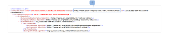

# Single Sign-On in [!DNL Workfront Proof]: AD FS-Konfiguration

>[!IMPORTANT]
>
>Dieser Artikel bezieht sich auf Funktionen im eigenständigen [!DNL Workfront Proof]. Informationen zu Proofing in [!DNL Adobe Workfront] finden Sie unter [Proofing](../../../review-and-approve-work/proofing/proofing.md).

Wenn Sie Administrator auf Ihrem AD-Server sind, können Sie AD FS installieren und konfigurieren.

## Installieren und Konfigurieren von AD FS

1. Laden Sie [AD FS 2.0](http://www.microsoft.com/en-us/download/details.aspx?id=10909) auf Ihren Computer herunter.
1. Öffnen Sie die heruntergeladene Datei „AdfsSetup.exe“, um den Installationsassistenten für ADFS (Active Directory Federation Services) zu starten.
1. Wählen Sie im Bildschirm „Serverrolle“ eine der Optionen aus (Sie benötigen mindestens einen Verbundserver).
1. Wenn Sie IIS auf Ihrem AD-Server nicht dem Internet aussetzen möchten (Ports 80 und 443 für HTTP und HTTPS), können Sie zunächst einen Verbundserver hinter der Firewall einrichten und dann einen zweiten Verbundserverproxy erstellen, der Anforderungen über die Firewall an den Verbundserver weiterleitet.
1. Nachdem Sie die AD FS-Einrichtung abgeschlossen haben, wählen Sie **[!UICONTROL Start the AD FS 2.0 Management Snap-In]** und klicken Sie dann auf **[!UICONTROL Beenden]**. Sobald dies abgeschlossen ist, sollte sich das AD FS 2.0-Verwaltungsfenster sofort öffnen. Andernfalls können Sie es über **[!UICONTROL Start]** > **[!UICONTROL Admin Tools]** > **[!UICONTROL AD FS 2.0 Management]**. Dies ist die Hauptanwendung der AD FS-Steuerung.

1. Klicken Sie zunächst auf AD FS 2.0 Federation Server Configuration Wizard (Assistent für die Serverkonfiguration).
Auf diese Weise können Sie AD FS konfigurieren und sowohl über IIS als auch mit AD eine Verbindung zum Internet herstellen.
1. Wenn Sie einen neuen AD FS-Server konfigurieren, wählen Sie **[!UICONTROL Neuen Verbunddienst erstellen]** aus.
1. Wählen Sie **[!UICONTROL Eigenständiger Verbundserver]** (zu Test- und Auswertungszwecken) aus.

1. Klicken Sie für hohe Verfügbarkeit und Lastenausgleich auf Neue Verbundserverfarm.
1. Geben Sie den Namen Ihres Verbunddiensts an.
Standardmäßig ruft der Konfigurationsassistent das SSL-Zertifikat ab, das an die Standardwebsite in IIS gebunden ist, und verwendet den dort angegebenen Antragstellernamen. Wenn Sie ein Platzhalterzertifikat verwenden, müssen Sie den Namen des Verbunddienstes eingeben.
Wenn in IIS kein SSL-Zertifikat konfiguriert ist, sucht der Konfigurationsassistent im Zertifikatspeicher des lokalen Computers nach gültigen Zertifikaten. Diese werden in der Dropdown-Liste SSL-Zertifikat angezeigt. Wenn keine Zertifikate gefunden werden, können Sie mit dem Server-Zertifikatgenerator in IIS ein Zertifikat erstellen.

1. Fahren Sie mit der Konfiguration fort, und klicken Sie **[!UICONTROL Schließen]** sobald sie abgeschlossen ist.

## Konfigurieren [!DNL Workfront Proof] einmaligen Anmeldens

Als [!DNL Workfront Proof] können Sie das einmalige Anmelden auf der [!DNL Workfront Proof] Seite konfigurieren. Weitere Informationen finden Sie unter [Single Sign-On [!DNL Workfront Proof]](../../../workfront-proof/wp-acct-admin/managing-security/single-sign-on-overview.md).

1. Klicken Sie auf **[!UICONTROL Einstellungen]** > **[!UICONTROL Kontoeinstellungen]** und öffnen Sie dann die Registerkarte **[!UICONTROL Single Sign-On]**.

1. Fügen Sie im Feld **SSO URL** Ihre Entitäts-ID ein.
Im Folgenden finden Sie ein Beispiel für eine Entitäts-ID:
http://*&lt;adfs.your-company.com>*/adfs/services/trust
Ihre Entitäts-ID finden Sie in Ihrer Verbundmetadaten-XML-Datei.
   

1. Verbundmetadaten befinden sich im Ordner AD FS 2.0-Snap-In > Dienst > Endpunkte . Suchen Sie im Abschnitt Metadaten die Variable mit dem Verbundmetadaten-Typ. Um Metadaten anzuzeigen, fügen Sie diesen Endpunkt in Ihren Browser ein. Sie können auch direkt zu diesem Link gehen: https://*&lt;adfs.your-company.com>*/FederationMetadata/2007-06/FederationMetadata.xml, nachdem Sie {adfs.your-company.com} durch Ihre eigenen Details ersetzt haben.
1. Fügen Sie im Feld **[!UICONTROL Anmelde]** URL Ihre SSO-Anmeldung ein.
1. Im Folgenden finden Sie ein Beispiel für eine SSO-Anmeldung:
1. http://*&lt;adfs.your-company.com>*/adfs/ls.
1. Dieser Link kann sich in der Verbundmetadaten-XML-Datei befinden.
   

1. Geben Sie im Feld **[!UICONTROL Abmelde]**URL den Link ein und speichern Sie ihn.
Im Folgenden finden Sie ein Beispiel für eine Abmelde-URL:
https://*&lt;adfs.your-company.com>*/adfs/ls/?wa=wsignout1.0

   1. Gehen Sie zu Ihrem AD FS-Manager > Vertrauensstellungen > Vertrauensstellungen vertrauender Parteien - ProofHQ Eigenschaften.
   1. Klicken Sie unter „Endpunkte[!UICONTROL  auf „Hinzufügen und ]&quot; mit den folgenden Details:

      * Endpunkttyp = SAML-Abmeldung
      * Bindung = POST
      * URL = https://*&lt;adfs.your-company.com*>/adfs/ls/?wa=wsignout1.0
      * Dieser Schritt kann ausgeführt werden, nachdem die Vertrauensstellung der vertrauenden Seite in der AD FS konfiguriert wurde (siehe unten).
   1. Geben **[!UICONTROL in das Feld]** Zertifikatfingerabdruck“ die Daten aus Ihrem Zertifikat ein.
   1. Navigieren Sie zu Ihrem ADFS 2.0-Snap-In zu Service > Zertifikate > Token-Signatur.
   1. Klicken Sie mit der rechten Maustaste auf diesen Eintrag, um das Zertifikat anzuzeigen.
   1. Kopieren Sie auf der [!UICONTROL Zertifikatdetails] den Fingerabdruck und fügen Sie ihn auf der Registerkarte **[!UICONTROL Konfiguration für einmaliges Anmelden]** Workfront Proof ein.

   1. Die Fingerabdruckzeichen können durch Doppelpunkte oder Leerzeichen getrennt werden. Wir empfehlen jedoch, diese zu entfernen. Sollten Sie Probleme mit Ihrer Single-Sign-On-Konfiguration haben, wenden Sie sich bitte an das Support-Team.

## Vertrauenswürdigkeit der vertrauenden Seite hinzufügen

Sobald die Konfiguration abgeschlossen ist, müssen Sie im Abschnitt „Vertrauensstellungen der vertrauenden Seite“ in Ihrem AD FS arbeiten.

1. Navigieren Sie zum Ordner **[!UICONTROL Vertrauensstellungen]** > **[!UICONTROL Vertrauensstellungen]** vertrauenden Seite) und klicken Sie dann auf **[!UICONTROL Vertrauensstellung für vertrauende Seite hinzufügen]**, um den Konfigurationsassistenten zu starten.

1. Datenquelle auswählen.
Alle Metadaten für Ihr [!DNL ProofHQ]-Konto befinden sich unter einem Link wie diesem:
https://`<yoursubdomain*>`.proofhq.com/saml/module.php/saml/sp/metadata.php/phq
Dadurch wird der größte Teil des Vertrauensbereichs der vertrauenden Seite konfiguriert.

   >[!NOTE]
   >
   >* Wenn Sie Probleme bei der Verbindungsherstellung über die URL haben, speichern Sie die Metadaten als Datei und importieren Sie Daten aus einer Datei.
   >* Wenn Sie eine vollständige benutzerdefinierte Domain (z. B. www.your-proofing.com) in Ihrem [!DNL ProofHQ]-Konto konfiguriert haben, ersetzen Sie den gesamten Teil &quot;{yoursubdomain}.proofhq.com“ durch Ihre eigene Domain, um Ihren [!DNL ProofHQ]-Metadaten-Link zu erstellen.

## Anspruchsregeln konfigurieren

Sobald die Konfiguration der Vertrauensstellung der vertrauenden Seite abgeschlossen ist, können Sie die Anspruchsregeln konfigurieren, um die Einrichtung abzuschließen. Sie konfigurieren zwei Anspruchsregeln für ProofHQ: E-Mail und Name der ID.

1. Öffnen Sie **[!UICONTROL Dialogfeld]** Anspruchsregeln bearbeiten“.
1. Gehen Sie zu **[!UICONTROL ProofHQ Vertrauen vertrauender Parteien]** und klicken Sie dann auf **[!UICONTROL Anspruchsregeln bearbeiten]** (1).\
   Das Popup sollte automatisch geöffnet werden, wenn Sie diese Option am Ende der Konfiguration der Vertrauensstellung ausgewählt haben.

1. Klicken Sie **[!UICONTROL Regel hinzufügen]** (2), um das Fenster für die Anspruchskonfiguration zu öffnen.

   * E-Mail (LDAP-Attribute als Anspruchsregelvorlage senden)
   * NameID (Umwandlung einer Regelvorlage für eingehende Ansprüche)
