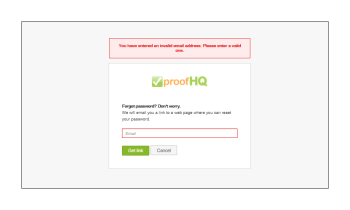

# Marke der [!DNL Workfront Proof]-Site - erweitert

>[!IMPORTANT]
>
>Dieser Artikel bezieht sich auf die Funktionalität im eigenständigen Produkt [!DNL Workfront Proof]. Informationen zum Testen innerhalb von [!DNL Adobe Workfront] finden Sie unter [Testversand](../../../review-and-approve-work/proofing/proofing.md).

Erweitertes Branding ist in den Plänen Select und Premium verfügbar und ist in den Kosten des Plans enthalten.

Informationen zum grundlegenden Branding, einschließlich Anmeldeseite, E-Mail-Benachrichtigungen und Testsendungen, finden Sie unter [Marke der [!DNL Workfront Proof] Site](../../../workfront-proof/wp-acct-admin/branding/brand-wp-site.md).

Erweiterte Branding-Optionen umfassen die Anpassung der folgenden Bereiche:

* Kopf- und Textfarbe
* Webanwendungs-Header
* Menüleiste und Textfarbe
* Willkommensfeld und Schnellstartfeld für Dashboard
* Fußzeilentext
* Favicon
* Seitentitel
* Hilfe-Links

In den folgenden Abschnitten wird das erweiterte Branding genauer beschrieben:

## Überblick über erweitertes Branding

Den Abschnitt [!UICONTROL Branding-Konfiguration] finden Sie auf der Registerkarte Ihrer Seite [Kontoeinstellungen](https://support.workfront.com/hc/en-us/sections/115000912147-Account-Settings) . Um die Änderungen auf Ihr Konto anzuwenden, stellen Sie sicher, dass die Option Branding auf [!UICONTROL Aktiviert] (1) gesetzt ist.

Weitere Informationen zum Konfigurieren der erweiterten Branding-Optionen (2-14) finden Sie im folgenden Abschnitt.

## Erweiterte Branding-Konfiguration

Sie können die folgenden Bereiche von [!DNL Workfront Proof] markieren:

* [Web-Anwendung](#web-application)
* [Header](#header)
* [Kopfzeilenlinks](#header-links)
* [Seitenleiste](#sidebar)
* [Willkommensfeld](#welcome-box)
* [Bereichs-Kopfzeilen](#section-headers)

### Web-Anwendung {#web-application}

Sie haben drei Branding-Optionen für den Webanwendungs-Header (2):

* Branding-Bild in der Kopfzeile
* Ihr Kontoname in der Kopfzeile
* Wenn Sie das Branding deaktivieren, bleibt das [!DNL Workfront Proof] -Logo in der Kopfzeile der Webanwendung

Branding-Bild: Die Größe wird auf maximal 550 x 90 Pixel geändert. Sie können JPG, GIF oder PNGs verwenden, und der transparente Hintergrund wird unterstützt.

Kontoname - Aus Ihren Kontodetails entnommen und mit weißer Schriftart angezeigt. Ihr Kontoname kann bis zu 60 Zeichen lang sein (einschließlich Leerzeichen und Satzzeichen).

### Header {#header}

In diesem Feld (3) können Sie den Hintergrund der Kopfzeile festlegen und eine Volltonfarbe oder ein Hintergrundbild auswählen.

Farbe - Hier können Sie wie in allen anderen Branding-Feldern der Farbschemakonfiguration entweder einen Hex-Farbwert Ihrer Wahl eingeben oder eine praktische Farbauswahl verwenden (durch Klicken auf das Textfeld wird das Popup-Fenster geöffnet). Die standardmäßige Kopfzeilenhintergrundfarbe ist #232d2e.

Hintergrundbild - kann mit dem Branding-Bild kombiniert werden.

* Sie können JPG, GIF oder PNGs verwenden - für Dateien mit Transparenz wird eine weiße Hintergrundfarbe angezeigt.
* Die Höhe der Kopfzeile beträgt 96 Pixel, und die Größe des hochgeladenen Bildes wird für die Option [!UICONTROL Keine Wiederholung] nicht geändert.
* Das Hintergrundbild wird oben links positioniert.

### Kopfzeilenlinks {#header-links}

In diesem Feld (4) können Sie die Farbe und Farbe des Benutzernamens für die Links im Menü Kopfzeile ändern, das oben rechts in Ihrem Konto angezeigt wird.

### Seitenleiste {#sidebar}

Wählen Sie Farben für die Menüleiste (5) und die Menüschrift (6) aus, um Ihre Seitenleiste anzupassen.

>[!NOTE]
>
>Die Hover-Farbe passt sich automatisch an, indem Sie Ihrer ausgewählten Menüleistenfarbe einen konstanten Hex-Wert hinzufügen.

Die Farbe der Schaltfläche Neuer Testversand kann nicht angepasst werden.

### Willkommensfeld {#welcome-box}

In diesem Feld (7) können Sie die Farbe des Begrüßungsfelds festlegen, das auf der Dashboard-Seite angezeigt wird.

### Bereichs-Kopfzeilen {#section-headers}

Mit diesen Feldern können Sie den Hintergrund (8) und die Schriftfarbe (9) der Abschnittsüberschriften auf den Seiten [[!UICONTROL Kontoeinstellungen]](https://support.workfront.com/hc/en-us/sections/115000912147-Account-Settings) anpassen.

**Footer**

In diesem Feld (10) der Branding-Konfiguration können Sie eine Fußzeile erstellen, die unten auf allen Kontoseiten angezeigt wird. Sie können den integrierten WYSIWYG-Editor verwenden oder einfach Ihr eigenes Design einfügen.

>[!NOTE]
>
>Sie können HTML nicht im Fußzeilentext-Editor bearbeiten, aber Sie können ein kopiertes Design (einschließlich aller Links und Bilder) einfügen.

**Favicon und Seitentitel**

Sie können anpassen, wie Ihre [!DNL Workfront Proof]-Seiten in den Browsern dargestellt werden, indem Sie Ihr eigenes Favicon-Bild (.ICO-Datei) (11) und Ihren Seitentitel (12) festlegen - diese werden in den Registerkarten/Fensterhandbüchern des Browsers für alle Kontoseiten angezeigt.

>[!NOTE]
>
>Ihr Favicon wird auch in den Kopfzeilen der Viewer-Fenster [!DNL Workfront Proof] für alle Testsendungen angezeigt, die auf Ihrem Konto erstellt wurden.

**Hilfe-Links**

Sie können Ihre eigenen Hilfelinks so anpassen, dass Ihre Benutzer und Validierer auf Ihre eigenen Inhalte verweisen. Setzen Sie dazu die Option [!UICONTROL Hilfe-Links] (13) auf Aktiviert und fügen Sie Ihre Links in die nächsten Felder (14) ein. Sie können bis zu vier Links konfigurieren, die dann verfügbar sein werden:

* im Menü [!UICONTROL Kopfzeile] unter dem Link [!UICONTROL Hilfe]
  

* im Bedienfeld [!UICONTROL Hilfe] der Seitenleiste [!DNL Workfront Proof] [!UICONTROL Viewer]
  

Zusätzlich können Kunden, die Pläne für Unternehmen nutzen, Folgendes vollständig anpassen:

* Volle Anpassung Ihrer Landingpages (z. B. Anmelde- und Abmeldeseiten, Kennwortseite vergessen)
* Vollständige Anpassung Ihrer Domäne

Kontaktieren Sie uns unter sales.team@workfront.com , um mehr über die zusätzlichen Branding-Optionen zu erfahren.

<!--
<h2 data-mc-conditions="QuicksilverOrClassic.Draft mode">Custom Domains</h2>
-->

<!--

Our Select and Premium plans include the option to purchase a fully-branded domain. This means that you can customize your URL as well as all links included in notification emails.&nbsp;

-->

<!--

For more information, please see&nbsp;<a href="../../../workfront-proof/wp-acct-admin/branding/configure-branded-domain-in-wp.md" class="MCXref xref">Configure a branded domain in Workfront Proof</a>.

-->

<!--
<h2 data-mc-conditions="QuicksilverOrClassic.Draft mode">Custom Page Branding</h2>
-->

<!--

Custom branding of the Workfront Proof pages is a paid service and by default&nbsp;includes full customization of the following:

-->

<!--
  <li data-mc-conditions="QuicksilverOrClassic.Draft mode"><a href="https://app.proofhq.com/login">Log in/landing page</a> </li>
  -->

<!--
  <li data-mc-conditions="QuicksilverOrClassic.Draft mode"><a href="https://app.proofhq.com/logout">Logout page</a> </li>
  -->

<!--
  <li data-mc-conditions="QuicksilverOrClassic.Draft mode"><a href="https://app.proofhq.com/login/password">Forgot password page</a> </li>
  -->

<!--
<h3 data-mc-conditions="QuicksilverOrClassic.Draft mode">Design Elements</h3>
-->

<!--

Please create your design&nbsp;in&nbsp;a .PSD file with all the elements placed in the separate layers - this will allow us to prepare the scalable pages for you.

-->

<!--

There are no particular restrictions on the .PSD files, and the look and layout of the pages is completely up to you. However please make sure that the key elements are included in your design:

-->

<!--

<strong>Login Page</strong>    

-->

<!--

<strong>Logout page</strong>    

-->

<!--

<strong>Forgot password</strong>    

-->

<!--

<strong>Inactivity alert</strong>    

-->

<!--

<strong>Invalid email address</strong>    

-->

<!--

<strong>Inactivity and incorrect email address</strong>    

-->

<!--
<note type="note">
&nbsp;The separate designs for the alerts are not required. If you'd like us to leave the default style of the messages, as shown on the screencasts above, please let us know. The team will match the colors with your design.
</note>
-->

<!--

If you'd like to have placeholder text in the text fields, please include this in your designs.

-->

<!--
<note type="note">
The wording of the alerts cannot be changed as these are the system messages.
</note>
-->

<!--

<strong>2. Fonts</strong> 

-->

<!--

Please make sure that the text is not rasterized but kept as the text layers, unless you want the particular elements to be displayed as images on your landing pages.

-->

<!--

If you use custom fonts in your design, please make sure to include the following font files: EOT + .TTF + OTF + SVG + WOFF for support in all browsers.

-->

<!--
<note type="note">
&nbsp; You need to hold an appropriate license, which allows implementing your selected fonts on the web pages.
</note>
-->

<!--

If you use the standard and widely available fonts, the font files are not required. Please see the following lists for reference:

-->

<!--
  <li data-mc-conditions="QuicksilverOrClassic.Draft mode"><a href="http://www.w3schools.com/cssref/css_websafe_fonts.asp">Websafe fonts listed in the standard Font families</a> </li>
  -->

<!--
  <li data-mc-conditions="QuicksilverOrClassic.Draft mode"><a href="https://www.google.com/fonts">Open Source Google fonts</a> </li>
  -->

<!--

<strong>3. Screen resolution</strong> 

-->

<!--

We support 1024x768 screen resolution (1366x768 for wide screens) and upwards. However, for the landing pages designs we do recommend using higher resolution for the better results on the various screens. The best practice would be to determine what screen resolution is the most common on your users' machines and prepare a slightly bigger design.

-->

<!--

<strong>4. Browsers compatibility</strong> 

-->

<!--

The newer browsers generally don't require any custom code to display the pages properly. However, if your users have the older browser versions installed on their machines some code adjustments may be needed.

-->

<!--

By default we do prepare the pages compatible with the following browsers:

-->

<!--
  <li data-mc-conditions="QuicksilverOrClassic.Draft mode">Internet Explorer 9+</li>
  -->

<!--
  <li data-mc-conditions="QuicksilverOrClassic.Draft mode">Safari 6.x+</li>
  -->

<!--
  <li data-mc-conditions="QuicksilverOrClassic.Draft mode">Chrome 22+ *</li>
  -->

<!--
  <li data-mc-conditions="QuicksilverOrClassic.Draft mode">Firefox 15+ *</li>
  -->

<!--

* Preferred browsers 

-->

<!--
<note type="note"> Workfront Proof will not design your custom pages, the PSD files must be supplied by you, but if you have any questions, please contact our Support team.
</note>
-->
