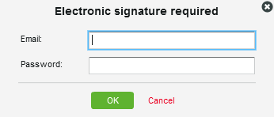

# Grundlagen zu elektronischen Signaturen in [!DNL Workfront Proof]

>[!IMPORTANT]
>
>Dieser Artikel bezieht sich auf Funktionen im eigenständigen [!DNL Workfront Proof]. Informationen zu Proofing in [!DNL Adobe Workfront] finden Sie unter [Proofing](../../../review-and-approve-work/proofing/proofing.md).

Elektronische Signaturen ermöglichen es Ihnen, die Sicherheit Ihrer Korrekturabzüge zu verbessern und Branchenstandards wie ISO einzuhalten.

Diese Einstellung kann auf Kontoebene obligatorisch oder nicht obligatorisch gemacht werden. Wenn sie standardmäßig obligatorisch ist, wird sie für alle in Ihrem Konto erstellten Korrekturabzüge aktiviert und kann nicht auf der Korrekturabzugsebene deaktiviert werden. Wenn diese Einstellung standardmäßig nicht obligatorisch ist, können Sie sie auf der Ebene des Korrekturabzugs aktivieren/deaktivieren.

Weitere Informationen finden Sie unter .

Wenn die Einstellung für die elektronische Signatur bei einem Korrekturabzug aktiviert ist, fordert ein Feld für die elektronische Signatur jeden Prüfer, der sich für den Korrekturabzug entscheidet, auf, seine E-Mail-Adresse und sein Passwort anzugeben.

## Elektronische Signaturen auf der Seite [!UICONTROL Korrekturabzugsdetails]

Wenn ein Prüfer seine Entscheidung trifft, indem er seine Entscheidung auf der Seite [!UICONTROL Korrekturabzugsdetails] (1) auswählt, wird ein Popup-Feld [!UICONTROL Elektronische Signatur] angezeigt, in dem er aufgefordert wird, seine Details einzugeben (2) und seine Entscheidung zu bestätigen (3).

Im Popup-Fenster wird die standardmäßige Nachrichtenvoreinstellung angezeigt (falls vorhanden), und der Validierungsverantwortliche muss seine E-Mail-Adresse und sein Passwort eingeben.

Das [!UICONTROL Elektronische Signatur]-Popup wird im Proofing Viewer und auch auf der Seite [!UICONTROL Korrekturabzugsdetails] angezeigt, wenn der/die Überprüfende beschließt, seine/ihre Entscheidung auf dieser Ebene zu treffen.

Wenn die Option [!UICONTROL Single Sign-On] im Korrekturabzug aktiviert ist, werden die E-Mail- und Kennwortdetails nicht im Popup [!UICONTROL Elektronische ]) angezeigt, wenn eine Entscheidung getroffen wird.

Nach dem Klicken auf die [!UICONTROL Bestätigen] (4) in diesem Popup wird der Reviewer stattdessen zur Seite [!UICONTROL Single Sign-On] weitergeleitet.

Nach der Eingabe ihrer SSO-Anmeldeinformationen wird der Validierungsverantwortliche automatisch zurück zur Seite [!UICONTROL Korrekturabzugsdetails] geleitet (oder zurück zur [!UICONTROL Korrekturabzugsansicht], wenn die Entscheidung von dort aus getroffen wurde).

>[!NOTE]
>
> Wenn die Entscheidung elektronisch signiert ist, wird das **[!UICONTROL Signatursymbol]** (5) neben der Entscheidung im Abschnitt [!UICONTROL Workflow] auf der Seite [!UICONTROL Korrekturabzugsdetails] angezeigt. Wird die Entscheidung nicht durch den Prüfer, sondern durch eine andere Person geändert, die Bearbeitungsrechte für den Korrekturabzug hat, wird diese Person nicht aufgefordert, die Entscheidung elektronisch zu unterzeichnen, und neben der Entscheidung wird kein Signatursymbol angezeigt (6).

Informationen zum einmaligen Anmelden finden Sie unter [Single Sign-On in Workfront Proof](../../../workfront-proof/wp-acct-admin/managing-security/single-sign-on-overview.md).

Weitere Informationen zur Seite mit Korrekturabzugsdetails finden Sie unter [Verwalten von Korrekturabzugsdetails in [!DNL Workfront] Proof](../../../workfront-proof/wp-work-proofsfiles/manage-your-work/manage-proof-details.md).
