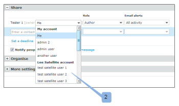

# Freigeben von Elementen für einen Partner in [!DNL Workfront Proof]

>[!IMPORTANT]
>
>Dieser Artikel bezieht sich auf Funktionen im eigenständigen [!DNL Workfront Proof]. Informationen zu Proofing in [!DNL Adobe Workfront] finden Sie unter [Proofing](../../../review-and-approve-work/proofing/proofing.md).

Wenn Sie eine [!DNL Workfront Proof] Partnerbeziehung mit einer anderen Organisation haben (z. B. einem Kunden oder einer anderen Abteilung in Ihrem Unternehmen), können Sie Testsendungen, Dateien, Ordner und Kontaktdaten mit dem Partner teilen. Weitere Informationen zu Partnerbeziehungen finden Sie unter [Verwalten einer Partnerbeziehung zwischen Workfront Proof-Konten](../../../workfront-proof/wp-acct-admin/partner-accounts/manage-partner-relationship-between-wp-accts.md).

## Informationen zum Freigeben von Elementen für einen Partner

Beachten Sie beim Freigeben von Elementen für einen Partner Folgendes:

* Sie können einen Benutzer in einem Partnerkonto nur dann als Besitzer eines Korrekturabzugs auswählen, wenn es sich um einen neuen Korrekturabzug handelt, den Sie gerade erstellen. Dies ist bei einem vorhandenen Korrekturabzug oder einer neuen Version eines Korrekturabzugs nicht möglich.
* Wenn Sie ein Element für einen Partner freigeben, übergeben Sie die Bearbeitungsrechte für den Korrekturabzug an die Supervisoren und Administratoren im Partnerkonto. Supervisoren und Administratoren in dem Konto, in dem der Korrekturabzug erstellt wurde, haben keine Bearbeitungsrechte mehr für den Korrekturabzug (dies schließt die Erstellerin des Korrekturabzugs ein). Weitere Informationen zu Berechtigungen in [!DNL Workfront]-Korrekturabzug finden Sie unter [Korrekturabzugsberechtigungsprofile in  [!DNL Workfront] -Korrekturabzug](../../../workfront-proof/wp-acct-admin/account-settings/proof-perm-profiles-in-wp.md).
* Der Korrekturabzug wird in dem Konto gespeichert, in dessen Besitz sich der Korrekturabzug befindet (nicht in dem Konto, in dem er erstellt wurde).
* Das Korrekturabzugs-Branding wird dem Konto entnommen, in dessen Besitz sich der Korrekturabzug befindet (nicht dem Konto, in dem der Korrekturabzug erstellt wurde).

## Freigeben von Elementen für einen Partner

Nachdem Sie eine akzeptierte Beziehung zu einem Partner haben, können Sie problemlos Elemente wie Ordner, Dateien und Korrekturabzüge für ihn freigeben.

1. Freigabe eines Korrekturabzugs oder einer Datei beginnen.\
   Weitere Informationen zur Freigabe finden Sie unter [Freigeben eines Korrekturabzugs in [!DNL Workfront Proof]](../../../workfront-proof/wp-work-proofsfiles/share-proofs-and-files/share-proof.md) [Freigeben von Dateien in [!DNL Workfront Proof]](../../../workfront-proof/wp-work-proofsfiles/share-proofs-and-files/share-files.md) und [Freigeben von Ordnern in [!DNL Workfront Proof]](../../../workfront-proof/wp-work-proofsfiles/organize-your-work/share-folders.md).

1. Im Abschnitt **[!UICONTROL Freigeben]** der Seite [!UICONTROL Neuer Korrekturabzug] oder [!UICONTROL Neue Datei] wird der Name Ihres Partners angezeigt, wenn Sie mit der Eingabe des Namens in das Feld für die automatische Vervollständigung beginnen, ganz so, als würden Sie ihn für einen anderen Benutzer im System freigeben.\
   

## Benutzer in einem Partnerkonto zum Besitzer des Korrekturabzugs machen

Wenn Sie Partnerbeziehungen mit anderen [!DNL Workfront Proof]-Konten eingerichtet haben, können Sie einen Benutzer aus einem Partnerkonto als Besitzer Ihres Testversands auswählen.

>[!NOTE]
>
>Sie können einen Benutzer nur dann aus einem Partnerkonto auswählen, wenn die folgenden Bedingungen erfüllt sind:
>
>* Es gibt keine benutzerdefinierten Felder
>* Kein Ordner ausgewählt
>* Keine Tags angewendet
>

So machen Sie einen Benutzer in einem Partnerkonto zum Besitzer eines Korrekturabzugs:

1. Klicken Sie auf der [!UICONTROL Neuer Korrekturabzug]-Seite auf den Link **[!DNL Change]** . 1)\
   

1. Wählen Sie einen Benutzer aus einem Partnerkonto aus, der Inhaber des Testversands sein soll. 2)\
   
