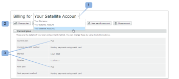

# Konfigurieren eines Satellitenkontos in [!DNL Workfront Proof]

>[!IMPORTANT]
>
>Dieser Artikel bezieht sich auf Funktionen im eigenständigen [!DNL Workfront Proof]. Informationen zu Proofing in [!DNL Adobe Workfront] finden Sie unter [Proofing](../../../review-and-approve-work/proofing/proofing.md).

Satellitenkonten sind gebührenpflichtige Konten, die Sie in Ihrem eigenen [!DNL Workfront Proof] konfigurieren und verwalten. Weitere Informationen finden Sie unter [Satellitenkonten in [!DNL Workfront] Proof](../../../workfront-proof/wp-acct-admin/satellite-accounts/sat-accts-in-wp.md).

Jeder Abrechnungs-Administrator kann ein Satellite-Konto erstellen. Informationen zu Abrechnungsadministratoren finden Sie unter [[!UICONTROL Profile für Korrekturabzugsberechtigungen] in [!DNL Workfront Proof]](../../../workfront-proof/wp-acct-admin/account-settings/proof-perm-profiles-in-wp.md).

>[!NOTE]
>
> Satellitenkonten müssen auf einem unserer [!UICONTROL Standard] oder höher festgelegt werden.

## Erstellen eines Satellite-Kontos {#creating-a-satellite-account}

So erstellen Sie ein Satellitenkonto:

1. Navigieren Sie zur Seite [!UICONTROL Abrechnung].\
   Weitere Informationen zur Seite Abrechnung finden Sie unter [Die Seite  [!DNL Workfront Proof] [!UICONTROL Abrechnung]](../../../workfront-proof/wp-billingsettings/manage-your-billing/wp-billing-page.md).

1. Klicken Sie auf **[!UICONTROL Schaltfläche „Neues]**&quot;. 1)

   Ein Popup-Fenster wird angezeigt.

   

1. Geben Sie die Details Ihres Kunden ein, einschließlich relevanter Promo-Codes.
1. Klicken Sie auf **[!UICONTROL Speichern]**. Das Satellitenkonto wird automatisch im Dropdown[!UICONTROL Menü ]Konten“ oben auf der Seite [!UICONTROL Abrechnung] angezeigt.
1. Wählen Sie das neue Satellitenkonto aus dem Dropdown-Menü aus.
1. Fahren Sie mit [Plan für Ihr Satellite-Konto auswählen](#selecting-a-plan-for-your-satellite-account) fort, um Ihr Satellite-Konto zu aktualisieren.

## Auswählen eines Plans für Ihr Satellite-Konto {#selecting-a-plan-for-your-satellite-account}

Nachdem Sie das Satellite-Konto wie unter &quot;[ eines Satellite-Kontos“ beschrieben eingerichtet haben](#creating-a-satellite-account) müssen Sie es auf den gewünschten Plan aktualisieren.

1. Navigieren Sie zur Seite [!UICONTROL Abrechnung].\
   Weitere Informationen zur Seite Abrechnung finden Sie unter [Die Seite  [!DNL Workfront Proof] [!UICONTROL Abrechnung]](../../../workfront-proof/wp-billingsettings/manage-your-billing/wp-billing-page.md).

1. Wählen Sie **[!UICONTROL Dropdown-Menü]** Ihre Konten“ oben auf der Seite (1) das entsprechende Satellitenkonto aus.

   Die Abrechnungsseite für das Satellite-Konto wird angezeigt, und die Abrechnungskontaktdetails aus Ihrem Konto werden automatisch repliziert.

   

1. Klicken Sie **[!UICONTROL oben rechts auf]** Seite auf die Schaltfläche „Plan ändern“. 2)\
   Oder\
   Öffnen Sie das Popup, indem Sie auf den Namen Ihres aktuellen oder nächsten Plans klicken. 3)

1. Plan aktualisieren oder herunterstufen.

## Hinzufügen von Benutzern zu Ihrem Satellite-Konto

Nachdem Sie das Satellite-Konto auf Ihren ausgewählten Plan aktualisiert haben, müssen Sie Benutzer zum Konto hinzufügen.

1. Melden Sie sich bei [!DNL Workfront Proof] als [!DNL Workfront Proof] an.
1. Klicken Sie **[!UICONTROL Kontoeinstellungen]**.
1. Wählen Sie oben auf der Seite im Dropdown-Menü das entsprechende Satellitenkonto aus. 1)\
   Die Seite mit den Kontoeinstellungen für das Satellite-Konto wird angezeigt.
1. Klicken Sie auf **[!UICONTROL Schaltfläche]** Neuer Benutzer“ oben rechts auf der Seite. 2)\
   Die Seite [!DNL New User] wird angezeigt.

1. Geben Sie die Details des Benutzers ein und klicken Sie dann auf **[!UICONTROL Speichern]**.\
   Der Benutzer erhält eine E-Mail-Benachrichtigung, mit der er Zugriff auf das Konto erhält.

Dem Satelliten-Konto hinzugefügte Benutzer werden als Mitglieder in der Kontaktliste des Hub-Kontos angezeigt.

Ebenso werden Benutzer im Hub-Konto als Mitglieder in den Kontakten des Satelliten-Kontos angezeigt.

Um eine vollständige Liste aller Benutzer im Satellite-Konto anzuzeigen, klicken Sie auf die Registerkarte **[!UICONTROL Benutzer]**.

## Verknüpfen vorhandener separater Konten mit Ihrem Hub-Konto

Wenn Sie zuvor andere separate Konten für Ihre Kunden erstellt haben, können diese in Satellitenkonten konvertiert werden.

Wir kümmern uns für Sie darum, indem wir sie mit Ihrem [!DNL Workfront Proof]-Konto verknüpfen (wodurch es ein Hub-Konto wird).

Sie müssen uns lediglich die folgenden Details mitteilen:

* Der Name Ihres [!DNL Workfront Proof] Kontos und die E-Mail-Adresse, die Sie zur Einrichtung verwendet haben
* Die Namen der separaten Konten, die mit Ihrem Konto verknüpft werden sollen, und die E-Mail-Adressen, die zum Einrichten der separaten Konten verwendet werden.
