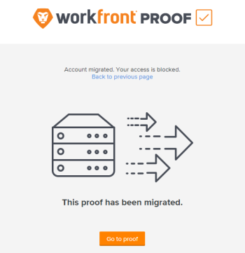

# Häufig gestellte Fragen: Migration von [!UICONTROL Workfront Proof] - USA nach EMEA

>[!IMPORTANT]
>
>Dieser Artikel bezieht sich auf Funktionen im eigenständigen [!DNL Workfront Proof]. Informationen zu Proofing in [!DNL Adobe Workfront] finden Sie unter [Proofing](../../../review-and-approve-work/proofing/proofing.md).

## Woher weiß ich, ob sich diese Änderung auf meine Organisation auswirkt?

[!DNL Workfront] kontaktiert direkt alle von der Migration aus den [!DNL Workfront Proof] USA nach EMEA betroffenen Organisationen.

## Muss ich etwas tun, um mich auf die Migration vorzubereiten?

Ja. Stellen Sie vor der Migration sicher, dass Sie der Zulassungsliste Ihrer Organisation Folgendes hinzufügen:

**[!DNL webcapture.proofhq.eu]**

## Wie lange dauert die Migration meines Kontos?

Für einen kurzen Zeitraum von bis zu zwei Stunden ist Ihr Konto nicht zugänglich, während wir es an seinen neuen Standort im Rechenzentrum der EMEA migrieren.

Nach Abschluss der Kontomigration übertragen wir Ihre Dateien aus unserem US-Rechenzentrum in das EMEA-Rechenzentrum. Während die Dateien verschoben werden, sind sie weiterhin im US-Rechenzentrum zugänglich. Dieser Vorgang findet im Hintergrund statt und hat keine Auswirkungen auf Sie und Ihre Benutzer.

Nach Abschluss der Migration können Sie und Ihre Benutzer nur noch über das Rechenzentrum von EMEA auf Dateien und Testsendungen zugreifen.

## Was passiert mit der URL, über die ich auf [!DNL Workfront Proof] zugreifen möchte?

Diese URL bleibt unverändert. Sie können genau so auf das [!DNL Workfront] zugreifen, wie Sie es in der Vergangenheit getan haben.

## Kann ich weiterhin meine alten Korrekturabzugs-Links und Lesezeichen verwenden?

Korrekturabzug-spezifische Lesezeichen funktionieren nach der Migration nicht mehr. Jeder, der einen Korrekturabzug verwendet, erhält über die Schaltfläche [!UICONTROL Zum Korrekturabzug gehen] eine Nachricht mit Zugriff auf den Korrekturabzug:

## Bleiben mein Benutzername und mein Passwort unverändert?

Ja, Ihr Benutzername und Ihr Passwort bleiben genau so, wie sie es heute sind.

## Kann ich weiterhin mit Proof Accounts in den USA interagieren, mit denen ich zusammenarbeite?

Nein, der Zugriff auf frühere Korrekturabzugskonten in den USA ist nicht mehr verfügbar. Ihr Konto in EMEA ist nicht mit der US-Umgebung verknüpft. Dadurch soll sichergestellt werden, dass Ihre Daten sicher bleiben und den EU-Datenschutzbestimmungen entsprechen.

Wenn Sie ein anderes US-Konto haben, mit dem Sie zusammenarbeiten, und diese Partnerschaft pflegen müssen, müssen die Eigentümer dieses Kontos mit Ihrem Konto migrieren. Besprechen Sie dies vor der Migration mit ihnen, um sicherzustellen, dass die richtigen Konten migriert werden.

## Was passiert, wenn ich SSO in meinem Konto verwende?

Wenn Sie SSO in Ihrem Proof-Konto verwenden, müssen Sie das Konto neu konfigurieren, um die neue [!DNL proofhq.eu]-Domain zu verwenden.
