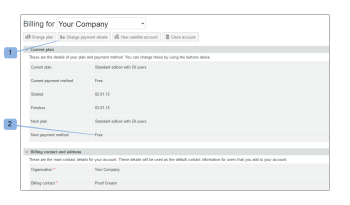
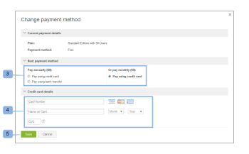

# Auswählen der Zahlungsmethode in [!DNL Workfront Proof]

>[!IMPORTANT]
>
>Dieser Artikel bezieht sich auf Funktionen im eigenständigen [!DNL Workfront Proof]. Informationen zu Proofing in [!DNL Adobe Workfront] finden Sie unter [Proofing](../../../review-and-approve-work/proofing/proofing.md).

## Grundlegendes zu Zahlungsoptionen

Die folgenden Zahlungsoptionen sind verfügbar:

| **Monatliche Abonnements** | **Jahresabonnements** |
|---|---|
| Kreditkarte | Kreditkarte |
| Banküberweisung |  |

{style="table-layout:auto"}

Wir akzeptieren keine Schecks

## Ändern der Zahlungsmethode und der Kreditkartendetails {#changing-your-payment-method-and-credit-card-details}

>[!NOTE]
>
>Beachten Sie Folgendes, bevor Sie Ihre Zahlungsmethode ändern:
>
>* Die Änderung der Zahlungsmethode wird nicht auf Ihr aktuelles Abonnement angewendet. Wenn Sie dies für eine bereits ausgestellte Rechnung ändern möchten, wenden Sie sich bitte an unser Finance-Team unter [finance@proofhq.com](mailto:finance@proofhq.com).
>* Sie können Ihre Zahlungsmethode nicht ändern oder eine Kreditkarte hinzufügen, wenn auf Ihrem Konto ein Testplan eingerichtet ist. Sie können diese Details beim Upgrade Ihres Kontos festlegen.
>

So ändern Sie Ihre nächste Zahlungsmethode und aktualisieren Ihre Kreditkartendetails:

1. Klicken **[!UICONTROL oben auf der Seite auf]** Zahlungsdetails ändern) (1).\
   Oder\
   Klicken Sie **[!UICONTROL Nächste Zahlungsmethode]**. 2)\
   

1. Wählen **[!UICONTROL im Popup]** Zahlungsdetails ändern“ Ihre nächste Zahlungsmethode aus. 3)
1. (Bedingt) Geben Sie für Kreditkartenzahlungen Ihre Kartendetails ein.\
   Wenn Sie nur Ihre Kreditkartendaten ändern möchten, füllen Sie nur die Felder Kreditkartendetails (4) mit Ihren neuen Kartendaten aus und speichern (5) die Änderungen. Sie können Ihre Kreditkartendaten jederzeit ändern. Die neue Karte wird für alle Abonnementzahlungen verwendet, die sofort wirksam werden.\
   Wir akzeptieren [!DNL Visa], [!DNL American Express] und [!DNL MasterCard].

1. Klicken Sie auf **[!UICONTROL Speichern]**. 4)\
   

## Ändern der Zahlungsmodusdetails für Satellitenkonten

Wenn Sie über Satellitenkonten verfügen, müssen Sie Ihre Kreditkartendetails und die Zahlungsmethode für jedes Konto separat aktualisieren. Weitere Informationen zu Satellitenkonten finden Sie unter [Satellitenkonten.](https://support.workfront.com/hc/en-us/sections/115000921108-Satellite-accounts)

1. Navigieren Sie zur Seite [!UICONTROL Abrechnung] in Ihrem Hub-Konto.\
   Weitere Informationen zur Seite Abrechnung finden Sie unter [Die  [!DNL Workfront] -Seite Abrechnung](../../../workfront-proof/wp-billingsettings/manage-your-billing/wp-billing-page.md).

1. Öffnen Sie [!UICONTROL  Dropdown-Menü ]Kontoliste“. 1)
1. Wählen Sie das Satellitenkonto (2) aus, das mit der Kreditkarte verknüpft ist, die Sie aktualisieren möchten.
1. Fahren Sie fort mit [Ändern Ihrer Zahlungsmethode und Kreditkartendetails](#changing-your-payment-method-and-credit-card-details).\
   
