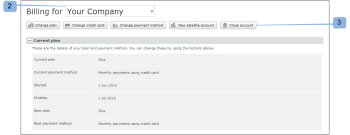

# [!DNL Workfront Proof] Konto schließen

>[!IMPORTANT]
>
>Dieser Artikel bezieht sich auf Funktionen im eigenständigen [!DNL Workfront Proof]. Informationen zu Proofing in [!DNL Adobe Workfront] finden Sie unter [Proofing](../../../review-and-approve-work/proofing/proofing.md).

Nachdem Sie die Schritte in diesem Abschnitt ausgeführt haben, wird Ihr Konto sofort geschlossen. Alle Daten in Ihrem Konto werden gelöscht und können nicht wiederhergestellt werden.

Wir bemühen uns ständig, unser Produkt zu verbessern. Wenn Sie Ihr Konto schließen möchten, würden wir uns freuen, wenn Sie sich ein paar Minuten Zeit nehmen und uns mitteilen könnten, wie wir uns verbessern können.

Sie können uns unter [!DNL support@proofhq.com] mit Ihren Kommentaren kontaktieren; alle Rückmeldungen sind willkommen.

1. Öffnen Sie die [!UICONTROL Abrechnung] in Ihrem Konto, indem Sie das Menü [!UICONTROL Einstellungen] öffnen und **[!UICONTROL Abrechnung]** (1) wählen.

   Weitere Informationen zur Seite Abrechnung finden Sie unter [Die  [!DNL Workfront] -Seite Abrechnung](../../../workfront-proof/wp-billingsettings/manage-your-billing/wp-billing-page.md).

   

1. Klicken Sie auf **[!UICONTROL Schaltfläche „Konto schließen]** (3).

   

1. Wählen Sie den Grund für die Schließung des Kontos aus. (4)
1. Bestätigen Sie Ihre Entscheidung durch Klicken auf **[!UICONTROL Speichern]**. (5)

   

1. Geben Sie Ihr Passwort ein, um Ihr Konto zu schließen. (6)

   
