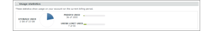

# Die [!DNL Workfront Proof] Rechnungsseite

>[!IMPORTANT]
>
>Dieser Artikel bezieht sich auf die Funktionalität im eigenständigen Produkt [!DNL Workfront Proof]. Informationen zum Testen in [!DNL Adobe Workfront], siehe [Testversand](../../../review-and-approve-work/proofing/proofing.md).

## Die Rechnungsseite

So greifen Sie auf die [!UICONTROL Rechnungsstellung] Seite, öffnen Sie die **[!UICONTROL Einstellungen]** Menü oben rechts auf dem Bildschirm und wählen Sie **[!UICONTROL Rechnungsstellung]** im Dropdown-Menü.

Die [!UICONTROL Rechnungsstellung] -Seite enthält Folgendes:

* Kontoname (1)
* Kontoliste (z. B. wenn Sie über Satellitenkonten verfügen)(2)
* Änderungsplan (3)
* Zahlungsdetails ändern (4)
* Neues Satellitenkonto (5)
* Konto schließen (6)
* Aktuelle Planinformationen (7)
* Rechnungskontakte und -adresse (8)
* Nutzungsstatistiken (9)
* Rechnungsverlauf (10)
* Abrechnungsaktivität (11)

   

## [!UICONTROL Aktueller Plan]

In diesem Abschnitt (7) werden die Details Ihres aktuellen Plans angezeigt, einschließlich der folgenden:

* Name des Plans
* Aktuelle Zahlungsmethode
* Start- und Enddatum des aktuellen Plans
* Nächster Planungstyp
* Nächste Planzahlungsmethode

   Weitere Informationen finden Sie unter [Auswählen Ihrer Zahlungsmethode in [!DNL Workfront Proof]](../../../workfront-proof/wp-billingsettings/manage-your-billing/choose-payment-method-in-wp.md).

## [!UICONTROL Rechnungskontakt und -adresse]

In diesem Abschnitt (8) werden die wichtigsten Rechnungskontakte und Adressdaten für Ihr Konto angezeigt.

Der Abrechnungskontakt kann nur von den Benutzern ausgewählt werden, die in Ihrem Konto als Rechnungsadministratoren eingerichtet sind. In den Satellitenkonten können nur die Rechnungsadministratoren aus dem Hauptkonto in dieses Feld eingestellt werden.

>[!NOTE]
>
> Sie können mehrere Rechnungsadministratoren für Ihr Konto haben, jedoch nur einen, der im [!UICONTROL Rechnungskontakte] -Feld alle Abrechnungsbenachrichtigungen und Kontoverwendungswarnungen erhalten.

Dazu gehören die folgenden Benachrichtigungs-E-Mails:

* Nutzung des Testversands
* Rechnungen
* Downgrade
* Warnhinweis zur verspäteten Auszahlung/Kontoaussetzung
* Kreditkartenfehler

   

Die [!UICONTROL Rechnungsstellung CC] können Sie auch eine E-Mail-Adresse hinzufügen, die in alle E-Mails kopiert werden soll, die mit der Rechnungsstellung zusammenhängen. Klicken Sie auf das Feld, um die Zeilenbearbeitung zu aktivieren, und geben Sie eine E-Mail-Adresse Ihrer Wahl ein (dies kann auch die E-Mail-Adresse eines vorhandenen Benutzers sein).

## [!UICONTROL Rechnungsadresse]

In diesem Abschnitt wird die Inline-Bearbeitung verwendet. Klicken Sie einfach auf die Felder, um den Text einzugeben/zu bearbeiten.

>[!NOTE]
>
> Diese Adresse wird auf Ihren Abonnementrechnungen angegeben. Stellen Sie also sicher, dass diese Daten stets aktuell sind.

## [!UICONTROL Nutzungsstatistiken]

Dieser Abschnitt enthält die Nutzungsstatistiken für Ihr Konto innerhalb des aktuellen Abrechnungszeitraums, einschließlich der folgenden:

* Verwendeter Speicher
* Verwendete Testsendungen
* Benutzerbeschränkung

### [!UICONTROL Nutzungswarnungen]

Die [[!UICONTROL Profile für Testberechtigungen] in [!DNL Workfront] Testversand](../../../workfront-proof/wp-acct-admin/account-settings/proof-perm-profiles-in-wp.md) als Rechnungskontakt (1) auf Ihrem Konto eingestellt wird, wird per E-Mail benachrichtigt, wenn Ihr Konto Folgendes erreicht:

* 75 % und dann 98 % Ihrer Speicherkapazität
* 75 % und dann 100 % Ihres Testversands

Sobald die Testsendungen oder Speichergrenzen erreicht sind, sehen Sie auch die Warnhinweise oben im [!UICONTROL Rechnungsstellung] Seite:

* Für erreichte Testversandgrenze

   

* Für die erreichte Speicherbegrenzung

>[!NOTE]
>
>Ihre Testversandanzahl wird bei der Erstellung von Testsendungen in Ihrem Konto verwendet und kann nicht durch Entfernen der Testsendungen wiederhergestellt werden.

Speicherplatz kann durch Löschen der Testsendungen und Dateien und Leeren der [!UICONTROL Papierkorb] später.

Beachten Sie bitte, dass Sie bei Bedarf jederzeit ein Upgrade Ihres Kontos durchführen können, wenn Sie weitere Testsendungen, Speicher oder Benutzer benötigen. und sofort wirksam wird.

## [!UICONTROL Rechnungsverlauf]

Dieser Abschnitt zeigt die Aktivitäten für die letzten Abrechnungszeiträume. Sie können Ihre Rechnungen auch von diesem Abschnitt herunterladen.

Weitere Informationen finden Sie unter &quot; [Herunterladen Ihrer [!DNL Workfront Proof] Rechnung](../../../workfront-proof/wp-billingsettings/manage-your-billing/download-wp-invoice.md).&quot;

## [!UICONTROL Rechnungsaktivität]

In diesem Abschnitt werden die letzten Änderungen an Ihrer Abrechnungseinrichtung angezeigt, z. B. Abonnements, Upgrades, Downgrade und Verlängerungen Ihrer [!DNL Workfront Proof] Planen Sie.

Wenn Sie Ihren Plan auf einen Plan mit einem niedrigeren Benutzerlimit (1) ändern, werden Benutzer, die die neue Grenze überschreiten, automatisch deaktiviert, wenn der neue Plan beginnt. Diese Aktivität wird auch in Ihren Kontologs (2) erfasst.

