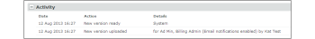

# Neue Korrekturabzugs-E-Mail

>[!IMPORTANT]
>
>Dieser Artikel bezieht sich auf Funktionen im eigenständigen [!DNL Workfront Proof]. Informationen zu Proofing in [!DNL Adobe Workfront] finden Sie unter [Proofing](../../../review-and-approve-work/proofing/proofing.md).

<!--

Make this article work better for PiW.

-->

Wenn Sie einen neuen Korrekturabzug oder eine neue Version eines Korrekturabzugs erstellen, neue Personen zu einem Korrekturabzug hinzufügen oder einen Workflow zu einem Korrekturabzug hinzufügen, können Sie entscheiden, ob Sie die Validierungsverantwortlichen per E-Mail benachrichtigen möchten, wie in den folgenden Artikeln beschrieben:

* [Erstellen eines erweiterten Korrekturabzugs mit einem automatisierten Workflow](../../../review-and-approve-work/proofing/creating-proofs-within-workfront/create-automated-proof-workflow.md)
* [Erstellen von Korrekturabzügen in [!DNL Workfront Proof]](../../../workfront-proof/wp-work-proofsfiles/create-proofs-and-files/generate-proofs.md)

Die E-Mail, die Ihre Empfänger erhalten, wird als [!UICONTROL neuer Korrekturabzug] bezeichnet. Diese E-Mail kann nur von der Erstellerin des Korrekturabzugs und von Benutzern gesteuert werden, die berechtigt sind, Prüfer zu einem Korrekturabzug hinzuzufügen. Empfänger und Empfängerinnen können sie nicht deaktivieren.

Die neue Korrekturabzugs-E-Mail enthält:

* Ihre persönliche Nachricht (sofern Sie eine Nachricht einbeziehen möchten)
* Wenn Sie Ihren Reviewern immer dieselbe benutzerdefinierte Nachricht senden, empfiehlt es sich möglicherweise, die Nachricht in Ihren [!UICONTROL Persönlichen Einstellungen] auf der Registerkarte [!UICONTROL Proofing-Standards] zu speichern. Weitere Informationen finden Sie unter .
* Persönlicher Link zum Testversand
* **[!UICONTROL Details anzeigen]** Link, der Sie zum zugehörigen [!DNL Workfront]-Objekt (z. B. Projekt, Aufgabe oder Problem) führt
* Miniaturansicht des Korrekturabzugsbilds
* Die folgenden Details des Korrekturabzugs:

   * Name des Korrekturabzugs
   * Versionsnummer
   * Liste der Prüfer und deren Fortschritt beim Testversand
   * Link zum Freigeben des Korrekturabzugs für eine andere Person

     Auf diese Weise können Sie die Korrekturabzugs-URL und/oder den Download-Link für die Originaldatei freigeben. Dadurch können Sie dem Korrekturabzug keine Prüfer explizit hinzufügen. Sie geben nur die öffentliche Korrekturabzugs-URL frei und der Empfänger erhält nur Lesezugriff auf den Korrekturabzug.

     Weitere Informationen finden [ unter  [!DNL Workfront Proof]](../../../workfront-proof/wp-work-proofsfiles/share-proofs-and-files/share-proof.md) eines Korrekturabzugs in .

     Wenn dieser Link nicht in der E-Mail des Empfängers angezeigt werden soll, können Sie die Einstellungen [!UICONTROL Öffentliche Freigabe] für den Testversand deaktivieren

     (Originaldatei und öffentliche URL herunterladen). Weitere Informationen [ Sie unter  [!DNL Workfront Proof]](../../../workfront-proof/wp-work-proofsfiles/manage-your-work/manage-proof-details.md) von Korrekturabzugsdetails in .

## Das Aktivitätsprotokoll

Das Senden einer E[!UICONTROL Mail ]Neuer Korrekturabzug) an eine Überprüfende wird im Abschnitt [!UICONTROL Aktivität] der Seite [!UICONTROL Details des Korrekturabzugs] protokolliert. Weitere Informationen finden [ unter [!UICONTROL Verwalten] Korrekturabzugsdetails [!DNL Workfront Proof]](../../../workfront-proof/wp-work-proofsfiles/manage-your-work/manage-proof-details.md) in. Sie können überprüfen, ob die [!UICONTROL Neuer Korrekturabzug]-E-Mail zum Zeitpunkt der Erstellung eines Korrekturabzugs aktiviert war.

>[!NOTE]
>
>* Wenn der Ersteller oder Besitzer des Korrekturabzugs [!UICONTROL Korrekturabzug erstellt] E-Mails standardmäßig deaktiviert hat (in den persönlichen Einstellungen), erhält er keine E-Mails [!UICONTROL Korrekturabzug erstellt] oder [!UICONTROL Neuer Korrekturabzug], selbst wenn das Kontrollkästchen [!UICONTROL Personen per E-Mail benachrichtigen] auf der Seite Neuer Korrekturabzug aktiviert ist. Weitere Informationen finden Sie unter .
>* Wenn die E-Mail-Benachrichtigungen in den [!UICONTROL Kontoeinstellungen] standardmäßig deaktiviert sind, erhält der Ersteller/Inhaber des Korrekturabzugs keine [!UICONTROL Korrekturabzugs erstellt] oder [!UICONTROL Neuer Korrekturabzug]-E-Mails, selbst wenn dies in den persönlichen Einstellungen aktiviert ist und das Kontrollkästchen [!UICONTROL Personen per E-Mail benachrichtigen] auf der Seite Neuer Korrekturabzug aktiviert ist. Weitere Informationen finden Sie unter [E[!UICONTROL Mail mit ] Korrekturabzug](../../../workfront-proof/wp-emailsntfctns/proof-notifications-and-reminders/proof-made-email.md) und unter .
>

## Aktivieren Sie die E[!UICONTROL Mail „Neuer Korrekturabzug] und fügen Sie eine benutzerdefinierte Nachricht hinzu

Sie können angeben, ob Sie den Prüfern bei der Erstellung eines Korrekturabzugs einen E-Mail-Warnhinweis senden oder jemanden hinzufügen möchten.

* [Wenn Sie einen Korrekturabzug erstellen](#when-you-create-a-proof)
* [Beim Hinzufügen eines Reviewers zu einem Korrekturabzug](#when-you-add-a-reviewer-to-a-proof)

### Wenn Sie einen Korrekturabzug erstellen {#when-you-create-a-proof}

Wenn Sie einen neuen Korrekturabzug auf der Seite [!UICONTROL Neuer Korrekturabzug] im Abschnitt **[!UICONTROL Freigeben]** erstellen, können Sie auswählen, ob E-Mail-Warnungen gesendet werden sollen:

* Hier können Sie entscheiden, ob Sie [!UICONTROL Personen per E-Mail benachrichtigen] (1) möchten. Wenn Sie diese Option deaktivieren, erhält keiner Ihrer Prüfer eine E-Mail, in der er informiert wird, dass der Korrekturabzug für seine Überprüfung bereit ist.
* Sie können auch eine benutzerdefinierte Nachricht in die E-Mail-Benachrichtigung aufnehmen (2).
* Wenn Sie sich entscheiden, Ihre eigene Nachricht hinzuzufügen, können Sie eine benutzerdefinierte Betreffzeile (3) und eine Nachricht in den Textkörper der E-Mail einfügen (4).
* Um die benutzerdefinierte Nachricht zu verwerfen, klicken Sie einfach auf den Link (5).

  >[!NOTE]
  >
  >Wenn Sie Ihren Reviewern immer die gleiche benutzerdefinierte Nachricht senden, empfiehlt es sich möglicherweise, die Nachricht in Ihren persönlichen Einstellungen auf der Registerkarte [!UICONTROL Proofing-]&quot; zu speichern. Weitere Informationen finden Sie unter .

### Beim Hinzufügen eines Reviewers zu einem Korrekturabzug {#when-you-add-a-reviewer-to-a-proof}

Sie können auswählen, ob ein neuer Prüfer, der zu einem vorhandenen Korrekturabzug hinzugefügt wird, über den Korrekturabzug benachrichtigt werden soll (ähnlich wie oben).

* Fügen Sie zunächst neue Validierungsverantwortliche hinzu, indem Sie auf der Seite **[!UICONTROL Korrekturabzugsdetails]** auf die Schaltfläche **[!UICONTROL Diese Version freigeben]** klicken (1).

* Es wird ein Feld angezeigt, in dem Sie neue Reviewer hinzufügen können. Sie können dann entscheiden, ob Sie möchten, dass sie per E-Mail benachrichtigt werden (2), und wählen, ob Sie der E-Mail eine benutzerdefinierte Nachricht hinzufügen möchten (3).

* Wenn Sie eine benutzerdefinierte Nachricht hinzufügen, wird das Feld erweitert und Sie können eine benutzerdefinierte Betreffzeile (4) und benutzerdefinierten Text in den Textkörper der E-Mail einfügen (5). Sie können die benutzerdefinierte Nachricht auch verwerfen, indem Sie auf den Link (6) klicken.

