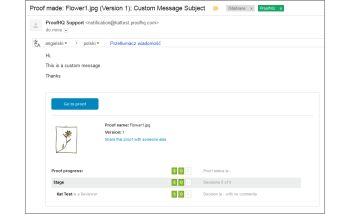

# Die E[!UICONTROL Mail „Korrekturabzug erstellt]

>[!IMPORTANT]
>
>Dieser Artikel bezieht sich auf Funktionen im eigenständigen [!DNL Workfront Proof]. Informationen zu Proofing in [!DNL Adobe Workfront] finden Sie unter [Proofing](../../../review-and-approve-work/proofing/proofing.md).

Eine [!UICONTROL Korrekturabzug erstellt]-E-Mail wird nur dann an den Korrekturabzug-Ersteller gesendet, wenn dieser einen Korrekturabzug erstellt hat. Wenn eine Person einen Korrekturabzug erstellt und eine andere Person zum Besitzer gemacht hat, erhält nur der neue Besitzer auch die E-[!UICONTROL Korrekturabzug erstellt]. Der Ersteller und/oder Inhaber erhält keine, sondern nur die E[!UICONTROL Mail „Korrekturabzug erstellt]. Weitere Informationen zur E-Mail [!UICONTROL Neuer Korrekturabzug] finden Sie unter [[!UICONTROL Neuer Korrekturabzug] E-Mail](../../../workfront-proof/wp-emailsntfctns/proof-notifications-and-reminders/new-proof-email.md).

Benutzer können [!UICONTROL Korrekturabzug erstellt] E-Mails in ihren Profileinstellungen deaktivieren, wie unten beschrieben.

>[!NOTE]
>
> Wenn der Ersteller oder Besitzer des Korrekturabzugs [!UICONTROL Korrekturabzug erstellt] E-Mails standardmäßig in den persönlichen Einstellungen deaktiviert hat, erhält er keine E-Mails [!UICONTROL Korrekturabzug erstellt] oder [!UICONTROL Neuer Korrekturabzug], auch wenn das Kontrollkästchen [!UICONTROL Personen per E-Mail benachrichtigen] auf der Seite [!UICONTROL Neuer Korrekturabzug] aktiviert ist.

Eine E[!UICONTROL Mail ]Testversand durchgeführt“ enthält Ihre persönliche Nachricht (sofern vorhanden) und die folgenden Details zum Testversand:

* Name des Korrekturabzugs
* Persönlicher Link zum Testversand
* Versionsnummer
* Miniaturansicht des Korrekturabzugs
* Korrekturabzugverlauf
* Link zum Freigeben des Korrekturabzugs für eine andere Person
* Auf diese Weise können Sie die Korrekturabzugs-URL und/oder den Download-Link für die Originaldatei freigeben.

>[!NOTE]
>
> Bei der Freigabe von Korrekturabzugs-Links ist es nicht möglich, dem Korrekturabzug explizit Reviewer hinzuzufügen. Sie geben nur die öffentliche Korrekturabzugs-URL weiter und der Empfänger erhält nur Lesezugriff auf den Korrekturabzug.

Weitere Informationen finden [ unter  [!DNL Workfront Proof]](../../../workfront-proof/wp-work-proofsfiles/share-proofs-and-files/share-proof.md) eines Korrekturabzugs in .

Wenn dieser Link nicht in der E-Mail des Empfängers angezeigt werden soll, sollten Sie die Einstellungen [!UICONTROL Öffentliche Freigabe] für den Testversand deaktivieren ([!UICONTROL Originaldatei herunterladen] und [!UICONTROL Öffentliche URL]).

## Deaktivieren der [!UICONTROL Korrekturabzug erstellt]-E-Mail

1. Klicken Sie auf **[!UICONTROL Einstellungen]** > **[!UICONTROL Persönliche Einstellungen]**, öffnen Sie die Registerkarte **[!UICONTROL Proofing-Standardeinstellungen]** und klicken Sie dann auf **[!UICONTROL Deaktivieren]** neben **[!UICONTROL E-Mail-Bestätigung, wenn die Korrekturabzüge fertig sind]**.

1. 

1. Detailliertere [ finden Sie unter „Konfigurieren der E-Mail](../../../workfront-proof/wp-emailsntfctns/email-alerts/config-email-notification-settings-wp.md)Benachrichtigungseinstellungen in Workfront Proof&quot;.
1. Wenn die E-Mail-Benachrichtigungen standardmäßig in den [!UICONTROL Kontoeinstellungen] deaktiviert sind, erhält der Ersteller oder Inhaber des Korrekturabzugs keine E-Mails [!UICONTROL Korrekturabzug erstellt] oder [!UICONTROL Neuer Korrekturabzug], selbst wenn dies in den persönlichen Einstellungen aktiviert ist und das Kontrollkästchen [!UICONTROL Personen per E-Mail benachrichtigen] auf der Seite [!UICONTROL Neuer Korrekturabzug] aktiviert ist.
