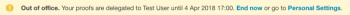

# Ausweisen von temporären Testversand-Inhabern in [!DNL Workfront Proof]

>[!IMPORTANT]
>
>Dieser Artikel bezieht sich auf die Funktionalität im eigenständigen Produkt [!DNL Workfront Proof]. Informationen zum Testen innerhalb von [!DNL Adobe Workfront] finden Sie unter [Testversand](../../../review-and-approve-work/proofing/proofing.md).

Wenn Sie über einen längeren Zeitraum abwesend sein werden, können Sie die Eigentumsrechte an Ihren Testsendungen an einen anderen Benutzer in Ihrem Konto delegieren.

>[!NOTE]
>
>Diese Funktion ist nur in [!DNL Workfront Proof] verfügbar.

So benennen Sie vorübergehenden Besitz Ihrer Testsendungen:

1. Wechseln Sie innerhalb von [!DNL Workfront Proof] zu **[!UICONTROL Persönliche Einstellungen]**.\
   

1. Klicken Sie auf die Registerkarte **[!UICONTROL Abwesenheit]**. Die folgenden Einstellungen sind verfügbar:

   * **[!UICONTROL Delegieren Sie Ihre Testsendungen an]** einen anderen Benutzer in Ihrem Konto.
   * Aktivieren und deaktivieren Sie die Funktion **[!UICONTROL Out of office]** , indem Sie das Kontrollkästchen aktivieren oder deaktivieren.
   * Wählen Sie das **[!UICONTROL Startdatum]** aus.

     Wenn die Option **[!UICONTROL Sofort starten]** ausgewählt ist, wird der Besitz der Testsendungen unmittelbar nach der Aktivierung der Funktion an den ausgewählten Benutzer delegiert.

     Wenn ein bestimmtes Startdatum und eine bestimmte Startzeit festgelegt sind, wird die Funktion am ausgewählten Tag und zur ausgewählten Zeit aktiviert.

   * Wählen Sie das **[!UICONTROL Enddatum]** aus.

     Wenn kein Enddatum ausgewählt wird, wird das Eigentum an den Testsendungen übertragen, bis die Funktion manuell deaktiviert wird.

     Wenn ein bestimmtes Enddatum und eine bestimmte Endzeit festgelegt sind, wird die Funktion am ausgewählten Tag und zur ausgewählten Zeit deaktiviert.

     

1. Wenn Testsendungen delegiert werden, wird der delegierte Inhaber im Abschnitt **[!UICONTROL Details]** der Seite mit den Testversanddetails angezeigt. Der Hinweis zur Eigentumsübertragung wird im Abschnitt **[!UICONTROL Aktivität]** der Seite mit den Testversanddetails angezeigt.

   

   Während der Aktivierung der Funktion wird auch eine [!UICONTROL Abwesenheit] -Benachrichtigung im Konto des ursprünglichen Testversandeigentümers angezeigt. Dies dient als Erinnerung an den ursprünglichen Eigentümer und ermöglicht ihm auch, die Zuweisung sofort zu beenden oder zu [!UICONTROL Persönliche Einstellungen] zu wechseln, um dies anzupassen.

   

   Wenn der Eigentümer Ihrer Testsendungen vom ursprünglichen Eigentümer zurückgenommen wird, verschwindet der zugewiesene Eigentümer aus dem Abschnitt [!UICONTROL Details] der Seite mit den Testversanddetails und die Benachrichtigung [!UICONTROL Abwesenheit] wird nicht mehr im Konto des ursprünglichen Testversandeigentümers angezeigt. Ein Hinweis darauf, dass der Testversand-Besitz zurückgesetzt wurde, wird im Abschnitt [!UICONTROL Aktivität] der Seite mit den Testversanddetails angezeigt.

   >[!NOTE]
   >
   >Der zugewiesene Eigentümer verbleibt im Testversand-Workflow, es sei denn, Sie entfernen sie manuell.

   ![[!UICONTROL activity-section-take-back].png](assets/activity-section-taken-back-350x99.png)
