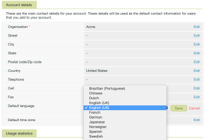

# Spracheinstellungen in [!DNL Workfront Proof]

>[!IMPORTANT]
>
>Dieser Artikel bezieht sich auf Funktionen im eigenständigen [!DNL Workfront Proof]. Informationen zu Proofing in [!DNL Adobe Workfront] finden Sie unter [Proofing](../../../review-and-approve-work/proofing/proofing.md).

Als [!DNL Workfront Proof] können Sie die Sprache auswählen, die in [!DNL Workfront Proof] für alle Benutzer in Ihrem Konto verwendet werden soll.

## In [!DNL Workfront Proof] unterstützte Sprachen

[!DNL Workfront Proof] ist in den folgenden Sprachen verfügbar:

* Englisch (USA/UK)
* Brasilianisch (Portugiesisch)
* Chinesisch
* Niederländisch
* Französisch
* Deutsch
* Japanisch
* Norwegisch
* Spanisch
* Schwedisch

## Standardsprache in „Kontoeinstellungen[!UICONTROL  ändern]

Gehen Sie wie folgt vor, um die Standardsprache Ihres Kontos zu ändern.

1. Navigieren Sie zur **[!UICONTROL Details]** in **[!UICONTROL Kontoeinstellungen]** in [!DNL Workfront Proof].

1. Klicken **[!UICONTROL im Abschnitt]** auf **[!UICONTROL Bearbeiten]** für die Einstellungen **[!UICONTROL Standardsprache]**.

1. Wählen Sie im Dropdown-Menü Ihre Standardsprache aus.\
   

1. Klicken Sie **[!UICONTROL Speichern].**

## Ändern der Standardsprache in &quot;[!UICONTROL  Einstellungen]

[!DNL Workfront Proof] Benutzer können eine Sprache angeben, die sich von der in ihrem Konto standardmäßig verwendeten unterscheidet. Gehen Sie wie folgt vor, um Ihre persönliche Standardsprache zu ändern.

1. Rufen Sie die **[!UICONTROL Persönliche Details]** in Ihrem **[!UICONTROL Persönliche Einstellungen]** in [!DNL Workfront Proof] auf.\
   Weitere Informationen finden Sie unter [Verwalten [!DNL Workfront Proof] Benutzer](../../../workfront-proof/wp-acct-admin/account-settings/manage-wp-users.md).

1. Klicken Sie auf die Sprache, die in der Einstellung **[!UICONTROL Sprache]** angezeigt wird.
1. Wählen Sie im Dropdown-Menü Ihre bevorzugte Sprache aus. Ihre Auswahl wird automatisch gespeichert.\
   

## Hinzufügen von Korrekturabzugskommentaren mit nicht lateinischen Buchstaben

Sie können Kommentare mit einem Alphabet hinzufügen, das sich von Ihrer Standardsprache unterscheidet. Wenn die Kommentare von einem anderen Testversand-Empfänger angezeigt werden, werden sie in der Sprache angezeigt, in der Sie den Inhalt hinzugefügt haben.

Sie können aus den folgenden Alphabeten wählen:

* lateinische Schrift
* Chinesisch
* Koreanisch
* Japanisch
* kyrillisch
* Hebräisch
* Arabisch
* Griechisch

## Spracheinstellungen der Korrekturabzugsansicht

Die Möglichkeit, die Sprache im Proofing Viewer anzupassen, hängt davon ab, ob die Person, die auf einen Korrekturabzug zugreift, ein Benutzer oder ein Gast ist.

Für [!DNL Workfront Proof] Benutzer zeigt die Korrekturabzugsansicht Inhalte in der Standardsprache an, die in ihren &quot;[!UICONTROL  Einstellungen“ festgelegt ].

Für Gäste zeigt die Korrekturabzugsanzeige Inhalte in der Sprache an, die der/die Korrekturabzugsverantwortliche in den &quot;[!UICONTROL  Einstellungen“ ] hat.

>[!NOTE]
>
>Wenn im Konto benutzerdefinierte Aktionen oder Entscheidungen vorhanden sind, werden diese in der Sprache angezeigt, in der sie ursprünglich hinzugefügt wurden, unabhängig von den Spracheinstellungen der Validierungsverantwortlichen.
