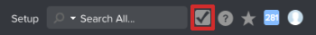

# Vorschau der Sandbox-Testumgebung - [!DNL Workfront Proof]

>[!IMPORTANT]
>
>Dieser Artikel bezieht sich auf Funktionen im eigenständigen [!DNL Workfront Proof]. Informationen zu Proofing in [!DNL Adobe Workfront] finden Sie unter [Proofing](../../../review-and-approve-work/proofing/proofing.md).

Die Vorschau-Sandbox ist eine Testumgebung, die als Replikation Ihrer Live-Umgebung dient und jedes Wochenende [!DNL Workfront Proof] aktualisiert wird.

## Grundlegendes zur Sandbox-Vorschau

Die Sandbox-Vorschau dient als Umgebung, in der Benutzer in Ihrer Organisation Daten aus der Produktionsumgebung sicher testen und damit arbeiten können, ohne die Produktionsumgebung zu beeinträchtigen. Es eignet sich ideal für Schulungen, das Testen neuer Funktionen und die Bestimmung der Setup-Funktionalität.

Außerdem werden neue Produktfunktionen in die Sandbox-Vorschau-Umgebung hochgeladen, bevor sie in die Produktionsumgebung bereitgestellt werden. Ihre Anwender können dort neue Funktionen ausprobieren, ohne ihren gewohnten Workflow in der Produktionsumgebung zu beeinträchtigen.

Die Vorschau-Sandbox enthält Ihre tatsächlichen Produktionsdaten. Die Daten fließen von der Produktion zur Vorschau und nicht umgekehrt. Die Daten werden jedes Wochenende aktualisiert, sodass es bis zu einer Woche hinter der Produktionsumgebung zurückliegen kann. Elemente, die seit der letzten Aktualisierung erstellt wurden, befinden sich bis zur nächsten Aktualisierung in der Sandbox-Vorschau-Umgebung.

## Zugriff auf die Vorschau-Sandbox

Standardmäßig haben Sie als System-Admin Zugriff auf die Sandbox-Vorschau-Umgebung. Wenn Sie nicht wie in diesem Abschnitt beschrieben auf die Sandbox-Vorschau-Umgebung zugreifen können, wenden Sie sich an Ihren [!DNL Workfront] oder an unser Support-Team.

* [Zugriff auf die Sandbox-Vorschau als eigenständiger  [!DNL Workfront Proof] &#x200B;](#accessing-the-preview-sandbox-as-a-stand-alone-workfront-proof-customer)
* [Zugriff auf die Vorschau-Sandbox als  [!DNL Workfront]+[!DNL Workfront Proof] &#x200B;](#accessing-the-preview-sandbox-as-a-workfrontworkfront-proof-customer)

### Zugriff auf die Sandbox-Vorschau als eigenständiger [!DNL Workfront Proof]

1. Navigieren Sie zu dieser URL: `https://preview.proofhq.com`.
1. Melden Sie sich mit Ihren Vorschau-Anmeldedaten an.\
   Die Vorschau-Anmeldedaten sollten den Produktions-Anmeldedaten entsprechen, es sei denn, Sie haben sie in der Produktionsumgebung nach der Aktualisierung der Vorschau geändert. Die Logins werden nur synchronisiert, wenn eine Aktualisierung stattfindet, die jedes Wochenende stattfindet. Sie werden nicht automatisch synchronisiert.

### Zugreifen auf die Sandbox-Vorschau als Kundin oder Kunde von [!DNL Workfront+Workfront] Proof

Als System-Admin können Sie über die [!DNL Workfront] auf die Sandbox &quot;[!DNL Workfront Proof]-Vorschau“ zugreifen.

So greifen Sie auf die Sandbox für die [!DNL Workfront Proof] zu:

1. Melden Sie sich bei Ihrer [!DNL Workfront] an.
1. Klicken **[!UICONTROL in]** globalen Navigationsleiste auf „Setup“.
1. Klicken Sie auf **[!UICONTROL System]** > **[!UICONTROL Voreinstellungen]**.

1. Klicken Sie **[!UICONTROL Abschnitt]** Testumgebungen“ auf **[!UICONTROL Sandbox-Vorschau]**.

1. Melden Sie sich mit Ihren Vorschau-Anmeldedaten an.\
   Ihre Vorschau-Anmeldedaten sollten mit Ihren Produktions-Anmeldedaten übereinstimmen, es sei denn, Sie haben sie in der Produktion nach der Aktualisierung der Vorschau geändert. Die Anmeldungen werden nur synchronisiert, wenn eine Aktualisierung erfolgt. Sie werden nicht automatisch synchronisiert.
1. Klicken Sie auf das [!DNL Workfront Proof] in der Symbolleiste für globale Navigation.\
   \
   Die [!DNL Workfront Proof] Vorschau -Umgebung wird angezeigt.

## E-Mails von der Vorschau-Sandbox empfangen

E-Mail-Benachrichtigungen werden nie aus der [!DNL Workfront Proof] Vorschau-Umgebung ausgelöst.

