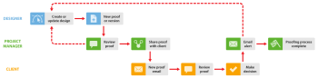

# Interne und dann externe Überprüfung in [!DNL Workfront Proof]

>[!IMPORTANT]
>
>Dieser Artikel bezieht sich auf die Funktionalität im eigenständigen Produkt [!DNL Workfront Proof]. Informationen zum Testen in [!DNL Adobe Workfront], siehe [Testversand](../../../review-and-approve-work/proofing/proofing.md).

Wenn Ihr Unternehmen interne Überprüfungen abschließt, bevor Testsendungen für Kunden freigegeben werden, schlagen wir zwei Möglichkeiten vor, [!DNL Workfront Proof] zur Verbesserung Ihres Workflows:

## Kunden sehen interne Kommentare

Diese Option zeigt einen Workflow, in dem Clients alle internen Kommentare sehen können.

Der Designer teilt den Testversand zunächst mit dem Projektmanager (und anderen Kollegen). Kollegen überprüfen den Testversand und wenn sie ihn validieren, können Sie die Freigabefunktion verwenden, um den Testversand mit Ihren Kunden zu teilen. Weitere Informationen finden Sie unter [Testversand freigeben in [!DNL Workfront Proof]](../../../workfront-proof/wp-work-proofsfiles/share-proofs-and-files/share-proof.md).

1. **Neuen Testversand erstellen** - Der Designer erstellt einen neuen Testversand in [!DNL Workfront Proof] und gibt sie für interne Validierungsverantwortliche frei. Der Designer macht den Projektmanager zum Besitzer des Testversands.
1. **Interne Überprüfung** - der Projektleiter und andere Kollegen überprüfen den Testversand.
1. **Testversand freigeben** - Der Projektmanager gibt den Testversand an den Kunden weiter.
1. **Neue Testversand-E-Mail** - Der Kunde erhält die E-Mail mit der Nachricht Neuer Testversand mit der [!UICONTROL Testversand durchführen] Link. Weitere Informationen finden Sie unter [Neue Testversand-E-Mail](../../../workfront-proof/wp-emailsntfctns/proof-notifications-and-reminders/new-proof-email.md).

1. **Testversand** - der Kunde prüft den Testversand, fügt Kommentare hinzu und trifft eine Entscheidung.
1. **Email-Warnhinweis** - Der Projektmanager erhält eine E-Mail-Warnung (je nach den Einstellungen für den Testversand). Weitere Informationen finden Sie unter [E-Mail-Benachrichtigungseinstellungen in Workfront Testversand konfigurieren](../../../workfront-proof/wp-emailsntfctns/email-alerts/config-email-notification-settings-wp.md).

1. **Anforderung ändern** - Der Projekt-Manager informiert den Designer über die Änderungsanforderungen. Dies kann mithilfe der Druckkommentar-Funktion erfolgen. Weitere Informationen finden Sie unter [Drucken und Exportieren von Kommentaren in [!DNL Workfront Proof]](../../../workfront-proof/wp-work-proofsfiles/organize-your-work/print-and-export-comments.md).

1. **Neue Version** (falls erforderlich) - Der Designer ändert die Datei und lädt sie hoch in [!DNL Workfront Proof] als neue Version. Weitere Informationen finden Sie unter .

Sie können diesen Vorgang wiederholen, bis der Testversand validiert wurde.

## Client sieht nur die eigene Version

Diese Option veranschaulicht einen Workflow, bei dem der Testversand vom Projektmanager verwaltet wird, der neue Versionen erstellt (falls erforderlich) und den Testversand an den Kunden weitergibt. Der Designer muss nicht in den Überprüfungsprozess einbezogen werden.)

1. **Neuen Testversand erstellen** - Der Designer erstellt einen neuen Testversand in [!DNL Workfront Proof] und teilt sie mit internen Validierern. Der Designer macht den Projektmanager zum Eigentümer des Testversands oder gibt ihm alternativ die Rolle von [!UICONTROL Autor] zum Testversand (siehe [Verwalten von Proof-Rollen in [!DNL Workfront Proof]](../../../workfront-proof/wp-work-proofsfiles/share-proofs-and-files/manage-proof-roles.md)).

1. **Interne Überprüfung** - der Projektleiter und andere Kollegen überprüfen den Testversand. Weitere Informationen finden Sie unter [Überprüfen von Testsendungen im Web Proofing-Viewer](https://support.workfront.com/hc/en-us/sections/115000275214-Reviewing-Proofs-in-the-Web-Proofing-Viewer) und [Überprüfen von Testsendungen im Viewer für die Desktop-Testversion.](https://support.workfront.com/hc/en-us/sections/360000686434-Reviewing-Proofs-in-the-Desktop-Proofing-Viewer)

1. **Neue Version** - Der Projektmanager erstellt eine neue Version (oder eine Kopie) des Testversands und gibt ihn für den Kunden frei. Siehe [Kopieren von Testsendungen in [!DNL Workfront Proof]](../../../workfront-proof/wp-work-proofsfiles/create-proofs-and-files/copy-proofs.md) und [Testversand freigeben in [!DNL Workfront Proof]](../../../workfront-proof/wp-work-proofsfiles/share-proofs-and-files/share-proof.md).

1. **Neue Testversand-E-Mail** - Der Kunde erhält die E-Mail zum neuen Testversand mit einer [!UICONTROL Testversand durchführen] Link. Weitere Informationen finden Sie unter [Neue Testversand-E-Mail](../../../workfront-proof/wp-emailsntfctns/proof-notifications-and-reminders/new-proof-email.md).

1. **[!UICONTROL Testversand]** - der Kunde prüft den Testversand, fügt Kommentare hinzu und trifft eine Entscheidung.
1. Der Kunde kann nur die Version des Testversands sehen, der explizit für ihn freigegeben wurde. sie werden die interne Version nicht sehen können.
1. **[!UICONTROL Email-Warnhinweis]** - Der Projektmanager erhält eine E-Mail mit einer Zusammenfassung der Überprüfung durch den Kunden (abhängig von seinen Testeinstellungen).
1. **Anforderung ändern** - Der Projekt-Manager informiert den Designer über die Änderungsanforderungen. Dies kann mithilfe der Druckkommentar-Funktion erfolgen. Weitere Informationen finden Sie unter [Drucken und Exportieren von Kommentaren in [!DNL Workfront Proof]](../../../workfront-proof/wp-work-proofsfiles/organize-your-work/print-and-export-comments.md).

1. **Neue Version** (falls erforderlich) - Der Designer ändert die Datei und lädt sie hoch in [!DNL Workfront Proof] als neue Version. Weitere Informationen finden Sie unter .

Sie können diesen Vorgang wiederholen, bis der Testversand validiert wurde.
