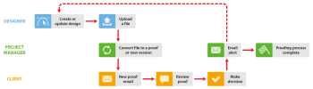

# Arbeiten mit Designern und Projektmanagern in [!DNL Workfront Proof]

>[!IMPORTANT]
>
>Dieser Artikel bezieht sich auf die Funktionalität im eigenständigen Produkt [!DNL Workfront Proof]. Informationen zum Testen in [!DNL Adobe Workfront], siehe [Testversand](../../../review-and-approve-work/proofing/proofing.md).

Sie können den Prüfungs-Workflow für den Projektmanager (die Person, die den Prüfungsprozess verwaltet) und den Designer, der an einem Projekt zusammenarbeitet, auf die zwei unten beschriebenen Arten erweitern.

Diese Workflows funktionieren in jeder Situation gut, sind jedoch besonders hilfreich, wenn Ihr Designer Dateien erstellt, die für eine E-Mail an den Projektmanager möglicherweise zu groß sind.

## Wann Designer Kommentare und Entscheidungen anzeigen muss

Wenn der Designer Kommentare und Entscheidungen zu einem Testversand sehen muss, kann er den Testversand starten und den Testversand nach Abschluss des Vorgangs erneut erhalten. Der Designer kann den Prozess dann erneut starten. 

1. Der Designer erstellt einen neuen Testversand und weist den Projektmanager als Eigentümer des Projekts zu (weitere Informationen finden Sie unter [Testsendungen generieren in [!DNL Workfront Proof]](../../../workfront-proof/wp-work-proofsfiles/create-proofs-and-files/generate-proofs.md)). Als Ersteller des Testversands kann der Designer:

   * Kommentar zum Testversand und Verwendung der [!UICONTROL Aktionen] , um Kommentar-Threads zu verfolgen.
   * Erstellen Sie eine neue Version des Testversands für den Projektmanager.

1. Der Projektmanager prüft den Testversand und gibt ihn dann für den Kunden frei. Weitere Informationen finden Sie unter [Testversand freigeben in [!DNL Workfront Proof]](../../../workfront-proof/wp-work-proofsfiles/share-proofs-and-files/share-proof.md).
1. Der Kunde erhält eine E-Mail mit einem Link zum Testversand. Weitere Informationen finden Sie unter [Neue Testversand-E-Mail](../../../workfront-proof/wp-emailsntfctns/proof-notifications-and-reminders/new-proof-email.md).
1. Der Kunde prüft den Testversand, fügt Kommentare hinzu und entscheidet über den Testversand.
1. Der Projektmanager erhält eine E-Mail mit einer Zusammenfassung der Prüfung durch den Kunden und der Designer erhält eine E-Mail über die erforderlichen Änderungen. Weitere Informationen finden Sie unter [E-Mail-Benachrichtigungseinstellungen konfigurieren in [!DNL Workfront Proof]](../../../workfront-proof/wp-emailsntfctns/email-alerts/config-email-notification-settings-wp.md).
1. Der Designer oder Projektmanager ändert die Datei. wenn der Designer die Datei dann als neue Version hochlädt, [!DNL Workfront Proof] weist dem Projektmanager das Eigentum an dem Testversand zu.

## Wenn Designer keine Testkommentare und Entscheidungen anzeigen muss

Wenn es nicht erforderlich ist, dass der Designer in die [!DNL Workfront Proof] Überprüfungsprozess kann der Projektmanager den Testversand erstellen und die Validierer hinzufügen.

1. Der Designer lädt die Datei hoch und gibt sie für den Projektmanager frei. Weitere Informationen finden Sie unter [Hochladen von Dateien und Webinhalten in [!DNL Workfront Proof]](../../../workfront-proof/wp-work-proofsfiles/create-proofs-and-files/upload-files-web-content.md) und [Freigeben von Dateien in [!DNL Workfront Proof]](../../../workfront-proof/wp-work-proofsfiles/share-proofs-and-files/share-files.md).

1. Der Projektmanager erhält die Datei und kann mit nur einem Klick einen Testversand aus der Datei erstellen. Weitere Informationen finden Sie unter [Testsendungen generieren in [!DNL Workfront Proof]](../../../workfront-proof/wp-work-proofsfiles/create-proofs-and-files/generate-proofs.md) Siehe auch  [Verwalten von Dateien in [!DNL Workfront Proof]](../../../workfront-proof/wp-work-proofsfiles/manage-your-work/manage-files.md) für Informationen zum Konvertieren von Dateien in Testsendungen.

1. Der Kunde erhält eine E-Mail mit einem Link zum Testversand. Weitere Informationen finden Sie unter [Neue Testversand-E-Mail](../../../workfront-proof/wp-emailsntfctns/proof-notifications-and-reminders/new-proof-email.md).
1. Der Kunde prüft den Testversand, fügt Kommentare hinzu und trifft eine Entscheidung.
1. Der Projektmanager erhält eine E-Mail mit einer Zusammenfassung der Überprüfung und Entscheidung des Kunden. Weitere Informationen finden Sie unter [E-Mail-Benachrichtigungseinstellungen konfigurieren in [!DNL Workfront Proof]](../../../workfront-proof/wp-emailsntfctns/email-alerts/config-email-notification-settings-wp.md).
1. Der Projektmanager informiert den Designer über die Änderungsanforderungen mit [!UICONTROL Kommentare drucken]. Weitere Informationen finden Sie unter [Drucken und Exportieren von Kommentaren in [!DNL Workfront Proof]](../../../workfront-proof/wp-work-proofsfiles/organize-your-work/print-and-export-comments.md).
1. Bei Bedarf ändert der Designer die Datei und lädt sie in hoch. [!DNL Workfront Proof], wo der Projektmanager eine neue Version für eine weitere Testrunde erstellen kann.

