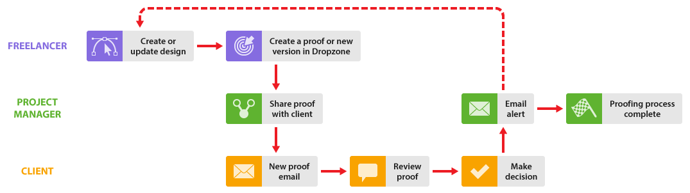

# Arbeiten mit Freiberuflern in [!DNL Workfront Proof]

>[!IMPORTANT]
>
>Dieser Artikel bezieht sich auf die Funktionalität im eigenständigen Produkt [!DNL Workfront Proof]. Informationen zum Testen innerhalb von [!DNL Adobe Workfront] finden Sie unter [Testversand](../../../review-and-approve-work/proofing/proofing.md).

Wenn Ihr Unternehmen mit Freiberuflern zusammenarbeitet, können Sie diese auch in Ihren [!DNL Workfront Proof]-Prozess einbeziehen.

Es gibt verschiedene Möglichkeiten, dies zu tun, je nachdem, ob der Freiberufler in [!DNL Workfront Proof] Teil Ihrer Organisation sein soll oder nicht:

## Hinzufügen von Freiberuflern zu Ihrem [!DNL Workfront Proof]-Konto

Sie können Ihre Freiberufler einfach als Benutzer in [!DNL Workfront Proof] zu Ihrem Konto hinzufügen, genau wie Ihre Kollegen, dann können sie Teil aller in diesem Abschnitt beschriebenen Workflows sein.

Sie können die verschiedenen Benutzerprofile sowie die Datenschutzregel für Ordner verwenden, um die Sichtbarkeit und den Zugriff Ihres Freiberuflers in Ihrem Konto zu verwalten.

Lesen Sie die Artikel [Benutzerprofile und Berechtigungen](https://support.workfront.com/hc/https://support.workfront.com/hc/en-us/articles/115004087428-User-profiles-and-permissions) und [Grundlegendes zu Ordnerberechtigungen in [!DNL Workfront Proof]](../../../workfront-proof/wp-work-proofsfiles/organize-your-work/folder-permissions.md) , bevor Sie Ihrem Konto einen Freiberufler als Benutzer hinzufügen.

Informationen zum Hinzufügen eines Freiberuflers zu Ihrem Team finden Sie unter [Benutzer mit erstellen [!DNL Workfront Proof]](../../../workfront-proof/wp-mnguserscontacts/users/create-users.md).

>[!NOTE]
>
>Freiberufler, die Ihrem Konto als Benutzer hinzugefügt wurden, haben Einblick in Ihr Konto und können ggf. auch Kundendetails anzeigen (je nach Benutzerprofil). Dies ist möglicherweise nicht das, was Sie sich wünschen. Vielleicht wäre es besser, ein Satellitenkonto für Ihre Freiberufler einzurichten. Weitere Informationen finden Sie unten unter [Einrichten eines Satellitenkontos für Ihre Freiberufler](https://support.workfront.com/knowledge/articles/115004259868/en-us?brand_id=662728&amp;return_to=%2Fhc%2Fen-us%2Farticles%2F115004259868#Option-B---set-up-a-satellite-account-for-your-freelancers) .

## Satellitenkonto für Ihre Freiberufler einrichten

Wenn Sie nicht möchten, dass sich Kunden und Freiberufler in [!DNL Workfront Proof] gegenseitig sehen, können Sie Satellitenkonten für Ihre Freiberufler einrichten.

Das bedeutet, dass sie über ein eigenes Dashboard verfügen, um alle Elemente, an denen sie arbeiten, an einem Ort anzuzeigen. Darüber hinaus können sie Dateien über [!DNL Workfront Proof] an Sie senden, die Sie in Testsendungen konvertieren können ([!UICONTROL Enterprise] - und [!UICONTROL Unlimited] -Pläne nur). Weitere Informationen finden Sie unter [Verwalten von Dateien in [!DNL Workfront Proof]](../../../workfront-proof/wp-work-proofsfiles/manage-your-work/manage-files.md).

Wenn der Freiberufler während des Überprüfungsprozesses neue Versionen des Testversands erstellen muss, können Sie sie dem Testversand explizit als [!UICONTROL Autor] hinzufügen, wodurch er sich an dem Überprüfungsprozess beteiligen und bei Bedarf neue Versionen erstellen kann. Weitere Informationen finden Sie unter und [Verwalten von Proof-Rollen in [!DNL Workfront Proof]](../../../workfront-proof/wp-work-proofsfiles/share-proofs-and-files/manage-proof-roles.md).

1. Der Freiberufler meldet sich bei seinem Satellitenkonto an.
1. Der Freiberufler lädt die Datei hoch und gibt sie für Sie frei. Siehe [Hochladen von Dateien und Webinhalten in  [!DNL Workfront Proof]](../../../workfront-proof/wp-work-proofsfiles/create-proofs-and-files/upload-files-web-content.md) und [Freigeben von Dateien in  [!DNL Workfront Proof]](../../../workfront-proof/wp-work-proofsfiles/share-proofs-and-files/share-files.md).

1. Sie erhalten eine E-Mail, in der Sie darüber informiert werden, dass eine Datei für Sie freigegeben wurde.
1. Sie melden sich bei Ihrem Konto an und suchen die Datei, die für Sie freigegeben wurde.
1. Verwenden Sie die Schaltfläche [!UICONTROL Konvertieren in Testversand] , um die Datei in einen Testversand zu konvertieren. Weitere Informationen finden Sie unter [Verwalten von Dateien in [!DNL Workfront Proof]](../../../workfront-proof/wp-work-proofsfiles/manage-your-work/manage-files.md).
1. Anschließend können Sie den Testversand-Workflow mit Ihren Kunden normal verwalten. Wenn Sie den Freiberufler explizit zum Testversand hinzufügen möchten, können Sie dies mit der Freigabefunktion tun. Weitere Informationen finden Sie unter [Testversand freigeben in [!DNL Workfront Proof]](../../../workfront-proof/wp-work-proofsfiles/share-proofs-and-files/share-proof.md).
1. Wenn Sie Ihre Freiberufler nicht explizit zum Testversand hinzufügen möchten, Sie diese jedoch bei der Validierung benachrichtigen möchten. Sie können Ihre Freiberufler am Ende des Testversands benachrichtigen, indem Sie einen Link zum Testversand mit ihnen teilen.

   Dies bedeutet, dass sie nicht Teil des Überprüfungsteams sind und Ihre Kunden ihren Namen nicht auf dem Testversand sehen.

Informationen zum Einrichten eines Satellitenkontos für Ihre Freiberufler finden Sie unter [Konfigurieren eines Satellitenkontos in  [!DNL Workfront Proof]](../../../workfront-proof/wp-acct-admin/satellite-accounts/configure-sat-acct-in-wp.md).

## Verwenden Sie die [!UICONTROL Dropzone]

Diese Option ist nützlich, wenn Sie nicht möchten, dass sich Kunden und Freiberufler in [!DNL Workfront Proof] gegenseitig sehen. Sie können Ihren Freiberuflern Zugriff auf Ihre [!UICONTROL Dropzone] gewähren (nur für [!UICONTROL Enterprise]- und [!UICONTROL Unlimited]-Pläne verfügbar). Weitere Informationen finden Sie unter [Die [!UICONTROL Dropzone]](../../../workfront-proof/wp-work-proofsfiles/create-proofs-and-files/dropzone.md).

1. Der Freiberufler besucht Ihre öffentliche Seite [!UICONTROL Dropzone] .
1. Sie verwenden die [!UICONTROL Dropzone] , um einen neuen Testversand in Ihrem Konto zu erstellen.
1. Sie erhalten eine E-Mail, in der Sie darüber informiert werden, dass sich in Ihrer [!UICONTROL Dropzone] ein neuer Testversand befindet.
1. Sie melden sich bei Ihrem Konto an und finden den Testversand in Ihrer [!UICONTROL Dropzone].
1. Sie entsperren den Testversand, fügen Überprüfer hinzu, legen die Testversandeinstellungen fest und verwalten den Testversand-Workflow mit Ihren Kunden auf die übliche Weise. Ihr Freiberufler wird als Ersteller des Testversands angezeigt (und kann nicht entfernt werden).

* Sie können den Zugriff Ihres Freiberuflers auf den Testversand mit Ihren Einstellungen für [!UICONTROL Dropzone] verwalten. Weitere Informationen finden Sie unter [Konfigurieren der Dropzone in [!DNL Workfront Proof]](../../../workfront-proof/wp-acct-admin/account-settings/configure-dropzone-in-wp.md).
* Sie können auch die Rolle verwalten, die ihnen beim Testversand zugewiesen wird, z. B. [!UICONTROL Schreibgeschützt], sowie die E-Mail-Kommunikation mit ihnen bezüglich des Testversands. Weitere Informationen finden Sie unter [Verwalten von Proof-Rollen in  [!DNL Workfront Proof]](../../../workfront-proof/wp-work-proofsfiles/share-proofs-and-files/manage-proof-roles.md).
* Wenn Sie nicht möchten, dass Ihr Freiberufler am Überprüfungsprozess teilnimmt, Sie jedoch möchten, dass er über die endgültige Entscheidung informiert wird, können Sie die standardmäßige Testversandrolle in Ihren Einstellungen für [!UICONTROL Dropzone] und einen E-Mail-Warnhinweis für alle [!UICONTROL Dropzone] -Absender auf [Rollen in  [!DNL Workfront Proof]](../../../workfront-proof/wp-work-proofsfiles/share-proofs-and-files/manage-proof-roles.md) verwalten und [E-Mail-Benachrichtigungseinstellungen in  [!DNL Workfront Proof]](../../../workfront-proof/wp-emailsntfctns/email-alerts/config-email-notification-settings-wp.md) konfigurieren. Weitere Informationen finden Sie unter [E-Mail-Warnhinweise, ](https://support.workfront.com/hc/en-us/sections/115000911867-Email-alerts) [Rollen für den Testversand in  [!DNL Workfront Proof]](../../../workfront-proof/wp-work-proofsfiles/share-proofs-and-files/manage-proof-roles.md) verwalten und [E-Mail-Benachrichtigungseinstellungen in  [!DNL Workfront Proof]](../../../workfront-proof/wp-emailsntfctns/email-alerts/config-email-notification-settings-wp.md) konfigurieren.
* Wenn Sie möchten, dass Ihr Freiberufler aktiv am Überprüfungsprozess teilnimmt, können Sie die Rolle des Testversands und die E-Mail-Warnhinweiseinstellungen nach Bedarf anpassen, indem Sie diese Details auf der Seite mit den Testversanddetails inline bearbeiten. Weitere Informationen zu dieser Seite finden Sie unter [Testversanddetails verwalten in [!DNL Workfront Proof]](../../../workfront-proof/wp-work-proofsfiles/manage-your-work/manage-proof-details.md) .
