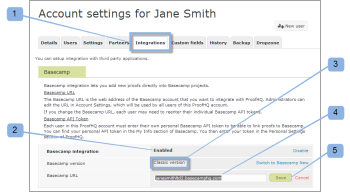
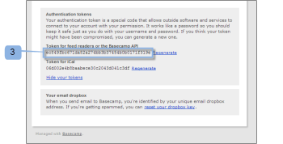
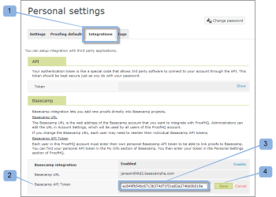

# Integrieren von [!DNL Workfront Proof] mit [!DNL Basecamp Classic]

>[!IMPORTANT]
>
>Dieser Artikel bezieht sich auf die Funktionalität im eigenständigen Produkt [!DNL Workfront Proof]. Informationen zum Testen innerhalb von [!DNL Adobe Workfront] finden Sie unter [Testversand](../../../review-and-approve-work/proofing/proofing.md).

Wenn Sie [!DNL Basecamp] für das Projektmanagement verwenden, können Sie Ihrem Projektteam umfassendere Prüfungs- und Validierungstools mit [!DNL Workfront Proof] anbieten.

## Die [!DNL Basecamp]-Integration mit [!DNL Workfront]

Durch die Integration mit [!DNL Basecamp] können Benutzer Testsendungen innerhalb von [!DNL Basecamp] anzeigen, überprüfen und genehmigen. Benutzer können Testsendungen an Ihr [!DNL Workfront Proof]-Konto senden und sie mit Ihrem [!DNL Basecamp] -Projekt verbinden. Ihre Validierer können [mithilfe des in Ihrer Basecamp-Nachricht eingebetteten Mini-Testversands eine Entscheidung über einen Testversand im Testversand-Viewer ](../../../review-and-approve-work/proofing/reviewing-proofs-within-workfront/make-a-decision-on-a-proof/make-decisions-on-proof.md) treffen.[!DNL Basecamp]

Wenn es mit [!DNL Workfront Proof] integriert ist, ermöglicht [!DNL Basecamp] Benutzern Folgendes mit Testsendungen:

* Benutzer können Testsendungen innerhalb von [!DNL Basecamp Classic] überprüfen und genehmigen.
* Benutzer haben Überprüfungs-Tools sofort verfügbar.
* Projektprüfungsteams erhalten eine Nachricht in [!DNL Basecamp] mit einem kleinen Testversand zur Überprüfung und Genehmigung.
* Benutzer können zur Überprüfung und Genehmigung zu einem ganzseitigen Testversand wechseln.
* Benutzer können sowohl Mini- als auch Vollbildsendungen Kommentare und Markups hinzufügen.

  >[!NOTE]
  >
  >Nachdem ein Kommentar beantwortet wurde, kann er nicht mehr bearbeitet oder gelöscht werden.

* Überprüfer können auf die Markierungen und reagieren, die von anderen Validierern vorgenommen wurden.
* Benutzer werden benachrichtigt, wenn eine neue Testversion verfügbar ist.
* Benutzer, die keine [!DNL Workfront Proof] -Benutzer sind, können in [!DNL Basecamp] an einem Testversand arbeiten.

Die Integration von [!DNL Workfront Proof] mit [!DNL Basecamp] muss auf zwei Ebenen eingerichtet werden:

* Konfigurieren Sie [!DNL Basecamp] in den [Kontoeinstellungen:](https://support.workfront.com/hc/en-us/sections/115000912147-Account-settings) Dies aktiviert die Basecamp-Integration für Ihre gesamte Organisation.
* Weitere Informationen finden Sie unter [Aktivieren der [!DNL Basecamp] Integration mit [!DNL Workfront Proof]](#enabling-the-basecamp-integration-with-workfront-proof).
* Konfigurieren Sie [!DNL Basecamp] in [Persönliche Einstellungen](https://support.workfront.com/hc/en-us/sections/115000921168-Personal-settings): Dadurch können Ersteller und Inhaber von Testsendungen eine Verbindung zu ihrem persönlichen [!DNL Basecamp]-Konto herstellen und den Zugriff auf [!DNL Workfront Proof] genehmigen. Weitere Informationen finden Sie unter [Konfigurieren der persönlichen Einstellungen](#configuring-personal-settings).

Sie können [!DNL Workfront] entweder mit [!DNL Basecamp] oder mit [!DNL Basecamp Classic] integrieren. Jede Version von [!DNL Basecamp] verwendet eine andere API und erfordert daher unterschiedliche Konfigurationsverfahren.

Informationen zum Konfigurieren von [!DNL Basecamp Classic] finden Sie unter [Aktivieren der [!DNL Basecamp] Integration mit [!DNL Workfront Proof]](#enabling-the-basecamp-integration-with-workfront-proof) in diesem Artikel.

Informationen zum Konfigurieren von [!DNL Basecamp] finden Sie unter [Integrieren [!DNL Workfront Proof] mit  [!DNL Basecamp]](../../../workfront-proof/wp-integrations/basecamp/integrate-workfront-proof-with-basecamp.md).

## Aktivieren der [!DNL Basecamp]-Integration mit [!DNL Workfront Proof]

Als [Proof Permissions Profiles in [!DNL Workfront Proof]](../../../workfront-proof/wp-acct-admin/account-settings/proof-perm-profiles-in-wp.md) oder [Proof Permissions Profiles in [!DNL Workfront Proof]](../../../workfront-proof/wp-acct-admin/account-settings/proof-perm-profiles-in-wp.md) können Sie die Basecamp-Integration für das gesamte Konto in Ihren [Kontoeinstellungen](https://support.workfront.com/hc/en-us/sections/115000912147-Account-settings) einrichten.

1. Navigieren Sie zu [Kontoeinstellungen](https://support.workfront.com/hc/en-us/sections/115000912147-Account-settings).
1. Öffnen Sie die Registerkarte **[!UICONTROL Integrationen]** (1).
1. Um die Basecamp-Integration zu aktivieren, klicken Sie auf **[!UICONTROL Aktivieren]** (2).
1. Stellen Sie sicher, dass [!DNL Basecamp Classic] die Version ist, in die Sie (3) integrieren.
1. (Bedingt) Wenn keine [!DNL Basecamp] URL angezeigt wird (4), klicken Sie auf **[!UICONTROL Bearbeiten]** und geben Sie die URL für Ihr [!DNL Basecamp]-Konto ein (ohne http://).
1. Klicken Sie auf **[!UICONTROL Speichern]** (5).\
   

1. (Optional) Überprüfen Sie Ihre [!DNL Basecamp]-URL in Ihrem Browser, nachdem Sie sich bei Ihrem [!DNL Basecamp Classic]-Konto angemeldet haben (6).

   

   Nachdem Sie [!DNL Workfront Proof] mit [!DNL Basecamp] integriert haben, können Ihre Benutzer ihre persönlichen Einstellungen konfigurieren. Informationen zum Einrichten von persönlichen Einstellungen finden Sie unter [Konfigurieren von persönlichen Einstellungen](#configuring-personal-settings).

   Wenn Sie die [!DNL Basecamp] -Integration nicht aktivieren können, ist Ihre [!DNL Workfront Proof] -Konto-ID möglicherweise nicht mit der Konto-ID identisch, die Sie in [!DNL Basecamp] verwenden.

## Persönliche Einstellungen konfigurieren

Nachdem Sie [Kontoeinstellungen](https://support.workfront.com/hc/en-us/sections/115000912147-Account-settings) für Ihre Organisation eingerichtet haben, sollten alle Autoren, die Testsendungen erstellen/senden, ihre [persönlichen Einstellungen festlegen.](https://support.workfront.com/hc/en-us/sections/115000921168-Personal-settings)

>[!NOTE]
>
>Die Ausführung dieser Schritte ist am einfachsten, wenn Sie Ihre [!DNL Basecamp] -Sitzung in einem Browserfenster geöffnet haben und Ihre [!DNL Workfront Proof] -Sitzung in einem anderen Fenster geöffnet ist.

* [Abrufen Ihres [!DNL Basecamp] API-Tokens](#retrieving-your-basecamp-api-token)
* [Hinzufügen Ihres [!DNL Basecamp] API-Tokens zu Ihren persönlichen Einstellungen](#adding-your-basecamp-api-token-to-your-personal-settings)

### Abrufen Ihres [!DNL Basecamp] API-Tokens

Um die Integration auf individueller Ebene in [!DNL Workfront Proof] abzuschließen, benötigen Benutzer ihr individuelles Authentifizierungstoken für die [!DNL Basecamp] -API.

So rufen Sie Ihr [!DNL Basecamp] -API-Token ab:

1. Melden Sie sich bei Ihrem [!DNL Basecamp] -Konto an.
1. Klicken Sie oben rechts im Bildschirm auf **[!UICONTROL My Info]** (1).\
   Die Seite [!UICONTROL My Info] wird angezeigt.\
   

1. Klicken Sie im Abschnitt [!UICONTROL Authentifizierungstoken] auf **[!UICONTROL Ihre Token anzeigen]** (2), um Ihre persönlichen Authentifizierungstoken anzuzeigen.
1. Wählen Sie das **[!UICONTROL Token für Feed-Leser]** oder die **[!UICONTROL Basecamp-API]** (3) aus und kopieren Sie dann das Token in die Zwischenablage.

1. Fügen Sie Ihr [!DNL Basecamp] -API-Token in das Feld [!UICONTROL Token für Feed-Leser] oder das Feld [!UICONTROL Basecamp-API] ein.\
   

### Hinzufügen Ihres [!DNL Basecamp]-API-Tokens zu Ihren persönlichen Einstellungen

So fügen Sie das [!DNL Basecamp] API-Token in Ihre [!DNL Workfront Proof] [persönlichen Einstellungen](https://support.workfront.com/hc/en-us/sections/115000921168-Personal-settings) ein:

1. Navigieren Sie zu [[!UICONTROL Integrationen] - Benutzereinstellungen](../../../workfront-proof/wp-getstarted/personal-settings/integrations-user-setup.md) in Ihren [persönlichen Einstellungen](https://support.workfront.com/hc/en-us/sections/115000921168-Personal-settings) (1).\
   Ein Administrator muss zunächst die [!DNL Basecamp Classic] -Integration aktivieren, damit Sie Ihre persönlichen Einstellungen aktivieren können. Informationen zum Einrichten der Integration finden Sie unter [Aktivieren der [!DNL Basecamp] Integration mit [!DNL Workfront Proof]](#enabling-the-basecamp-integration-with-workfront-proof) in diesem Artikel.

1. Fügen Sie im Feld [!DNL Basecamp] API-Token (2) das Token, das Sie gerade von Ihrer Seite [!DNL Basecamp] [!UICONTROL My Info] kopiert haben, in das Feld (3) ein.\
   Informationen zum Kopieren des [!DNL Basecamp] API-Tokens finden Sie unter [Abrufen Ihres [!DNL Basecamp] API-Tokens](#retrieving-your-basecamp-api-token) in diesem Artikel.

1. Klicken Sie auf **[!UICONTROL Speichern]** (4).

Ihre [!DNL Workfront Proof] [persönlichen Einstellungen](https://support.workfront.com/hc/en-us/sections/115000921168-Personal-settings) sind jetzt in Ihr [!DNL Basecamp Classic]-Konto integriert.
