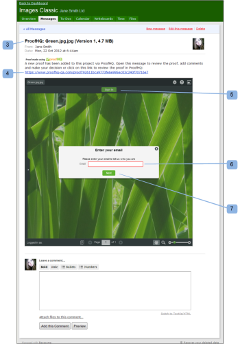

# Überprüfen eines Korrekturabzugs in [!DNL Basecamp] Classic

>[!IMPORTANT]
>
>Dieser Artikel bezieht sich auf Funktionen im eigenständigen [!DNL Workfront Proof]. Informationen zu Proofing in [!DNL Adobe Workfront] finden Sie unter [Proofing](../../../review-and-approve-work/proofing/proofing.md).

[!DNL Basecamp] ist ein von [!DNL 37signals] entwickeltes Online-Projektmanagement-Tool. Wenn Sie [!DNL Basecamp] für das Projekt-Management verwenden, können Sie Ihrem Projekt-Team umfassendere Überprüfungs- und Genehmigungs-Tools mit [!DNL Workfront Proof] anbieten.

## Grundlegendes zu Korrekturabzugsüberprüfungen in [!DNL Basecamp Classic]

Bei der Integration mit [!DNL Workfront Proof] können Benutzende [!DNL Basecamp] mit -Korrekturabzügen Folgendes durchführen:

* Benutzer können Korrekturabzüge in [!DNL Basecamp Classic] überprüfen und genehmigen.
* Die Benutzer verfügen über Prüfwerkzeuge, die jederzeit verfügbar sind.
* Projektüberprüfungs-Teams erhalten eine Nachricht in [!DNL Basecamp] mit einem Mini-Korrekturabzug zur Überprüfung und Genehmigung.
* Benutzer können zur Überprüfung und Genehmigung zu einem ganzseitigen Korrekturabzug wechseln.
* Benutzende können sowohl zu kleinen als auch zu großen Korrekturabzügen Kommentare und Markierungen hinzufügen.
* Nachdem ein Kommentar beantwortet wurde, kann er nicht mehr bearbeitet/gelöscht werden. Weitere Informationen zu Kommentaren finden Sie [Kommentar zu einem Korrekturabzug](../../../review-and-approve-work/proofing/reviewing-proofs-within-workfront/comment-on-a-proof/comment-on-proof.md).
* Reviewer können auf die von anderen Reviewern vorgenommenen Korrekturabzüge und Markierungen reagieren. Weitere Informationen zu Kommentaren finden Sie [Kommentar zu einem Korrekturabzug](../../../review-and-approve-work/proofing/reviewing-proofs-within-workfront/comment-on-a-proof/comment-on-proof.md).
* Benutzer werden benachrichtigt, wenn eine neue Version des Korrekturabzugs verfügbar ist.
* Benutzende, die keine [!DNL Workfront Proof] sind, können in [!DNL Basecamp] an einem Korrekturabzug arbeiten.

## Testversand über die Benachrichtigungs-E-Mail anzeigen

Wenn Sie einen Korrekturabzug mit [!DNL Basecamp] verknüpfen, sendet [!DNL Workfront Proof] eine E-Mail (1) zur Benachrichtigung bei Korrekturabzügen an alle Prüfer, die die folgenden Informationen enthält:

* **Korrekturabzugsdetails** (2): Zeigt Informationen zum Korrekturabzug an. Welche Informationen angezeigt werden, hängt davon ab, wie Ihr Workfront-Administrator Basecamp konfiguriert hat.
* **[!UICONTROL Zum Korrekturabzug gehen] link** (3): Öffnet den Korrekturabzug in Workfront.
* **[!DNL Basecamp]URL** (4): Öffnet den Testversand im Basecamp. Wenn dem Korrekturabzug nicht-Basecamp-Validierungsverantwortliche hinzugefügt werden, enthält ihre E-Mail-Benachrichtigung keinen Basecamp-Link.
* **[!UICONTROL Korrekturabzug-Fortschritt]** (5): Listet die Genehmigungsphasen auf und zeigt die Fortschrittsanzeigen des Korrekturabzugs an.
* **[!UICONTROL Phase]** (6): Listet die Validierungsverantwortlichen und ihren individuellen Fortschritt auf.

So öffnen Sie den Korrekturabzug über die E-Mail-Benachrichtigung:

1. Um den Korrekturabzug in [!DNL Workfront Proof] zu öffnen, klicken Sie auf **[!UICONTROL Zum Korrekturabzug gehen]**.\
   Oder\
   Um den Korrekturabzug in [!DNL Basecamp] zu öffnen, klicken Sie auf die im Feld **[!UICONTROL [!DNL Basecamp]-URL]** aufgeführte URL.\
   Informationen zur Überprüfung eines Korrekturabzugs in [!DNL Basecamp Classic] finden Sie unter [Überprüfen eines Korrekturabzugs in [!DNL Basecamp]](#reviewing-a-proof-in-basecamp) in diesem Artikel.

## Testversand über die [!DNL Basecamp Classic] anzeigen

Sie können über eine [!DNL Basecamp Classic] auf einen Korrekturabzug zugreifen.

1. Navigieren Sie [!DNL Basecamp] zu Ihrer Projektseite (1).\
   

1. Klicken Sie auf die Nachricht für den Korrekturabzug, den Sie öffnen möchten. 2)\
   Die Meldung für den Korrekturabzug wird geöffnet und zeigt einen kleinen Korrekturabzug an. Der Name des Testversands wird oben im Nachrichtenfenster angezeigt (3).\
   Sie können den Korrekturabzug für die Miniaturansicht entweder in [!DNL Basecamp Classic] oder in [!DNL Workfront Proof] anzeigen.\
   

1. Um den Korrekturabzug im Vollbildmodus in [!DNL Workfront proof] anzuzeigen, klicken Sie auf die URL, die über dem Korrekturabzug aufgeführt ist (4).
1. (Bedingt) Wenn Sie in einem Ihrer Browser-Fenster nicht bei Ihrem [!DNL Workfront Proof]-Konto angemeldet sind, melden Sie sich an, um den Korrekturabzug zu überprüfen:

   1. Klicken Sie **[!UICONTROL Anmelden]** (5) über dem Korrekturabzug.
   1. Geben Sie Ihre E-Mail-Adresse ein (6).\

      Sie müssen dieselbe E-Mail-Adresse verwenden, die beim Hinzufügen zum Korrekturabzug verwendet wurde.
   1. Klicken Sie **[!UICONTROL Weiter]**.
   1. Geben Sie Ihr [!DNL Workfront Proof] Kennwort ein (7).\

      Oder\
      Wenn Sie kein [!DNL Workfront Proof] Konto haben, geben Sie einen öffentlichen Namen ein, der angezeigt werden soll.\
      Sie können &quot;[!UICONTROL Merke mich]&quot; auswählen, sodass Sie Ihre Daten nur einmal eingeben müssen.

1. Um den Korrekturabzug zu überprüfen, fahren Sie mit [Überprüfen eines Korrekturabzugs in  [!DNL Basecamp]](#reviewing-a-proof-in-basecamp).

>[!NOTE]
>
> Das Kommentarfeld, das unter dem Mini-Korrekturabzug auf der Nachrichtenseite angezeigt wird, gilt nur für die Nachricht selbst. Um Prüfungskommentare zu senden, müssen Sie die Schaltfläche mit dem Kommentarsymbol oben im Mini-Korrekturabzug oder die Schaltfläche mit dem größeren [!UICONTROL Kommentare] oben im vollständigen Seitenkorrektur verwenden. Weitere Informationen finden Sie unter Überprüfen eines Korrekturabzugs [Überprüfen eines Korrekturabzugs in  [!DNL Basecamp]](#reviewing-a-proof-in-basecamp).

## Überprüfen eines Korrekturabzugs in [!DNL Basecamp]

Der Mini-Korrekturabzug in [!DNL Basecamp] bietet Ihnen die Tools, die Sie hinzufügen müssen, um [ Korrekturabzug in der Korrekturabzugsansicht ](../../../review-and-approve-work/proofing/reviewing-proofs-within-workfront/make-a-decision-on-a-proof/make-decisions-on-proof.md) entscheiden. Alle dem Projekt zugewiesenen Benutzer sehen Ihre Markierungen und Kommentare und können mit ihren eigenen Kommentaren in Echtzeit antworten.

Wenn Sie den Korrekturabzug öffnen, wird der Korrekturabzug im Fenster [!UICONTROL Proofing] (1) angezeigt, und der Name des Korrekturabzugs und die Versionsnummer werden in der oberen linken Ecke (2) angezeigt.

So überprüfen Sie den Korrekturabzug:

1. Um einen Kommentar hinzuzufügen, klicken Sie [!UICONTROL Kommentar] (3) oben im Korrekturabzug und geben Sie Ihren Kommentar ein.\
   Es ist nicht erforderlich, eine Antwort auf die [!DNL Basecamp] zu senden, da die Kommentare und [Entscheidung über einen Korrekturabzug in der Korrekturabzugsansicht treffen](../../../review-and-approve-work/proofing/reviewing-proofs-within-workfront/make-a-decision-on-a-proof/make-decisions-on-proof.md) im Korrekturabzug gespeichert wurden (ähnlich wie bei der Überprüfung eines Korrekturabzugs in [!DNL Workfront Proof]).

1. Um eine Entscheidung hinzuzufügen, klicken Sie auf Entscheidung (3) oben im Korrekturabzug und wählen Sie Ihre Genehmigungsentscheidung aus.\
   Weitere Informationen zu Entscheidungen über einen Korrekturabzug finden Sie unter [Entscheidung über einen Korrekturabzug in der Korrekturabzugsansicht treffen](../../../review-and-approve-work/proofing/reviewing-proofs-within-workfront/make-a-decision-on-a-proof/make-decisions-on-proof.md#making-a-decision-on-a-proof).

Zu den weiteren Funktionen im Korrekturabzugsfenster gehören:

* **[!UICONTROL Aktionsmenüs]** (4): Ermöglicht die Auswahl von Einstellungen für den Korrekturabzug.
* **[!UICONTROL Vollbildschaltfläche]** (5): Ermöglicht den Wechsel zwischen Vollbild und Mini-Korrekturabzug.
* **[!UICONTROL Seitenleiste]** (6): Ermöglicht das Erweitern oder Verkleinern der Korrekturabzugsansicht.
* **[!UICONTROL Benutzername]** (7): Zeigt Ihren Benutzernamen an, wenn Sie bei Workfront angemeldet sind.
* **[!UICONTROL Zoom-Tools]** (8): Ermöglicht das Vergrößern eines Bereichs des Korrekturabzugs.
* **[!UICONTROL Seitennavigations-Tools]** (9): Ermöglicht den Bildlauf zu anderen Seiten innerhalb des Korrekturabzugs.

<!--For more information on reviewing proofs, see [Legacy proofing viewer Overview](../../../workfront-proof/wp-work-proofsfiles/review-proofs-lpv/legacy-proofing-viewer.md).-->
