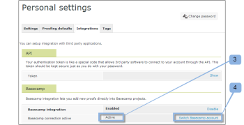

# Integrieren [!DNL Workfront Proof] mit [!DNL Basecamp]

>[!IMPORTANT]
>
>Dieser Artikel bezieht sich auf die Funktionalität im eigenständigen Produkt [!DNL Workfront Proof]. Informationen zum Testen in [!DNL Adobe Workfront], siehe [Testversand](../../../review-and-approve-work/proofing/proofing.md).

Wenn Sie [!DNL Basecamp] Für das Projektmanagement können Sie Ihrem Projektteam umfangreiche Überprüfungs- und Validierungstools mit [!DNL Workfront Proof].

## Grundlagen zum [!DNL Basecamp] Integration mit [!DNL Workfront]

Integrieren mit [!DNL Basecamp] ermöglicht Benutzern das Anzeigen, Überprüfen und Genehmigen von Testsendungen in [!DNL Basecamp]. Benutzer können Testsendungen an Ihre [!DNL Workfront Proof] -Konto und verbinden Sie sie mit Ihrem [!DNL Basecamp] Projekt. Ihre Validierer können Kommentare abgeben und Entscheidungen treffen über [!DNL Basecamp], unter Verwendung des in Ihre Basecamp-Nachricht eingebetteten Mini-Testversands.

Bei Integration in [!DNL Workfront Proof], [!DNL Basecamp] verfügt über die folgende Testfunktion:

* Benutzer können Testsendungen in [!DNL Basecamp Classic].
* Benutzer haben Überprüfungs-Tools sofort verfügbar.
* Projektprüfungsteams erhalten eine Nachricht in [!DNL Basecamp] mit einem kleinen Testversand zur Überprüfung und Validierung.
* Benutzer können zur Überprüfung und Genehmigung zu einem ganzseitigen Testversand wechseln.
* Benutzer können sowohl Mini- als auch Vollbildsendungen Kommentare und Markups hinzufügen.

   >[!NOTE]
   >
   >Nachdem ein Kommentar beantwortet wurde, kann er nicht mehr bearbeitet oder gelöscht werden.

* Überprüfer können auf die Markierungen und reagieren, die von anderen Validierern vorgenommen wurden.
* Benutzer werden benachrichtigt, wenn eine neue Testversion verfügbar ist.
* Benutzer, die nicht [!DNL Workfront Proof] -Benutzer können an einem Testversand in [!DNL Basecamp].

Die Integration von [!DNL Workfront Proof] mit [!DNL Basecamp] muss auf zwei Ebenen eingerichtet werden:

* Konfigurieren [!DNL Basecamp] in [Kontoeinstellungen:](https://support.workfront.com/hc/en-us/sections/115000912147-Account-settings) Dies ermöglicht die Basecamp-Integration für Ihre gesamte Organisation. Weitere Informationen finden Sie unter [Aktivieren der Basecamp-Integration mit [!DNL Workfront Proof]](#enabling-the-basecamp-integration-with-workfront-proof).

* Konfigurieren [!DNL Basecamp] in [Persönliche Einstellungen](https://support.workfront.com/hc/en-us/sections/115000921168-Personal-settings): Dies ermöglicht es Erstellern und Eigentümern von Testsendungen, sich mit ihrem persönlichen Basecamp-Konto zu verbinden und die Genehmigung zu erteilen [!DNL Workfront Proof] Zugriff. Weitere Informationen finden Sie unter [Persönliche Einstellungen konfigurieren](#configuring-personal-settings).

Sie können [!DNL Workfront] mit [!DNL Basecamp] oder [!DNL Basecamp Classic]. Jede Version von [!DNL Basecamp] verwendet eine andere API und erfordert daher unterschiedliche Konfigurationsverfahren.

Informationen zur Konfiguration [!DNL Basecamp Classic], siehe [Integration [!DNL Workfront Proof] mit [!DNL Basecamp Classic].](https://support.workfront.com/knowledge/articles/115004234707/en-us?brand_id=662728&amp;return_to=%2Fhc%2Fen-us%2Farticles%2F115004234707)

## Aktivieren der [!DNL Basecamp] Integration mit [!DNL Workfront Proof]

Als [Profile für Testberechtigungen in [!DNL Workfront Proof]](../../../workfront-proof/wp-acct-admin/account-settings/proof-perm-profiles-in-wp.md) oder [Profile für Testberechtigungen in [!DNL Workfront Proof]](../../../workfront-proof/wp-acct-admin/account-settings/proof-perm-profiles-in-wp.md), können Sie die [!DNL Basecamp] Integration für das gesamte Konto in Ihrer [Kontoeinstellungen](https://support.workfront.com/hc/en-us/sections/115000912147-Account-settings).

1. In [!UICONTROL Basecamp]die folgenden Informationen erfassen:

   * Die URL für Ihre [!DNL Basecamp] account
   * Die URL im Verzeichnis &quot;[!UICONTROL Meine Informationen]&quot; Abschnitt

1. Abmelden von [!DNL Basecamp].
1. Klicken **[!UICONTROL Kontoeinstellungen]** in der Nähe der oberen rechten Ecke.
1. Klicken Sie auf **[!UICONTROL Integrationen]** Registerkarte.
1. Im **[!UICONTROL [!DNL Basecamp]]** Abschnitt rechts von **[!UICONTROL [!DNL Basecamp]Integration]** klicken **[!UICONTROL Aktivieren]**.

1. Weiter zu **[!UICONTROL [!DNL Basecamp]version]**, überprüfen Sie die **[!UICONTROL Klassische Version]** ist die Version, in die Sie integrieren.

1. (Bedingt) Wenn nicht [!DNL Basecamp] URL wird angezeigt, klicken Sie auf **[!UICONTROL Bearbeiten]** Geben Sie die URL für Ihre [!DNL Basecamp] -Konto, ohne &quot;http://&quot;einzuschließen, und klicken Sie dann auf **[!UICONTROL Speichern]**.

1. Klicken Sie oben rechts im Fenster auf **[!UICONTROL Einstellungen]** > **[!UICONTROL Persönliche Einstellungen]**.

1. Klicken Sie auf **[!UICONTROL Integrationen]** Registerkarte.
1. under **[!DNL Basecamp]**, rechts von **[!UICONTROL Basecamp-Integration]** klicken **[!UICONTROL Aktivieren]**.

1. In den Optionen wird rechts neben **[!UICONTROL [!DNL Basecamp]API-Token]** klicken **[!UICONTROL Bearbeiten]**.

1. Geben Sie in das Feld, das angezeigt wird, die URL im Feld[!UICONTROL Meine Informationen]&quot; Abschnitt in [!DNL Basecamp]Klicken Sie auf **[!UICONTROL Speichern]**.\
   Nach der Integration [!DNL Workfront Proof] mit [!DNL Basecamp], können Ihre Benutzer ihre persönlichen Einstellungen konfigurieren. Informationen zum Einrichten von persönlichen Einstellungen finden Sie unter [Persönliche Einstellungen konfigurieren](#configuring-personal-settings)

1. Wenn die Option [!DNL Basecamp] Integration, [!DNL Workfront Proof] Die Konto-ID stimmt möglicherweise nicht mit der Konto-ID überein, die Sie in [!DNL Basecamp].
1. Nach der Integration [!DNL Workfront Proof] mit [!DNL Basecamp], können Ihre Benutzer ihre persönlichen Einstellungen konfigurieren. Informationen zum Einrichten von persönlichen Einstellungen finden Sie unter [Persönliche Einstellungen konfigurieren](#configuring-personal-settings).

## Persönliche Einstellungen konfigurieren

Nach der Einrichtung [Kontoeinstellungen](https://support.workfront.com/hc/en-us/sections/115000912147-Account-settings) für Ihre Organisation sollte jeder Autor, der Testsendungen erstellt/sendet, seine  [persönliche Einstellungen.](https://support.workfront.com/hc/en-us/sections/115000921168-Personal-settings)

1. Navigieren Sie zu **[!UICONTROL Persönliche** &#x200B;**Einstellungen]**.

1. Öffnen Sie die **[!UICONTROL Integrationen]** Registerkarte (1).
1. So aktivieren Sie die [!DNL Basecamp] Integration, klicken Sie auf **[!UICONTROL Aktivieren]** Absatz 2.
1. Klicken **[!UICONTROL Verbinden Sie Ihre [!DNL Basecamp] account]** Absatz 3.\
   

1. Melden Sie sich bei Ihrer [!DNL Basecamp] Konto (1).\
   

1. Klicken **[!UICONTROL Ja, ich erlaube den Zugriff]** Autorisierung [!DNL Workfront Proof] Zugriff auf Ihr Konto (2).\
   

1. (Optional) Wenn Ihre persönliche Integration aktiv ist (3), können Sie einfach zwischen Ihrer [!DNL Basecamp] Konten.

   1. Klicken **[!UICONTROL Switch [!DNL Basecamp] account]** 4.\

      \
      Die [!UICONTROL Basecamp-Konto wechseln] bringt Sie zum [!UICONTROL Persönliche Einstellungen] -Seite, auf der Sie auswählen können, welche Ihrer [!DNL Basecamp] Konten, die Sie in Ihre [!DNL Workfront Proof] -Konto.

   1. Klicken **[!UICONTROL Integrieren Sie erneut mit[!DNL Basecamp]]** 5. vor der Auswahl der [!DNL Basecamp] account\

      Dadurch wird die [!UICONTROL Persönliche Einstellungen] und zeigt Ihre aktuellste Liste der [!DNL Basecamp] Konten.

   1. Klicken **[!UICONTROL Mit diesem Konto integrieren]** , um eine Verbindung herzustellen mit [!DNL Workfront Proof].\

      \
      Sie können jetzt Testsendungen zu [!DNL Basecamp] Projekte.
