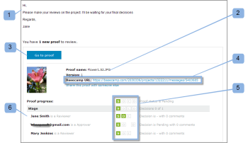

# Testversand in überprüfen [!DNL Basecamp]

>[!IMPORTANT]
>
>Dieser Artikel bezieht sich auf die Funktionalität im eigenständigen Produkt [!DNL Workfront Proof]. Informationen zum Testen in [!DNL Adobe Workfront], siehe [Testversand](../../../review-and-approve-work/proofing/proofing.md).

Die [!DNL Basecamp] Integration mit [!DNL Workfront Proof] erleichtert Ihnen die Überprüfung und Validierung von Testsendungen, ohne die [!DNL Basecamp].

Du brauchst nicht einmal eine [!DNL Workfront Proof] sich anmelden, um alle Überprüfungs-Tools zu verwenden, um Kommentare und Entscheidungen zu Testsendungen zu treffen:

* In [!DNL Basecamp] -Konto, erhalten Sie eine Nachricht, die den Testversand enthält, den Sie überprüfen können (über den miniproof).
* Sie können Kommentare und Markierungen hinzufügen und Entscheidungen für den minimierten Testversand treffen oder zum ganzseitigen Testversand wechseln, um ihn zu überprüfen.
* Sie können die Kommentare und Markierungen der anderen validierungsverantwortlichen Benutzer anzeigen und darauf antworten

Informationen zu Entscheidungen finden Sie unter [Entscheidungsfindung über einen Testversand im Testversand-Viewer](../../../review-and-approve-work/proofing/reviewing-proofs-within-workfront/make-a-decision-on-a-proof/make-decisions-on-proof.md).

>[!NOTE]
>
> Wenn Sie kein Benutzer von [!DNL Workfront Proof], können Sie weiterhin an einem Testversand in arbeiten. [!DNL Basecamp]. Sie müssen lediglich Ihre E-Mail-Adresse und Ihren Bildschirmnamen eingeben. Sie können auch &quot;[!UICONTROL erinnere mich]&quot;, müssen Sie diese Details nur einmal eingeben.

## Anzeigen des Testversands über die Benachrichtigungs-E-Mail

Wenn Sie einen neuen oder vorhandenen Testversand mit [!DNL Basecamp], [!DNL Workfront Proof] sendet an alle validierungsverantwortlichen Benutzer eine Benachrichtigungs-E-Mail mit folgenden Informationen:

* Die Testversandnachricht (benutzerdefiniert oder Standard) (1)
* Testversanddetails (2)
* Persönliche URL (Gehe zu Testversand-Link) (3)
* Link zur [!DNL Basecamp] Projektnachricht, die Sie direkt zum Testversand in führt [!DNL Basecamp] Absatz 4\
   Wenn nicht[!DNL Basecamp] validierungsverantwortliche Benutzer wurden zum Testversand hinzugefügt. Ihre E-Mail-Benachrichtigung enthält nicht die [!DNL Basecamp] Link.
* Fortschritt der Prüfung (5)
* Prüfer und ihr individueller Fortschritt (6)

>[!NOTE]
>
> Wenn Sie keine [!DNL Basecamp] Sitzung in einem anderen Browserfenster öffnen, müssen Sie sich bei Ihrem [!DNL Basecamp] -Konto, bevor Sie die Nachricht in [!DNL Basecamp].

## Anzeigen des Testversands über [!DNL Basecamp] Nachricht

Wenn Sie eine E-Mail-Benachrichtigung über einen neuen Testversand erhalten, der zu Ihrem [!DNL Basecamp] Projekt:

1. Navigieren Sie zu Ihrer Projektseite (1).
1. Suchen Sie die Nachricht für Ihren Testversand (2).\
   Die Seite mit der Nachricht enthält den Namen des Testversands (im Betreff) (3) und einen Link zum Vollbild-Proof-Viewer (4).
1. 

1. Wenn Sie bei Ihrer [!DNL Workfront Proof] -Konto in einem Browser-Fenster, können Sie sofort mit der Überprüfung beginnen. Wenn Ihr Name nicht in der unteren linken Ecke der minimierten Anzeige angezeigt wird:
1. Klicken **[!UICONTROL Anmelden]** Absatz 5.
1. Geben Sie Ihre E-Mail-Adresse ein (Sie wurden zum Testversand hinzugefügt) (6).
1. Klicken **[!UICONTROL Nächste]** und geben Sie in ein zweites Feld, das angezeigt wird, Ihre [!DNL Workfront Proof] password (7).\
   Wenn Sie keine [!DNL Workfront Proof] -Konto einen öffentlichen Namen eingeben, der angezeigt werden soll.

1. Klicken **[!UICONTROL Erinnern Sie sich]** sodass Sie Ihre Daten nur einmal eingeben müssen.\
   Jetzt können Sie mit der Überprüfung des Testversands in fortfahren. [!DNL Basecamp].

## Testversand in [!DNL Basecamp]

Testversand in [!DNL Basecamp] ist so einfach wie in [!DNL Workfront Proof]. Die minimierte in [!DNL Basecamp] bietet Ihnen alle Tools, die Sie benötigen, um Kommentare hinzuzufügen, zu markieren und Entscheidungen über den Testversand zu treffen.

* Ihre [!DNL Basecamp] Projektname (1)
* Die [!DNL Workfront Proof] Betreff der E-Mail-Benachrichtigung (2)
* Direkter Link zum vollständigen Proof-Viewer (öffnet eine Vollbildansicht) (3)
* Name und Version des Testversands (4)
* Aktionsmenüs (5)
* Schaltfläche &quot;Vollbild&quot;(6)
* Seitenleiste (7)
* Benutzername (8)
* [!UICONTROL Kommentar] und [!UICONTROL Entscheidung] Schaltflächen (9)
* Zoom-Tools (10)
* Seitennavigations-Tools (11)

Es ist nicht erforderlich, eine Antwort an die [!DNL Basecamp] Nachricht: Kommentare und Entscheidungen werden auf dem Testversand gespeichert (wie bei der Überprüfung eines Testversands in [!DNL Workfront Proof]).

## Überprüfen des vollständigen Testversands

Sie können den ganzseitigen Testversand mit allen [!DNL Workfront Proof] normale Funktionalität, indem Sie entweder auf den Link in der Nachricht direkt über dem minimierten oder auf das Vollbildsymbol in der oberen rechten Ecke des miniproof klicken.

Das Testversandbild ist weiterhin die Originalgröße, aber die Seite selbst ist größer als die minimierte Seite.

Der ganzseitige Testversand zeigt Folgendes an:

* Die [!UICONTROL Kommentare hinzufügen] und [!UICONTROL Einsendeentscheidung] -Schaltflächen (anstelle der auf der minimierten Seite angezeigten Kommentare und Entscheidungssymbole) (1).
* Mehr Zoom- und Navigationstools als die minimierten (2).
* Die [!UICONTROL Navigieren Sie zu [!DNL Basecamp]] in der oberen linken Ecke des Testversands. Wenn Sie auf diesen Link klicken, werden Sie zu Ihrem [!DNL Basecamp] Konto (3).

