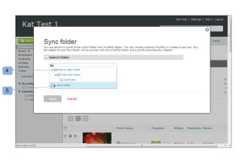
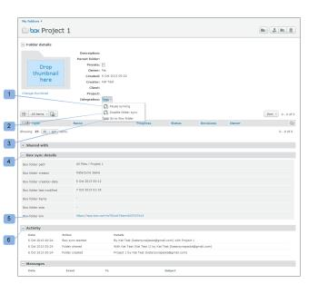

# Synchronisieren [!DNL Box] Ordnern mit [!DNL Workfront Proof]

>[!IMPORTANT]
>
>Dieser Artikel bezieht sich auf Funktionen im eigenständigen [!DNL Workfront Proof]. Informationen zu Proofing in [!DNL Adobe Workfront] finden Sie unter [Proofing](../../../review-and-approve-work/proofing/proofing.md).

Sie können einen [!DNL Box] Ordner mit einem Ordner in [!DNL Workfront Proof] synchronisieren. Jede Änderung, die Sie an Ihren Dateien im Ordner „Box“ vornehmen, wird in Workfront Proof übernommen (also das Hochladen einer neuen Datei, das Hinzufügen einer neuen Version, das Umbenennen einer Datei usw.).

Weitere Informationen zu Ordnern finden Sie unter [Verwalten von Ordnern und ihrem Inhalt in [!DNL Workfront Proof]](../../../workfront-proof/wp-work-proofsfiles/organize-your-work/manage-folders-and-contents.md).

>[!NOTE]
>
>Nur Benutzer mit Profilen [!UICONTROL Manager] oder höher können Ordner synchronisieren. Der [!DNL Box] Benutzer, der die Datei in einen mit [!DNL Workfront Proof] synchronisierten Ordner hochlädt, wird zum Besitzer des in [!DNL Workfront Proof] erstellten Korrekturabzugs (wenn er ein Benutzer innerhalb desselben [!DNL Workfront Proof] ist). Wenn der [!DNL Box] Benutzer ein Benutzer mit einem anderen [!DNL Workfront Proof]-Konto ist oder kein Konto bei [!DNL Workfront Proof] hat, wird die Person, die die Synchronisierung zwischen den Ordnern erstellt hat, Besitzer des Korrekturabzugs. Weitere Informationen finden Sie unter *Bearbeiten von Benutzerprofilen und Berechtigungen“*

So synchronisieren Sie einen [!DNL Box] Ordner mit einem Ordner in [!DNL Workfront Proof]:

1. Rufen Sie in Ihrem [!DNL Box]-Konto die Seite [!UICONTROL Alle Dateien und Ordner] auf.
1. Klicken Sie auf das **[!UICONTROL Weitere Optionen]**-Menü neben dem Ordner, mit dem Sie [!DNL Workfront Proof] (1) synchronisieren möchten.
1. Wählen Sie **[!UICONTROL Weitere Aktionen]** (2) aus.
1. Klicken Sie **[!UICONTROL Mit[!DNL Workfront Proof]]** synchronisieren (3).
1. Führen [!UICONTROL &#x200B; im angezeigten &#x200B;] „Ordner synchronisieren“ (wenn Sie bei [!DNL Workfront Proof] angemeldet sind) einen der folgenden Schritte aus:

   * Klicken Sie auf einen [!DNL Workfront Proof] Ordnernamen, um ihn mit dem entsprechenden Ordner in Feld (4) zu synchronisieren.
   * Klicken Sie auf **[!UICONTROL Neuer Ordner]**, um einen neuen Ordner in [!DNL Workfront Proof] (5) zu erstellen.\

     Wenn Sie einen neuen Ordner erstellt haben, werden Sie aufgefordert, Details zum neuen Ordner anzugeben.

1. Klicken Sie auf **[!UICONTROL Speichern]**.\
   Die [!UICONTROL Ordnerdetails] für den synchronisierten Ordner wird in [!DNL Workfront Proof] geöffnet. Diese Seite enthält Informationen zum Ordner .\
   Auf dieser Seite können Sie die Synchronisierung auch anhalten und deaktivieren. Wenn Sie die Synchronisierung anhalten, wird der Ordner nicht mehr mit den Änderungen aus [!DNL Box] aktualisiert, die Synchronisierung kann jedoch jederzeit fortgesetzt werden. Wenn Sie die Synchronisierung deaktivieren, wird die Verbindung zwischen den Ordnern unterbrochen und die Synchronisierung muss vom [!DNL Box] Konto aus erneut hergestellt werden.\
   Die [!UICONTROL Ordnerdetails] enthält die folgenden Informationen und Funktionen in Bezug auf Ihren Ordner in [!DNL Box]:

   * **[!UICONTROL Synchronisierung anhalten]**: Der [!DNL Workfront Proof] wird nicht mehr mit den Änderungen aus Box aktualisiert. Die Synchronisation kann jederzeit wieder aufgenommen werden (1).
   * **[!UICONTROL Ordnersynchronisierung deaktivieren]**: Die Verbindung zwischen Ordnern geht verloren, und die Synchronisierung muss erneut über das [!DNL Box]-Konto eingerichtet werden (2).

   * Nur der Benutzer, der die Ordnersynchronisierung gestartet hat, kann sie deaktivieren oder anhalten. Weitere Informationen finden Sie unter [Verwalten von Ordnern und ihrem Inhalt in [!DNL Workfront Proof]](../../../workfront-proof/wp-work-proofsfiles/organize-your-work/manage-folders-and-contents.md).
   * **Wechseln Sie [!DNL Box] Ordner**: Wenn Sie die Ordner-URL freigegeben haben (in den [!DNL Box] Ordneroptionen), wird diese Option verfügbar und Sie gelangen direkt zum [!DNL Box] Ordner (3).
   * **[!UICONTROL Details zur Ordnersynchronisierung]**: Dieser Abschnitt enthält Informationen zum [!DNL Box] (4).
   * **[!UICONTROL [!DNL Box]Ordnerlink]**: URL zum [!DNL Box] Ordner (5).
   * **[!UICONTROL Activity]:** Zeigt die Aktivitätsprotokolle des [!DNL Workfront Proof] Ordners an, in dem Sie überprüfen können, wer die Ordnersynchronisierung gestartet hat (6).
   * 

>[!NOTE]
>
>* Sie können den [!DNL Box] auch über das Menü [!UICONTROL Ordneroptionen] synchronisieren.
>* Wenn Sie eine eigene [!DNL Workfront Proof]-Anmeldeseite haben, werden Sie anstelle der standardmäßigen [!DNL Workfront Proof]-Anmeldeseite zu dieser Seite weitergeleitet. Weitere Informationen finden Sie in [&#x200B; Artikeln unter &#x200B;](https://support.workfront.com/hc/en-us/sections/115000921208-Branding)Branding“.
>* Wenn Sie die Funktion [!UICONTROL Single Sign-On (SSO)] in Ihrem [!DNL Workfront Proof]-Konto aktiviert haben, werden Sie zur SSO-Anmeldeseite weitergeleitet und aufgefordert, Ihre SSO-Anmeldedaten einzugeben, jedoch nur, wenn Sie dieselbe E-Mail-Adresse für Ihr [!DNL Box]-Konto und [!DNL Workfront Proof] verwenden. Weitere Informationen finden Sie unter [[!UICONTROL Single Sign-On] in [!DNL Workfront Proof]](../../../workfront-proof/wp-acct-admin/managing-security/single-sign-on-overview.md).
>* Wenn Sie nicht dieselbe E-Mail-Adresse sowohl für Ihr [!DNL Box]-Konto als auch für Ihr [!DNL Workfront Proof]-Konto verwenden, werden Sie immer zur standardmäßigen [!DNL Workfront Proof]-Anmeldeseite weitergeleitet.
>

