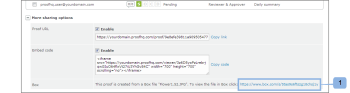

# Originaldatei eines Testversands in einem Feld anzeigen

>[!IMPORTANT]
>
>Dieser Artikel bezieht sich auf die Funktionalität im eigenständigen Produkt [!DNL Workfront Proof]. Informationen zum Testen in [!DNL Adobe Workfront], siehe [Testversand](../../../review-and-approve-work/proofing/proofing.md).

Wenn Sie die [!DNL Workfront Proof] - [!DNL Box] -Integration können Sie in Box die Originaldatei anzeigen, die zum Erstellen eines Testversands verwendet wurde. Dazu gibt es zwei Möglichkeiten:

## Anzeigen der Datei unter [!DNL Box] über E-Mail-Benachrichtigung bei Testversand

Wenn ein neuer Testversand oder eine neue Version aus einem [!DNL Box] Datei, erhalten der Ersteller und die Validierer eine E-Mail-Benachrichtigung, die einen Link zur Datei in Ihrer [!DNL Box] Konto (1).\

## Anzeigen der Datei unter [!DNL Box] über die [!UICONTROL Testversanddetails] Seite

Die [!UICONTROL Mehr Freigabeoptionen] Abschnitt [!UICONTROL Testversanddetails] Seite des Testversands, den Sie anhand einer [!DNL Box] enthält einen Link zur Datei in Ihrer [!DNL Box] Konto (1).

