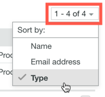
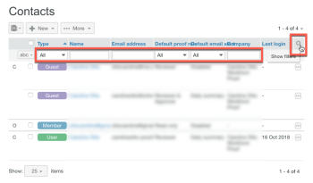

# Kontakte verwalten in [!DNL Workfront Proof]

>[!IMPORTANT]
>
>Dieser Artikel bezieht sich auf die Funktionalität im eigenständigen Produkt [!DNL Workfront Proof]. Informationen zum Testen in [!DNL Adobe Workfront], siehe [Testversand](../../../review-and-approve-work/proofing/proofing.md).

Sie können Ihre Kollegen, Mitglieder und Gäste auf der Seite Kontakte verwalten.

## Öffnen der Kontaktseite

1. Klicken **[!UICONTROL Kontakte]** in der linken Navigationsseitenleiste.
1. (Optional) Klicken Sie auf **[!UICONTROL Ansicht ändern]** und wählen Sie dann eine Option aus, um festzulegen, ob Sie nach Kontakt oder Unternehmen anzeigen möchten.

## Sortieren von Kontakten

1. Klicken **[!UICONTROL Kontakte]** in der linken Navigationsseitenleiste.
1. Klicken Sie auf die Spaltenüberschrift, nach der Sie sortieren möchten.
Oder wählen Sie eine Option aus dem **[!UICONTROL Sortieren]** in der rechten oberen Ecke der Seite Kontakte .

1. 

1. Das Dreieck einer Spaltenüberschrift zeigt die Sortierreihenfolge an. Nach oben zeigt es eine aufsteigende Reihenfolge an; Wenn nach unten zeigt, wird die absteigende Reihenfolge angezeigt.

## Filterkontakte

1. Klicken **[!UICONTROL Kontakte]** in der linken Navigationsseitenleiste.
1. Klicken Sie auf **[!UICONTROL Filter]** rechts neben den Spaltenüberschriften, um die Filteroptionen unter den Spaltenüberschriften anzuzeigen.
1. Auswählen [!UICONTROL Filteroptionen] aus den Dropdown-Menüs aus und geben Sie in die Filterfelder ein, die unter jeder Spaltenüberschrift angezeigt werden. Klicken Sie dann auf die Schaltfläche **[!UICONTROL Filter]** erneut klicken, um die Optionen anzuwenden.
1. 

1. Oder
1. Wählen Sie den ersten Brief im Namen des gewünschten Kontakts aus.
1. 

## Verwalten eines oder mehrerer Kontakte

1. Klicken **[!UICONTROL Kontakte]** in der linken Navigationsseitenleiste.
1. Aktivieren Sie das Kontrollkästchen für einen oder mehrere Kontakte.
1. Führen Sie einen der folgenden Schritte aus:

   * Klicken **[!UICONTROL Zu Gruppe hinzufügen]** , um die ausgewählten Kontakte einer Gruppe hinzuzufügen.

      

   * Klicken **[!UICONTROL Entfernen]** und klicken Sie dann im Dropdown-Menü auf eine Option, um den Kontakt aus Testsendungen oder Gruppen zu entfernen.
   * Klicken **[!UICONTROL Mehr]** > **[!UICONTROL Erinnerung bei verspäteten Testsendungen senden]** , um den ausgewählten Kontakten eine Erinnerungsmail über verspätete Testsendungen zu senden.

   * Klicken **[!UICONTROL Mehr]** > **[!UICONTROL Kontakte in CSV exportieren]** um die ausgewählten Kontakte in eine CSV-Datei zu exportieren.

   * Klicken **[!UICONTROL Kontakte löschen]** um die ausgewählten Kontakte aus der Liste zu entfernen.

      
Das Löschen eines Kontakts bedeutet nicht, dass ein Benutzer aus Ihrem Konto entfernt wird. Wenn jedoch ein Administrator oder Rechnungsadministrator eine Person aus der Kontaktliste löscht, wird diese Person vollständig aus dem Konto Ihres Unternehmens gelöscht.

   * Klicken Sie auf **[!UICONTROL Mehr]** -Symbol am Ende der Zeile eines Kontakts und verwenden Sie eine der Optionen im angezeigten Dropdown-Menü.

      Diese Optionen unterscheiden sich je nach Kontakttyp. Siehe [Benutzer, Mitglieder und Gäste in [!DNL Workfront Proof]](../../../workfront-proof/wp-mnguserscontacts/contacts/use-members-guests.md) für weitere Informationen.

## Kontakte importieren

Sie können Kontakte aus einer CSV-Datei importieren.

1. Klicken **[!UICONTROL Kontakte]** in der linken Navigationsseitenleiste.
1. Klicken Sie auf der Seite Kontakte auf **[!UICONTROL Mehr]** > **[!UICONTROL Kontakte importieren]** um Kontakte zu Ihrer Liste hinzuzufügen.

1. Klicken Sie auf der angezeigten Seite Personen importieren auf **[!UICONTROL Datei auswählen]**.
1. Wählen Sie die Feldtrennmethode in der Datei aus.
1. Klicken Sie auf **[!UICONTROL Speichern]**.

   * Die CSV-Datei muss mindestens eine Spalte namens &quot;E-Mail&quot;(mit den E-Mail-Adressen) enthalten.
   * Sie können auch zusätzliche Spalten für &quot;Name&quot;, &quot;Firma&quot;, &quot;Telefon&quot;und &quot;Mobiltelefon&quot;einfügen.
   * Anstelle von &quot;Name&quot;können Sie zwei Spalten für &quot;Vorname&quot;und &quot;Nachname&quot;verwenden. Wenn separate Vor- und Nachname-Spalten verwendet werden, müssen Sie sicherstellen, dass Sie nicht auch eine &quot;Name&quot;-Spalte einschließen.
